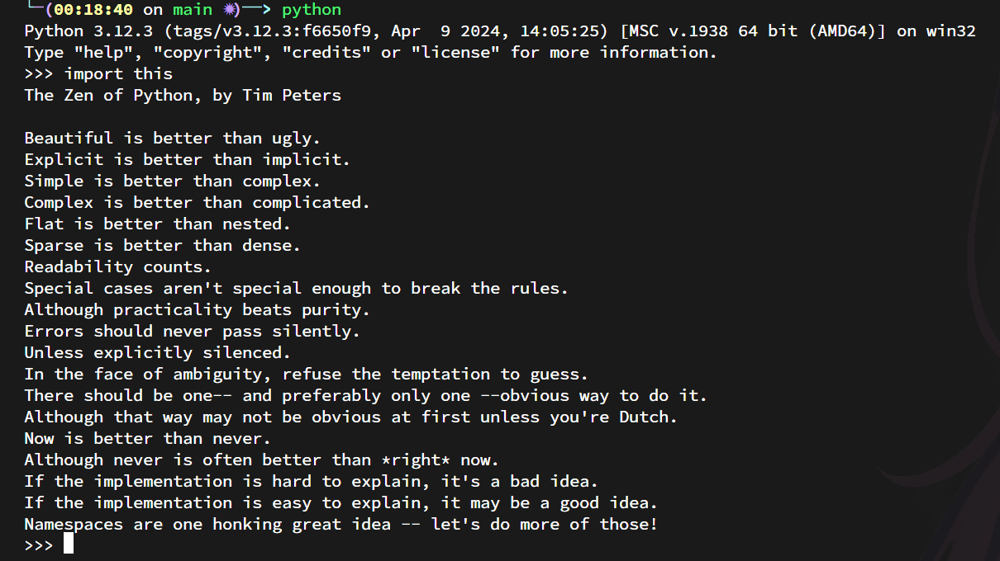
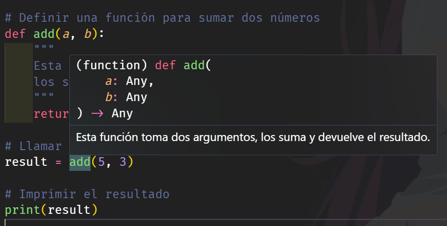

# Introducción a Python


> *Repositorio*: [python_desde_cero_2024](https://github.com/Duz-Dev/python_desde_cero_2024) - fecha de edición: 16/05/2024
---
<!-- TOC -->

- [Introducción a Python](#introducción-a-python)
  - [Origen de Python y su Propuesta](#origen-de-python-y-su-propuesta)
    - [Características Clave de Python](#características-clave-de-python)
    - [Comparación con Otros Lenguajes](#comparación-con-otros-lenguajes)
  - [Python como lenguaje](#python-como-lenguaje)
    - [Ventajas del Proceso](#ventajas-del-proceso)
  - [Instalación de Python](#instalación-de-python)
  - [Hola mundo en python](#hola-mundo-en-python)
  - [Primeros pasos en python](#primeros-pasos-en-python)
    - [Documentación](#documentación)
    - [El Zen de python](#el-zen-de-python)
    - [Comentarios en python](#comentarios-en-python)
      - [Comentarios de una linea](#comentarios-de-una-linea)
      - [comentarios de comillas triples (docstrings)](#comentarios-de-comillas-triples-docstrings)
    - [Conversiones y PEP8](#conversiones-y-pep8)
      - [Convenciones de Estilo](#convenciones-de-estilo)
      - [PEP8](#pep8)
        - [1. Indentación](#1-indentación)
        - [2. Longitud de la Línea](#2-longitud-de-la-línea)
        - [3. Saltos de Línea](#3-saltos-de-línea)
        - [4. Importaciones](#4-importaciones)
        - [5. Espacios en Blanco](#5-espacios-en-blanco)
        - [6. Nomenclatura](#6-nomenclatura)
        - [7. Comentarios](#7-comentarios)
        - [8. Docstrings](#8-docstrings)
        - [9. Declaraciones](#9-declaraciones)
        - [10. Espacios de nombres](#10-espacios-de-nombres)
  - [Amplia tus conocimientos](#amplia-tus-conocimientos)

<!-- /TOC -->
        - [2. Longitud de la Línea](#2-longitud-de-la-línea)
        - [3. Saltos de Línea](#3-saltos-de-línea)
        - [4. Importaciones](#4-importaciones)
        - [5. Espacios en Blanco](#5-espacios-en-blanco)
        - [6. Nomenclatura](#6-nomenclatura)
        - [7. Comentarios](#7-comentarios)
        - [8. Docstrings](#8-docstrings)
        - [9. Declaraciones](#9-declaraciones)
        - [10. Espacios de nombres](#10-espacios-de-nombres)

- [Amplia tus conocimientos](#amplia-tus-conocimientos)

<!-- /TOC -->
<!-- /TOC -->
---
Antes de comenzar de lleno en este repositorio, es requisito que tengas a la mano las siguientes herramientas y conocimientos:

- ¿Qué es un lenguaje de programación?
- ¿Qué es Python?
- Interpretador vs compilador
- Editor de código
- ¿Qué es una terminal? (utilización básica)

También, en caso de que Python sea el primer lenguaje de programación con el cual tengas contacto, seria muy recomendable que primero abordes algunos conceptos y temas de "lógica de programación". Entender lo que son las variables, tipos de dato, condicionales, ciclos, ect. De lo contrario te sera mucho mas difícil comprender lo que empezaremos abordar de aquí en adelante.

## Origen de Python y su Propuesta

Python fue concebido en diciembre de 1989 por Guido van Rossum en el Centrum Wiskunde & Informatica (CWI) en los Países Bajos. Guido, quien había trabajado en el lenguaje ABC, quería crear un lenguaje que mantuviera la sencillez y el aprendizaje intuitivo de ABC pero con capacidades más avanzadas. La primera versión pública de Python (versión 0.9.0) se lanzó en febrero de 1991.

El lenguaje fue diseñado con la filosofía de enfatizar la legibilidad del código y permitir a los desarrolladores escribir código limpio y lógico para proyectos pequeños y grandes. Python adopta el principio de "menos es más", promoviendo una sintaxis y una estructura que hacen que el código sea fácil de leer y entender. Su sintaxis se asemeja al inglés, esto lo hace perfecto para los principiantes, pero también es muy poderoso para los desarrolladores experimentados.

### Características Clave de Python

**Sintaxis Clara y Legible**: Python utiliza una sintaxis limpia y su estructura se basa en la indentación, lo cual fuerza a los desarrolladores a escribir código legible y organizado.

**Multiparadigma**: Soporta varios paradigmas de programación, incluyendo la programación orientada a objetos, la programación estructurada y la programación funcional.

**Bibliotecas Estándar Extensas**: Python viene con una gran biblioteca estándar que ofrece módulos y paquetes para realizar muchas tareas comunes como manipulación de archivos, operaciones matemáticas, y acceso a protocolos de internet.

### Comparación con Otros Lenguajes

**Java**: Java es robusto y ampliamente utilizado en grandes sistemas empresariales. Es más complicado de aprender que Python debido a su sintaxis más estricta.

**C++**: Es muy potente y rápido, ideal para aplicaciones de alto rendimiento como videojuegos. Sin embargo, es más complejo debido a la gestión manual de la memoria.

**JavaScript**: Es el rey del desarrollo web, especialmente en el frontend. Python, aunque también se puede usar para el desarrollo web (sobre todo backend), es más generalista.

## Python como lenguaje

Python como ya hice mención, es un lenguaje Interpretado. Con ello trae tanto ventajas como desventajas. La primera contra que se tiene al momento de utilizar lenguajes Interpretados es que son menos óptimos en cuestión de eficiencia de procesos y tiempos a comparación de los compilados. Python soluciona gran parte de dicha desventaja con una propuesta interesante, imitando a un lenguaje ya conocido como lo es java utiliza la siguiente forma:

1. **Escritura del Código Fuente:**

   - Escribes tu código en un archivo con extensión `.py`. Este archivo contiene instrucciones en lenguaje Python, que es de alto nivel y fácil de leer para los humanos.
2. **Compilación a Bytecode:**

   - Cuando ejecutas tu archivo Python (por ejemplo, usando `python mi_programa.py`), el intérprete de Python primero compila el código fuente a una representación intermedia llamada bytecode. El bytecode es una forma optimizada y más eficiente del código que la computadora puede procesar más rápidamente.
   - Este bytecode es independiente de la plataforma y se almacena en archivos con extensión `.pyc` dentro de un directorio `__pycache__`.
3. **Ejecución del Bytecode en la Máquina Virtual de Python (PVM):**

   - La Python Virtual Machine (PVM) toma el bytecode y lo ejecuta. La PVM es un motor de ejecución que interpreta el bytecode y lo traduce a instrucciones específicas de la máquina en la que se está ejecutando.
   - La PVM maneja la gestión de la memoria, la ejecución de los bloques de código y otras tareas importantes para ejecutar tu programa.

**Diagrama del Proceso:**

```markdown
Código Fuente (mi_programa.py)
        ↓
Compilación a Bytecode
        ↓
Bytecode (archivos .pyc en __pycache__)
        ↓
Ejecución en la Máquina Virtual de Python (PVM)
```

### Ventajas del Proceso

- **Portabilidad:** El bytecode es independiente de la plataforma, lo que significa que puedes ejecutar el mismo bytecode en cualquier sistema operativo que tenga un intérprete de Python compatible.
- **Eficiencia:** Compilar a bytecode optimiza el código, permitiendo una ejecución más rápida en comparación con interpretar directamente el código fuente.
- **Facilidad de Uso:** Los desarrolladores no necesitan preocuparse por estos detalles; Python maneja automáticamente la compilación y ejecución del bytecode.

Visualmente se podría ver de la siguiente manera:


## Instalación de Python

Ya que sabemos lo que propone, algunas de las cosas que podemos hacer con python y la utilidad de este mismo, ahora veremos como empezar a utilizarlo.

Primeramente debemos tener una manera de poder ejecutar nuestros archivos de python. Para ello existen diferentes herramientas que nos permitirán hacer dicha tarea como las que se mencionan en el libro de [AprendePython](https://aprendepython.es/core/devenv/). En mi caso, utilizo y recomiendo descargar y empezar a utilizar python con ayuda del ejecutable que ofrece de manera oficial en [https://www.python.org/](https://www.python.org/)


Dependiendo del sistema operativo de nuestro computador, debemos escoger una de las opciones de la lista. En mi caso yo uso Windows, pero perfectamente podemos instalarlo en mac y Linux.

> nota: En Linux ya viene instalado por defecto, pero es necesario verificar que tengamos la version mas reciente y el gestor de paquetes 'pip'

Si decides instarlo por este método, te guiare en caso de que seas usuario de windows.

**Paso 1**. Primero lo descargas desde el sitio que ya comente y le darás en el botón de 'downloads' y veras que te aparece la lista de la imagen anterior, le das clic al botón de python 3.12.X y la descarga empezara.

**Paso 2**. Ejecutas el archivo y te recomiendo activar las casillas: 'user admin privileges when installing py.exe' y 'add python.exe to path'. Con ambas opciones evitaremos un posible error de instalación por culpa de permisos.

<center></center>

**Paso 3**. Si ya las marcaste, ahora procede a darle al botón de 'install now'. La instalación procederá a realizarse y solo quedara esperar. Cuando termine te quedara una ventana como la siguiente:

<center></center>

Solo con darle a el botón de close, cerramos la instalación terminada.

Con dicha instalación python nos incluye algunas cosas adicionales como el 'IDLE'para python, el cual nos dejara ejecutar y probar nuestros archivos de python en dado de caso de no tener otra herramienta para ello. Yo en lo personal no la utilizo, ya que ejecuto los archivos con ayuda de la terminal de windows 11, o en su defecto desde mi editor de código favorito [Visual Studio Code.](https://code.visualstudio.com/)

Te recomiendo encarecidamente que utilices VSCode y aprendas a utilizarlo. En mi canal de Youtube podrás encontrar como instalar dicho programa y utilizarlo con Python.

Otra manera de ejecutar nuestros archivos de python, una vez que instalamos python es utilizando una terminal. En windows por predeterminado esta la CMD y PowerShell. En lo personal no utilizo ninguna y opte por trabajar en la terminal que ofrece git en windows, [git bash.](git-scm.com/downloads) La gran diferencia de esta a las otras que ofrece windows, es que podemos utilizar comandos como normalmente se implementarían en Linux o mac.

Ya sea que utilices cualquiera de estas terminales en el caso de windows, el utilizar los comandos de python serán exactamente igual.

A modo de ejemplo: Escribe en la aplicación de windows 'cmd' el texto `python --version` y después dale enter. Veras que te mostrara la version de python que tienes instalada en tu equipo.

Ejemplo en cmd
<center></center>
Ejemplo en git bash
<center></center>

## Hola mundo en python

Ya para terminar, te diré como crear y ejecutar archivos de python. Personalmente recomiendo que para este paso si no tienes experiencia en VSCode, mires otras explicaciones aparte de la que te daré a continuación:

1. Si tienes visual estudio code, ábrelo. Debes crear un archivo nuevo, esto se puede lograr presionando la combinación de teclas `ctrl + n` y dicho archivo guárdalo con la combinación `ctrl + s`. Se te desplegara la ventana de gestor de archivos en windows y lo que te pedirá es que le indiques donde deseas guardar el archivo, por ejemplo el Escritorio. Con ello debes darle un nombre a tu archivo, puede ser cualquiera pero solo recuerda que para especificar que nuestro archivo esta hecho para utilizar python le debemos escribir la extensión `.py` al final del nombre.
   Algo asi se vera cuando guardes el archivo:
   <center></center>

2. Es posible que VScode reconozca que ahora estas utilizando python y te pida instalar algunas cosas, no te preocupes. Son extensiones que agregara a Visual Code para que utilizar python sea aun mas fácil.
3. Ahora en tu archivo de python, escribe dentro de este la expresión `print("Hola mundo")`. Esto con la finalidad de mostrar el texto hola mundo en la terminal que tenemos por defecto en nuestro equipo. usa `ctrl + s` para guardar los cambios. Tu VSCode se debe ver algo parecido a esto:
   <center></center>

4. Ahora solo te faltara ejecutar dicho archivo. Para ello podemos darle al botón de arriba a la derecha (es como una flecha `>`) y esto hará que el código se ejecute en la terminal de nuestro ordenador pero dentro de VScode.
   <center></center>

   Si el 'hola mundo' sale en dicha terminal, significa que todo a funcionado correctamente.

>observación. Para indicar que queremos que nuestros archivos `.py` sean ejecutados por el interprete de python, hacemos uso del comando `python`, y el resultado seria igual como en la imagen anterior.

Si escribimos solo `python` en la terminal y lo ejecutamos (darle enter), nos dará la posibilidad de empezar a trabajar con instrucciones de python sin necesidad de crear un archivo, la desventaja de esto es que no quedara nada guardado. Si lo intentas, una forma de salir de este es escribiendo la expresión `exit()` ó cierra la terminal.

Como curiosidad, una forma de evitar llamar a el comando python desde la terminal para indicarle a la consola que queremos que nuestro archivo se interprete con la shell de python, podemos hacer uso del "hashbang"[^1] que es poner al inicio de nuestro script la dirección del interprete de  python.

Por ejemplo, en mi caso, dicha shell de python se encuentra en la ruta del siguiente script llamado hola_mundo.py:

```python
#!/c/Users/miner/AppData/Local/Programs/Python/Python312/python

print("Hola mundo!")
```

En la terminal, solo bastaría con escribir el nombre del archivo, sin necesidad de escribir el comando `python` previamente.

```bash
./hola_mundo.py
```

## Primeros pasos en python

Ahora que sabemos crear un archivo de python y utilizar el interprete, es momento de ponernos a trabajar y empezar a conocer algunas cosas de este lenguaje.

Ahora te daré un tour sobre algunos temas que en realidad dependiendo tus bases, pueden ser algo mas complicados o sin un background en donde aplicar hasta que conozcas mas de python.

### Documentación

*Debes saber que toda pieza de software o elemento creado por los programadores, debe pasar por la practica de crear un manuscrito (documento) ancestral que trascenderá y sera leído por miles o millones de programadores, los cuales intentaran descifrar tus encantamientos (codigo), que les sera guía en este basto mundo.*

Fuera de metáforas, la documentación, es la colección de datos e información que muestra a lujo de detalle (no siempre) el uso y explicación de los elementos de un software.

Cuando hablamos de un lenguaje de programación como lo es Python, también existe dicha documentación la cual fue creada y esta disponible para todo mundo.

Uno de los objetivos de la documentación es darle una introducción y explicación de lo que puede hacer con tal tecnología, asi como explicación de detalles técnicos.

Si eres nuevo en algo, la mejor decisión para aprender sobre esto es buscando si existe documentación oficial sobre dicha cosa, ya que es la fuente confiable de información mas veras que podrás encontrar para tal tema.

El enlace de la documentación de python esta [aqui](https://docs.python.org/3/). Si quieres aprender algo sobre python, este sera el mejor recurso que encontraras y lo mejor es que esta traducido a el español.

### El Zen de python

El Zen de Python es una colección de 19 principios que guían el diseño del lenguaje Python y su filosofía de desarrollo. Fue escrito por Tim Peters y está incluido como un "huevo de pascua" en el lenguaje Python. Estos principios reflejan las mejores prácticas y la mentalidad que los desarrolladores de Python deben adoptar para escribir código limpio, legible y eficiente.

El Zen de Python se puede visualizar ejecutando `import this` en un intérprete de Python.

<center></center>

A continuación, se muestran los principios del Zen de Python (traducido al español):

1. Hermoso es mejor que feo.
2. Explícito es mejor que implícito.
3. Simple es mejor que complejo.
4. Complejo es mejor que complicado.
5. Plano es mejor que anidado.
6. Espaciado es mejor que denso.
7. La legibilidad cuenta.
8. Los casos especiales no son lo suficientemente especiales para romper las reglas.
9. Aunque la practicidad le gana a la pureza.
10. Los errores nunca deberían pasar silenciosamente.
11. A menos que se silencien explícitamente.
12. En caso de ambigüedad, rechaza la tentación de adivinar.
13. Debe haber una —y preferiblemente solo una— manera obvia de hacerlo.
14. Aunque esa manera no sea obvia al principio, a menos que seas holandés.
15. Ahora es mejor que nunca.
16. Aunque nunca es frecuentemente mejor que *ya mismo*.
17. Si la implementación es difícil de explicar, es una mala idea.
18. Si la implementación es fácil de explicar, puede ser una buena idea.
19. Los espacios de nombres son una gran idea — ¡hagamos más de esos!

Estos principios promueven la escritura de código que sea fácil de entender y mantener.

Notaras con el tiempo que mucha de estos puntos están presentes en cada concepto que aprendas dentro de python.

### Comentarios en python

 los comentarios se utilizan para explicar y documentar el código, y son ignorados por el intérprete durante la ejecución del programa. Hay varias formas de crear comentarios en Python, que incluyen comentarios de una sola línea, comentarios de múltiples líneas y docstrings.

#### Comentarios de una linea

comienzan con el símbolo # y se extienden hasta el final de la línea. Se utilizan para hacer anotaciones breves y claras.

```python
# Este es un comentario de una sola línea
x = 5  # También se puede usar al final de una línea de código
```

Como vez, es fácil de usar y es muy recurrente. El único detalle con los comentarios de este estilo es que no pueden ser utilizados para crear comentarios de múltiples lineas de texto, lo mas cercano a esto seria el siguiente ejemplo.

```python
# Este es un comentario de múltiples líneas
# que abarca varias líneas
# utilizando el símbolo #
```

#### comentarios de comillas triples (docstrings)

Los docstrings se utilizan para documentar funciones, clases y módulos. Se colocan inmediatamente después de la definición de la función, clase o módulo y utilizan comillas triples.

```python
# Definir una función para sumar dos números
def add(a, b):
    """
    Esta función toma dos argumentos,
    los suma y devuelve el resultado.
    """
    return a + b

# Llamar a la función y almacenar el resultado
result = add(5, 3)

# Imprimir el resultado
print(result)
```

Este tipo de comentarios están creados principalmente para apoyar a el programador que analizara el código y software como VScode son sensibles a estos. Si pasas el cursor por encima de la función creada, veras que te mostrara el mensaje insertado en el docstring.

<center></center>

Aunque los docstrings están diseñados para documentar funciones, clases y módulos, a menudo se utilizan como comentarios de múltiples líneas.

```python
"""
Este es un comentario de múltiples líneas
usando comillas triples. Aunque es más común
usarlo para la documentación.
"""
```

También es valido, por si te lo preguntabas, crear estos mismos bloques de documentación con comillas simples, pero no es la conversion recomendada.

```python
'''
Este es un comentario de múltiples líneas
usando comillas triples simples. Aunque es más común
usarlo para la documentación.
'''
```

### Conversiones y PEP8

Python es un lenguaje de programación que destaca por su legibilidad y simplicidad. Para mantener estas cualidades y asegurar que el código escrito por diferentes desarrolladores sea consistente y fácil de leer, Python tiene un conjunto de convenciones y estándares ampliamente aceptados. Estos se documentan principalmente en los Python Enhancement Proposals (PEPs), que son documentos de diseño que proporcionan información sobre las nuevas características y la filosofía del lenguaje. Uno de los PEPs más importantes es el PEP 8, que establece las convenciones de estilo para el código Python.

#### Convenciones de Estilo

Son un conjunto de reglas y recomendaciones diseñadas para estandarizar la escritura de código. Estas reglas ayudan a los desarrolladores a escribir código que sea más legible y mantenible.

- **Consistencia**: Facilitan la lectura y comprensión del código por parte de diferentes desarrolladores.
- **Legibilidad**: Hacen que el código sea más fácil de entender y seguir.
- **Mantenimiento**: Simplifican la detección y corrección de errores.

#### PEP8

Un PEP (Python Enhancement Proposal) es un documento de diseño que proporciona información sobre nuevas características, procesos o estándares del lenguaje Python. Ejemplos de estos pep's serian:

- **PEP 8**: Guía de estilo para el código Python.
- **PEP 20**: El Zen de Python.
- **PEP 257**: Convenciones para docstrings.

En este caso, usaremos con el pasar de los bloques el **PEP8**, que en resumen nos en lista los siguientes puntos:

##### 1. Indentación

- **Usar espacios en lugar de tabulaciones**: La indentación debe hacerse con 4 espacios por nivel. Las tabulaciones no deben mezclarse con espacios.
  
  ```python
  def funcion_ejemplo():
      if True:
          print("Indentación correcta")
  ```

##### 2. Longitud de la Línea

- **Limitar las líneas a un máximo de 79 caracteres**: Para mejorar la legibilidad y evitar el desplazamiento horizontal. En casos de docstrings o comentarios, se recomienda un límite de 72 caracteres.

  ```python
  # Código con longitud de línea adecuada
  def funcion_ejemplo():
      print("Esta línea tiene menos de 79 caracteres.")
  ```

##### 3. Saltos de Línea

- **Separar las funciones y clases**: Utilizar dos líneas en blanco para separar funciones y definiciones de clase. Dentro de las clases, se debe utilizar una línea en blanco para separar métodos.

  ```python
  class MiClase:
      
      def metodo_uno(self):
          pass
          
      def metodo_dos(self):
          pass
  ```

##### 4. Importaciones

- **Orden y estructura de las importaciones**: Las importaciones deben estar al inicio del archivo y seguir el orden: primero las bibliotecas estándar, luego las bibliotecas de terceros y finalmente los módulos locales. Cada grupo de importaciones debe estar separado por una línea en blanco.

  ```python
  import os
  import sys

  import numpy as np
  import pandas as pd

  from mi_modulo import mi_funcion
  ```

##### 5. Espacios en Blanco

- **Evitar espacios en blanco innecesarios**: No utilizar espacios alrededor de los paréntesis, corchetes o llaves.

  ```python
  # Correcto
  lista = [1, 2, 3]
  
  # Incorrecto
  lista = [ 1, 2, 3 ]
  ```

- **Espacios alrededor de los operadores**: Utilizar espacios alrededor de los operadores de asignación y operadores aritméticos.

  ```python
  # Correcto
  x = 1 + 2
  
  # Incorrecto
  x=1+2
  ```

##### 6. Nomenclatura

- **Nombres de variables y funciones**: Utilizar snake_case para los nombres de variables y funciones.

  ```python
  # Correcto
  mi_variable = 10
  
  # Incorrecto
  miVariable = 10
  ```

- **Nombres de clases**: Utilizar CamelCase para los nombres de las clases.

  ```python
  class MiClase:
      pass
  ```

##### 7. Comentarios

- **Comentarios útiles y concisos**: Los comentarios deben ser claros y explicar el por qué se hace algo, no solo el qué.

  ```python
  # Incorrecto
  x = x + 1  # Incrementar x en 1
  
  # Correcto
  # Aumenta el valor de x en 1 para ajustar el índice al siguiente elemento.
  x = x + 1
  ```

##### 8. Docstrings

- **Documentar módulos, clases y funciones**: Utilizar docstrings con comillas triples para documentar módulos, clases y funciones.

  ```python
  def sumar(a, b):
      """
      Suma dos números y devuelve el resultado.

      Parámetros:
      a (int): El primer número.
      b (int): El segundo número.

      Retorna:
      int: La suma de los dos números.
      """
      return a + b
  ```

##### 9. Declaraciones

- **Una declaración por línea**: Evitar múltiples declaraciones en una sola línea.

  ```python
  # Incorrecto
  x = 1; y = 2; z = 3
  
  # Correcto
  x = 1
  y = 2
  z = 3
  ```

##### 10. Espacios de nombres

- **Evitar declaraciones de importaciones globales**: Evitar el uso de `from module import *` para mantener la claridad y evitar conflictos en los espacios de nombres.

  ```python
  # Incorrecto
  from mi_modulo import *
  
  # Correcto
  from mi_modulo import mi_funcion
  ```

## Amplia tus conocimientos

[^1]:  el nombre que recibe el par de caracteres #! que se encuentran al inicio de los programas ejecutables interpretados. Comúnmente utilizado en scripts para Linux, pero es aplicable en teoría a cualquier script. [Visita la wikipedia](https://es.wikipedia.org/wiki/Shebang)

Visita: [Aprendepython.es](https://aprendepython.es) para conocer mas de tipos de datos.
