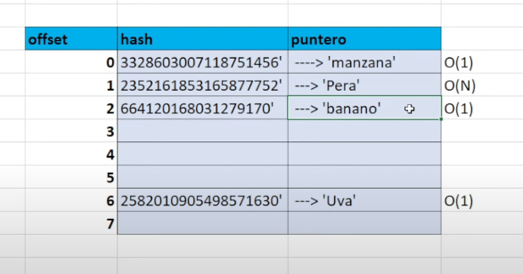

# Tipos de datos ll


> *Repositorio*: [python_desde_cero_2024](https://github.com/Duz-Dev/python_desde_cero_2024) - fecha de edición: 01/01/2025

<!-- TOC -->

- [Tipos de datos ll](#tipos-de-datos-ll)
  - [Introducción](#introducción)
  - [Strings](#strings)
    - [Concatenación](#concatenación)
    - [Formateo de Texto](#formateo-de-texto)
    - [Métodos de Strings](#métodos-de-strings)
    - [Detalles y usos](#detalles-y-usos)
    - [Caracteres especiales](#caracteres-especiales)
    - [Funcionalidades útiles](#funcionalidades-útiles)
    - [Consejos prácticos](#consejos-prácticos)
  - [Enteros (int) y Flotantes (float)](#enteros-int-y-flotantes-float)
    - [Métodos](#métodos)
    - [Detalles y usos](#detalles-y-usos-1)
    - [Funciones Matemáticas del Módulo `math`](#funciones-matemáticas-del-módulo-math)
    - [Redondeo de Valores](#redondeo-de-valores)
    - [Modulo decimal](#modulo-decimal)
      - [Redondeo Explícito](#redondeo-explícito)
      - [Ejemplo: Cálculo Financiero](#ejemplo-cálculo-financiero)
  - [Listas en Python](#listas-en-python)
    - [Creación y Acceso](#creación-y-acceso)
    - [Métodos](#métodos-1)
    - [Ejemplos](#ejemplos)
    - [Detalles y usos](#detalles-y-usos-2)
    - [Compresión de listas](#compresión-de-listas)
  - [Sets (Conjuntos)](#sets-conjuntos)
    - [Definición](#definición)
      - [Características](#características)
      - [Sintaxis](#sintaxis)
    - [Operaciones comunes](#operaciones-comunes)
    - ["hasheable" y HashTable](#hasheable-y-hashtable)
      - [Visualización conceptual de la tabla hash](#visualización-conceptual-de-la-tabla-hash)
  - [FrozenSets (Conjuntos inmutables)](#frozensets-conjuntos-inmutables)
    - [Definición](#definición-1)
      - [Características principales](#características-principales)
      - [Ejemplo práctico](#ejemplo-práctico)
      - [Diferencias entre `set` y `frozenset`](#diferencias-entre-set-y-frozenset)
  - [Diccionarios](#diccionarios)
    - [Definición](#definición-2)
    - [Características principales](#características-principales-1)
    - [Operaciones comunes](#operaciones-comunes-1)
    - [Metodos adicionales](#metodos-adicionales)
    - [Diccionarios en ciclo For](#diccionarios-en-ciclo-for)
    - [Compresión de diccionarios](#compresión-de-diccionarios)
    - [Funciones adiccionales](#funciones-adiccionales)

<!-- /TOC -->

## Introducción

Si recordamos lo de la parte numero uno sobre los tipos de datos, sabemos que en programación, un dato es cualquier información que puede ser procesada por un programa. En Python, existen varios tipos de datos básicos que se utilizan con frecuencia, tales como enteros, flotantes, cadenas de texto (strings), listas, tuplas y diccionarios. Cada uno de estos tipos de datos tiene sus propias características y usos específicos.

En Python, todo es un objeto. Esto significa que cada dato tiene asociado una serie de métodos que se pueden utilizar para manipular y operar sobre él. Esta característica es fundamental en Python, ya que permite un manejo más intuitivo y flexible de los datos.

A partir de a qui profundizaremos en cada uno de los tipos de datos que tenemos con mayor utilización en python, métodos, funciones, curiosidades, entre otras cosas, pero es necesario recordar y tener en mano las siguientes funciones: `type` , `isinstance` y `dir`.

La función `type` se utiliza para determinar el tipo de dato de un objeto. Por ejemplo:

```python
print(isinstance(x, int))  # True
print(isinstance(x, float))  # False
```

Todo objeto en python tiene métodos. Un método es básicamente una función encapsulada dentro de la clase. Esto es util porque puede ayudarnos a modificar el objeto. Gran parte de este apunte se basa en poder modificar los tipos de datos de python mas usado.
Si quisiéramos saber cuales métodos tiene alguna clase y por ende un objeto, podemos utilizar la función `dir`

La función `dir` se utiliza para listar todos los atributos y métodos disponibles de un objeto. Esto es útil para explorar qué operaciones se pueden realizar sobre un objeto específico.

```python
x = "hello"
print(dir(x))
```

Al ejecutar esto veremos todos los métodos del tipo de dato que le pasamos a la función. En este caso la variable `x` contiene texto y por ende es un string.

## Strings

Las cadenas de texto (strings) son uno de los tipos de datos más comunes y útiles en Python. Los strings se utilizan para almacenar y manipular texto. En Python, los strings son objetos inmutables, lo que significa que no pueden cambiar después de su creación.

### Concatenación

La concatenación es el proceso de unir dos o más strings en uno solo. Esto se puede hacer utilizando el operador `+`.

```python
str1 = "Hola"
str2 = "Mundo"
result = str1 + " " + str2
print(result)  # Hola Mundo
```

### Formateo de Texto

Python ofrece varias formas de formatear strings. Uno de los métodos más utilizados es el método `format`.

```python
nombre = "Juan"
edad = 25
mensaje = "Me llamo {} y tengo {} años.".format(nombre, edad)
print(mensaje)
```

Otra forma moderna de formateo es utilizando f-strings (a partir de Python 3.6).

```python
nombre = "Juan"
edad = 25
mensaje = f"Me llamo {nombre} y tengo {edad} años."
print(mensaje)
```

### Métodos de Strings

1. **`upper`**: Convierte todos los caracteres de la cadena a mayúsculas.

```python
s = "hola"
print(s.upper())  # HOLA
```

2. **`lower`**: Convierte todos los caracteres de la cadena a minúsculas.

```python
s = "HOLA"
print(s.lower())  # hola
```

3. **`capitalize`**: Convierte el primer carácter de la cadena a mayúscula y el resto a minúsculas.

```python
s = "hola mundo"
print(s.capitalize())  # Hola mundo
```

4. **`title`**: Convierte el primer carácter de cada palabra a mayúscula.

```python
s = "hola mundo"
print(s.title())  # Hola Mundo
```

5. **`strip`**: Elimina los espacios en blanco al principio y al final de la cadena.

```python
s = "  hola  "
print(s.strip())  # "hola"
```

6. **`replace`**: Reemplaza una subcadena por otra.

```python
s = "hola mundo"
print(s.replace("mundo", "Python"))  # hola Python
```

7. **`find`**: Devuelve el índice de la primera aparición de una subcadena. Si no se encuentra, devuelve -1.

```python
s = "hola mundo"
print(s.find("mundo"))  # 5
```

Esta ultima puede llegar a ser util ya que nos ayuda a confirmar si existen cadenas o fragmentos de texto dentro de un string. En el caso anterior hay que tener en cuenta que si no se hubiera teniendo en cuenta las mayúsculas, ejemplo:

```python
s = "hola mundo"
print(s.find("Mundo")) # -1
```

En este ecenario daria un -1 ya que la subcadena "Mundo" no existe, a no ser que la letra 'm' sea minúscula.

8. **`split`**:  divide una cadena en varias subcadenas basándose en un delimitador. Por defecto, el delimitador es cualquier espacio en blanco (espacios, tabulaciones, saltos de línea, etc.). El resultado es una lista que contiene cada fragmento como un elemento.

```python
#Sintaxis basica
str.split(sep=None, maxsplit=-1)
```

   Parámetros:
   sep (opcional):
   El delimitador que se usará para dividir la cadena. Si no se especifica, se usarán espacios en blanco.

   Si el delimitador es una cadena vacía (""), se lanza un error.
   maxsplit (opcional):
   Especifica cuántas divisiones se deben realizar como máximo. El valor predeterminado es -1, lo que significa "sin límite" (divide todo lo que pueda).

```python
#Ejemplo 1
cadena = "Hola mundo Python"
resultado = cadena.split()
print(resultado)
# Salida: ['Hola', 'mundo', 'Python']

#Ejemplo 2
cadena = "uno-dos-tres-cuatro"
resultado = cadena.split("-", maxsplit=2)
print(resultado)
# Salida: ['uno', 'dos', 'tres-cuatro']
```

### Detalles y usos

- **inmutabilidad**: Los strings en Python son inmutables. Esto significa que cualquier operación que modifique un string crea una nueva cadena en lugar de modificar la original.
Ejemplo:

```python
s = "HOLA"
print(s.lower())  # hola
print(s) # HOLA
```

Aunque le aplicamos el método `lower()` nuestro string se seguirá viendo como originalmente lo creamos. Esto es debido a la inmutabilidad y este comportamiento sucede en los tipos de datos simples en python.

- **Iteración**: Los strings pueden ser iterados carácter por carácter usando un bucle `for`.

- **Extracción**: Se trata de sacar fuera de una cadena, una porción de la misma según su posición dentro de ella. Para lo cual es necesario indicar la posición a extraer.

```python
s = "Python"
print(s[0])  # P
print(s[1])  # y
print(s[-1])  # n
print(s[2:4]) #tho
```

- **Manipulación de input**: También es posible aplicar los cambios que vimos sobre los strings a funciones que devuelvan este valor. Un ejemplo claro de este es la función `input`. Este por defecto le pide un dato al usuario y en automático python lo toma como un str, y por ende podemos manipularlo como uno.

```python
#!Ejemplo 1
saludo = input("primera frase: ") + input("segunda frase:")
print(saludo)

#!Ejemplo 2
text_lower = input("intresa un mensaje: ").lower()
print(text_lower)
```

### Caracteres especiales

Los caracteres especiales (o tambien llamados secuencias de escape) comienzan con una barra invertida (`\`) y se utilizan para representar caracteres que de otro modo no podrías incluir directamente. Aquí hay algunos de los más comunes:

1. **Salto de línea (`\n`)**  
   Inserta una nueva línea en la cadena.  

   ```python
   print("Hola\nMundo")
   # Salida:
   # Hola
   # Mundo
   ```

2. **Tabulación (`\t`)**  
   Inserta un tabulador horizontal. Es útil para dar formato a salidas.

   ```python
   print("Nombre\tEdad\tCiudad")
   print("Ana\t25\tMonterrey")
   # Salida:
   # Nombre Edad Ciudad
   # Ana  25 Monterrey
   ```

3. **Barra invertida (`\\`)**  
   Permite incluir una barra invertida literal en la cadena.

   ```python
   print("Carpeta: C:\\Usuarios\\Pablos")
   # Salida: Carpeta: C:\Usuarios\Pablos
   ```

4. **Comillas simples o dobles (`\'` o `\"`)**  
   Permiten usar comillas dentro de una cadena sin terminarla accidentalmente.

   ```python
   print("Ella dijo: \"Hola, ¿cómo estás?\"")
   print('Es una comilla simple: \' ')
   # Salida:
   # Ella dijo: "Hola, ¿cómo estás?"
   # Es una comilla simple: '
   ```

5. **Carácter Unicode (`\u` o `\U` o `\N`)**  
   Representa caracteres Unicode. Es útil para trabajar con símbolos y caracteres de otros alfabetos.

   ```python
   print("\u2602")  # ☂ (paraguas)
   print("\U0001F600")  # 😀 (emoji de cara feliz)
   ```

6. **Carácter nulo (`\0`)**  
   Representa un carácter nulo (usado en programación de bajo nivel). No suele ser visible en las salidas.

   ```python
   print("Hola\0Mundo")
   ```

7. **Retroceso (`\b`)**  
   Elimina el último carácter visible.

   ```python
   print("Hola\b Mundo")
   # Salida: Hol Mundo
   ```

8. **Retorno de carro (`\r`)**  
   Mueve el cursor al inicio de la línea actual, sobrescribiendo el texto.

   ```python
   print("Hola\rMundo")
   # Salida: Mundo
   ```

Si necesitas usar muchas secuencias de escape en una cadena y no quieres que se interpreten, puedes usar un prefijo `r` antes de la cadena. Esto es muy común para trabajar con rutas en sistemas Windows o **expresiones regulares**.  

Ejemplo:

```python
ruta = r"C:\nueva\carpeta\archivo.txt"
print(ruta)
# Salida: C:\nueva\carpeta\archivo.txt
```

### Funcionalidades útiles

Aunque ya he mencionado lo mas relevante de los strings dentro de este lenguaje es importante saber que existen de forma nativa otras características. Ejemplo, para saber el largo de un string, podemos usar un ciclo for como ya mencionamos:

```python
for letter in "Texto"
print(letter,end =" ")
#salida: T e x t o
```

Y para saber el largo del propio string podemos utilizar la función `len()`.

```python
print(len("Texto")) # Salida: 5
```

A continuación mostrare unas cuantas igual de útiles:

1. **Métodos avanzados de manipulación**
   - **`str.zfill(width)`**: Rellena una cadena con ceros a la izquierda hasta alcanzar el ancho especificado.

     ```python
     print("42".zfill(5))
     # Salida: 00042
     ```

   - **`str.partition(sep)`**: Divide una cadena en tres partes: antes del separador, el separador y después.

     ```python
     print("correo@gmail.com".partition("@"))
     # Salida: ('correo', '@', 'gmail.com')
     ```

2. **Codificación y decodificación (`encode` y `decode`)**  
   Puedes convertir cadenas a bytes o trabajar con diferentes esquemas de codificación como UTF-8.

   ```python
   texto = "Hola"
   codificado = texto.encode("utf-8")
   print(codificado)  # b'Hola'
   print(codificado.decode("utf-8"))  # Hola
   ```

3. **Transformaciones útiles**
   - **`str.translate()`** con mapas de traducción: Útil para reemplazar caracteres según un diccionario.
   - **`str.expandtabs(tabsize)`**: Ajusta el tamaño de las tabulaciones en una cadena.

   ```python
   print("Nombre\tEdad".expandtabs(10))
   # Salida: Nombre    Edad
   ```

4. **Detectar caracteres específicos**  
   Métodos como `isalpha()`, `isdigit()`, `isspace()` permiten verificar el contenido de una cadena.

   ```python
   print("12345".isdigit())  # True
   print("abc".isalpha())    # True
   ```

5. **Repetición y alineación**
   - Multiplicación de cadenas:

     ```python
     print("-" * 20)
     # Salida: --------------------
     ```

   - Alineación:

     ```python
     print("Título".center(20, "-"))
     # Salida: -------Título-------
     ```

### Consejos prácticos

1. **Manejo de texto largo**  
   Usa cadenas multilínea (`""" o '''`) para definir textos extensos o documentos.  

   ```python
   texto_largo = """
   Este es un texto
   que ocupa varias
   líneas.
   """
   ```

2. **Combinar secuencias de escape con raw strings**  
   Si necesitas manejar rutas que incluyan saltos de línea reales, usa una combinación de `r` con secuencias explícitas:

   ```python
   ruta = r"C:\nueva\carpeta" + "\narchivo.txt"
   print(ruta)
   # Salida: C:\nueva\carpeta
   #         archivo.txt
   ```

3. **Cadenas vacías y evaluación lógica**  
   Las cadenas vacías (`""`) evalúan como `False` en un contexto lógico. Puedes usarlas para verificaciones rápidas:

   ```python
   if not cadena:
       print("La cadena está vacía.")
   ```

   Esta ultima es una forma pythonica y fácil de implementar cuando queramos hacer validaciones en nuestros programas. Asi que no la olvides.

## Enteros (int) y Flotantes (float)

Un entero es un número sin decimales. Puede ser positivo, negativo o cero. Los enteros en Python tienen una precisión ilimitada, lo que significa que pueden ser tan grandes o pequeños como lo permita la memoria disponible.
Los enteros se utilizan en una amplia variedad de contextos, desde contar elementos en una lista hasta realizar operaciones matemáticas complejas.

```python
a = 5
b = 3
suma = a + b  # 8
resta = a - b  # 2
multiplicacion = a * b  # 15
division_entera = a // b  # 1
modulo = a % b  # 2
```

Un número de punto flotante es un número que contiene una parte decimal. Los `float` se utilizan para representar números no enteros, permitiendo una mayor precisión en los cálculos.

Para declarar un `float`, se incluye un punto decimal.

```python
x = 10.5
y = -3.14
z = 0.0
```

Los números de punto flotante son esenciales en aplicaciones científicas, financieras y de ingeniería donde se necesita precisión decimal.

```python
a = 5.5
b = 2.2
suma = a + b  # 7.7
resta = a - b  # 3.3
multiplicacion = a * b  # 12.1
division = a / b  # 2.5
```

### Métodos

Ambos tipos de datos numéricos (`int` y `float`) soportan una variedad de operaciones y funciones matemáticas que se pueden utilizar para manipular y operar con números.

1. **Conversión entre `int` y `float`**: Puedes convertir entre estos tipos de datos utilizando las funciones `int()` y `float()`.

```python
x = 10
y = 10.5
x_float = float(x)  # 10.0
y_int = int(y)  # 10
```

2. **Redondeo**: El método `round()` redondea un número de punto flotante a un número específico de decimales.

```python
a = 5.5678
print(round(a, 2))  # 5.57
```

3. **Valor absoluto**: La función `abs()` devuelve el valor absoluto de un número.

```python
a = -5
b = -3.14
print(abs(a))  # 5
print(abs(b))  # 3.14
```

4. **Potencia**: La función `pow()` o el operador `**` se utiliza para elevar un número a una potencia.

```python
a = 2
b = 3
print(pow(a, b))  # 8
print(a ** b)  # 8
```

### Detalles y usos

- **Precisión de `float`**: Los números de punto flotante pueden tener problemas de precisión debido a cómo se representan internamente en el hardware. Esto puede llevar a resultados inesperados en algunos cálculos.

```python
a = 0.1 + 0.2
print(a == 0.3)  # False
print(a)  # 0.30000000000000004
```

Descuida, este es un problema clásico y que sucede en casi todos los lenguajes de programación, y es inevitable. El tema es aun mas extenso de lo que crees porque involucra mucho el tema de como se gestionan los números en nuestros ordenadores. Te recomiendo visitar el siguiente [enlace](http://puntoflotante.org/).

- **Operaciones entre `int` y `float`**: Cuando se realizan operaciones entre estos dos tipos, el resultado será un `float`.

```python
a = 5
b = 2.0
c = a + b
print(type(c))  # <class 'float'>
```

### Funciones Matemáticas del Módulo `math`

Estaba dudando si hablar sobre esto aun sin tocar el tema de módulos en python, pero veo aun asi conveniente mostrarte que existen herramientas fuera de lo que ofrece inicialmente python que nos ayudan para resolver problemas, en este caso, problemas matemáticos.

El módulo `math` en Python proporciona una variedad de funciones matemáticas adicionales que pueden ser útiles al trabajar con números. Para trabajar con este o cualquier modulo usamos la palabra `import` y seguido de este el nombre de dicho modulo, en este caso se llama `math`. Este proporciona una variedad de funciones matemáticas adicionales que pueden ser útiles al trabajar con números.

```python
import math

# Raíz cuadrada
print(math.sqrt(16))  # 4.0

# Logaritmo natural
print(math.log(2.7183))  # 0.999896315728952

# Logaritmo base 10
print(math.log10(100))  # 2.0

# Valor del número pi
print(math.pi)  # 3.141592653589793

# Exponencial (e^x)
print(math.exp(2))  # 7.38905609893065
```

### Redondeo de Valores

- El método `round()` redondea un número de punto flotante a un número específico de decimales. Este es el método más directo para redondear números.

```python
a = 5.5678
print(round(a, 2))  # 5.57
```

- La función `format()` permite dar formato a los números de punto flotante, limitando la cantidad de decimales mostrados.

```python
a = 5.5678
print(format(a, '.2f'))  # 5.57
```

- Las f-strings en Python 3.6+ proporcionan una forma conveniente y legible de dar formato a los números.

```python
a = 5.5678
print(f"{a:.2f}")  # 5.57
```

- El método `str.format()` también permite formatear números de punto flotante de manera similar a las f-strings.

```python
a = 5.5678
print("{:.2f}".format(a))  # 5.57
```

- El módulo `math` también proporciona funciones para redondear hacia abajo (`math.floor()`) y hacia arriba (`math.ceil()`).

```python
import math

a = 5.5678
print(math.floor(a))  # 5
print(math.ceil(a))  # 6
```

- La función `divmod()` devuelve una tupla que contiene el cociente y el resto al dividir dos números.

```python
a = 10
b = 3
print(divmod(a, b))  # (3, 1)
```

- Redondeo a Dos Decimales

```python
a = 5.5678
print(round(a, 2))  # 5.57
print(f"{a:.2f}")  # 5.57
print("{:.2f}".format(a))  # 5.57
print(format(a, '.2f'))  # 5.57
```

### Modulo decimal

Para manejar decimales y no perder precisión en Python, especialmente en cálculos financieros o científicos, es importante seguir algunas mejores prácticas. Aquí te detallo algunas de las más importantes:

El módulo `decimal` en Python proporciona soporte para aritmética decimal de precisión fija. A diferencia del tipo `float`, que puede introducir errores de redondeo debido a su representación en punto flotante binario, el tipo `Decimal` permite un control preciso sobre el número de dígitos decimales.

```python
from decimal import Decimal, getcontext

# Establecer el contexto de precisión
getcontext().prec = 10

# Crear números decimales
a = Decimal('0.1')
b = Decimal('0.2')

# Realizar cálculos con alta precisión
c = a + b
print(c)  # 0.3
```

Los números de punto flotante (`float`) son adecuados para cálculos donde la precisión no es crítica, pero no son recomendables para cálculos financieros debido a su posible pérdida de precisión.
Utilizar el contexto de `decimal` para establecer la precisión necesaria para tus cálculos.

```python
from decimal import Decimal, getcontext

# Establecer precisión global
getcontext().prec = 10

# Ejemplo de cálculo preciso
result = Decimal('1.123456789') + Decimal('2.987654321')
print(result)  # 4.111111110
```

#### Redondeo Explícito

Cuando sea necesario redondear números, hazlo explícitamente usando los métodos disponibles en `Decimal`.

```python
from decimal import Decimal, ROUND_HALF_UP

# Redondear a dos decimales
number = Decimal('2.34567')
rounded_number = number.quantize(Decimal('0.01'), rounding=ROUND_HALF_UP)
print(rounded_number)  # 2.35
```

Al mostrar números en tu aplicación, utiliza formateo de salida para asegurarte de que los números se muestren con la precisión adecuada.

```python
value = Decimal('123.456789')
print(f"{value:.2f}")  # 123.46
```

#### Ejemplo: Cálculo Financiero

Aquí tienes un ejemplo completo de cómo utilizar el módulo `decimal` para realizar cálculos financieros precisos:

```python
from decimal import Decimal, getcontext, ROUND_HALF_UP

# Establecer precisión global
getcontext().prec = 10

# Crear valores decimales
precio_producto = Decimal('19.99')
cantidad = Decimal('3')
descuento = Decimal('0.10')  # 10% de descuento

# Calcular el total sin descuento
total_sin_descuento = precio_producto * cantidad

# Calcular el total con descuento
total_descuento = total_sin_descuento * descuento
total_con_descuento = total_sin_descuento - total_descuento

# Redondear el resultado final
total_con_descuento = total_con_descuento.quantize(Decimal('0.01'), rounding=ROUND_HALF_UP)

print(f"Total con descuento: {total_con_descuento}")  # Total con descuento: 53.97
```

En si, existen muchos mas módulos creados por terceros para el manejo de números, ya que este problema es inevitable en todos los lenguajes de programación debido a la naturaleza del punto decimal.

## Listas en Python

Las listas son uno de los tipos de datos más versátiles y utilizados en Python. Permiten almacenar colecciones ordenadas de elementos y ofrecen una gran variedad de métodos para manipular y acceder a sus elementos.

Una lista en Python es una colección ordenada y mutable de elementos, que pueden ser de diferentes tipos. Las listas se definen usando corchetes (`[]`) y los elementos se separan por comas.

```python
# Ejemplo de lista en Python
mi_lista = [1, 2, 3, 4, 5]
```

### Creación y Acceso

Las listas se pueden crear de diversas formas y permiten acceder a sus elementos mediante índices.

```python
# Crear una lista vacía
lista_vacia = []

# Crear una lista con elementos
frutas = ["manzana", "banana", "cereza"]

# Acceder a elementos de la lista
print(frutas[0])  # Output: manzana
print(frutas[1])  # Output: banana
```

### Métodos

Las listas en Python vienen con una serie de métodos incorporados que facilitan su manipulación:

- **append()**: Añade un elemento al final de la lista.
- **extend()**: Añade múltiples elementos al final de la lista.
- **insert()**: Inserta un elemento en una posición específica.
- **remove()**: Elimina la primera aparición de un elemento.
- **pop()**: Elimina y devuelve el último elemento (o un elemento específico).
- **clear()**: Elimina todos los elementos de la lista.
- **index()**: Devuelve el índice de la primera aparición de un elemento.
- **count()**: Cuenta cuántas veces aparece un elemento en la lista.
- **sort()**: Ordena la lista en orden ascendente.
- **reverse()**: Invierte el orden de los elementos en la lista.
- **copy()**: Devuelve una copia superficial de la lista.

### Ejemplos

```python
# Añadir elementos a la lista
frutas.append("naranja")
print(frutas)  # Output: ['manzana', 'banana', 'cereza', 'naranja']

# Extender la lista con múltiples elementos
frutas.extend(["kiwi", "mango"])
print(frutas)  # Output: ['manzana', 'banana', 'cereza', 'naranja', 'kiwi', 'mango']

# Insertar un elemento en una posición específica
frutas.insert(1, "fresa")
print(frutas)  # Output: ['manzana', 'fresa', 'banana', 'cereza', 'naranja', 'kiwi', 'mango']

# Eliminar un elemento de la lista
frutas.remove("cereza")
print(frutas)  # Output: ['manzana', 'fresa', 'banana', 'naranja', 'kiwi', 'mango']

# Eliminar y devolver el último elemento de la lista
ultimo = frutas.pop()
print(ultimo)  # Output: mango
print(frutas)  # Output: ['manzana', 'fresa', 'banana', 'naranja', 'kiwi']

# Ordenar la lista
frutas.sort()
print(frutas)  # Output: ['banana', 'fresa', 'kiwi', 'manzana', 'naranja']

# Invertir el orden de la lista
frutas.reverse()
print(frutas)  # Output: ['naranja', 'manzana', 'kiwi', 'fresa', 'banana']
```

### Detalles y usos

- **Mutabilidad**: Las listas son mutables, lo que significa que sus elementos pueden ser modificados después de su creación.
- **Tipos Mixtos**: Las listas pueden contener elementos de diferentes tipos, aunque generalmente se usa un solo tipo para mantener la coherencia.
- **Listas Anidadas**: Las listas pueden contener otras listas, lo que permite crear estructuras complejas.

```python
# Lista con elementos de diferentes tipos
mixta = [1, "hola", 3.14, True]

# Lista anidada
anidada = [[1, 2, 3], [4, 5, 6], [7, 8, 9]]
print(anidada[1][2])  # Output: 6
```

- **Slicing**: Las listas soportan slicing, lo que permite acceder a subpartes de la lista.

```python
# Slicing de lista
sublista = frutas[1:3]
print(sublista)  # Output: ['fresa', 'kiwi']
```

### Compresión de listas

La **compresión de listas** es una manera concisa y elegante de crear listas en Python. Consiste en usar una expresión dentro de corchetes que genera elementos basados en iterables, a menudo con condiciones adicionales. Es muy útil para reemplazar bucles `for` simples y hacer que el código sea más compacto y legible.

Sintaxis:

```python
[expresión for elemento in iterable if condición]
```

- **`expresión`**: Lo que quieres añadir a la lista (puede ser el elemento mismo o una transformación de este).
- **`for elemento in iterable`**: Recorre cada elemento del iterable (como una lista, rango, etc.).
- **`if condición`** *(opcional)*: Añade el elemento a la lista solo si cumple esta condición.

**Ejemplo 1: Crear una lista con cuadrados de números**
Queremos generar una lista con los cuadrados de los números del 1 al 5:

```python
# Sin comprensión de listas
cuadrados = []
for i in range(1, 6):
    cuadrados.append(i ** 2)

# Con comprensión de listas
cuadrados_compresion = [i ** 2 for i in range(1, 6)]

print(cuadrados)             # [1, 4, 9, 16, 25]
print(cuadrados_ñ)  # [1, 4, 9, 16, 25]
```

**Explicación del código**:

- **Expresión**: `i ** 2` → Estamos calculando el cuadrado de cada número.
- **Iterable**: `range(1, 6)` → Generamos los números del 1 al 5.
- **Condición**: No hay, así que se incluye cada número.

**Ejemplo 2: Filtrar números pares**
Supongamos que queremos obtener los números pares del 1 al 10 en una lista:

```python
# Sin comprensión de listas
pares = []
for i in range(1, 11):
    if i % 2 == 0:
        pares.append(i)

# Con comprensión de listas
pares_compresion = [i for i in range(1, 11) if i % 2 == 0]

print(pares)             # [2, 4, 6, 8, 10]
print(pares_compresion)  # [2, 4, 6, 8, 10]
```

**Explicación del código**:

- **Expresión**: `i` → Incluimos el número como está.
- **Iterable**: `range(1, 11)` → Generamos los números del 1 al 10.
- **Condición**: `if i % 2 == 0` → Solo añadimos los números que son pares.

## Sets (Conjuntos)

Imagina que estás organizando una fiesta y tienes una lista de invitados. Algunos nombres están duplicados por error, pero quieres asegurarte de que cada persona esté registrada una sola vez. Un **set** en Python es ideal para solucionar esto, ya que elimina los duplicados automáticamente.

Un **set** en Python es como una "caja mágica" donde puedes guardar elementos únicos. Si intentas agregar algo que ya está en el set, simplemente no se añade. Es como un equipo deportivo donde no puede haber dos jugadores con el mismo número.

Por ejemplo:

```python
invitados = {"Ana", "Pedro", "Juan", "Ana", "Pedro"}
print(invitados)  # Salida: {'Ana', 'Pedro', 'Juan'}
```

Un set elimina automáticamente los elementos duplicados, y no le importa el orden en que agregaste las cosas.

### Definición

Un **set** es una estructura de datos en Python que implementa un conjunto matemático: un grupo no ordenado de elementos únicos. Los sets están diseñados para operaciones rápidas de pertenencia (`in`) y para eliminar duplicados.

#### Características

1. **Elementos únicos**: No permite elementos duplicados.
2. **No ordenado**: Los elementos no tienen un índice o un orden predecible.
3. **Mutable**: Puedes agregar o eliminar elementos del set después de su creación.
4. **Operaciones matemáticas**: Admite operaciones como intersección, unión y diferencia, útiles para resolver problemas de conjuntos.

#### Sintaxis

- Crear un set vacío:

  ```python
  mi_set = set()
  ```

- Crear un set con elementos:

  ```python
  frutas = {"manzana", "plátano", "cereza"}
  ```

Observación. Como veras, no podemos crear un set vacio usando `{}` (ejemplo = { } ), porque esta forma esta reservada para otro tipo de dato que vermeos mas adelante.

El operador mas util para este tipo de dato es el operador de pertenencia `in` y `not in` ya que de forma tan simple podemos coraborar si un elemento existe en un conjunto.

Un ejemplo seria en un caso donde queramos verificar si un nombre esta en un conjunto, podriamos hacerlo de la siguiente forma:

```python
aprobados = {"Ana", "Luis", "Sofía", "Carlos"}

esta_juan = "juan" in aprobados

print(esta_juan) # Salida: False
```

Ahora que conocemos lo basico de los sets, veremos unas cuantos puntos a repasar.

### Operaciones comunes

1. **Agregar elementos**:

   ```python
   frutas.add("pera")
   ```

   Cuando añadimos un elemento a un set recuerda que el orden los elementos no siempre sera el mismo, no como las listas si que mantienen un orden. Esto tiene un gran potencial ya que algoritmicamente permite hacer busquedas mas rapidas debido al mecanismo que hay por detras de un set (gracias a la hashtable).

2. **Eliminar elementos**:
   - `remove()`: Elimina un elemento y lanza error si no existe.
   - `discard()`: Elimina un elemento, pero no lanza error si no existe, y retorna el valor de `None`.

   ```python
   frutas.remove("manzana")
   frutas.discard("naranja")
   ```

3. **Operaciones de conjuntos**:
   - Unión (`|`): Combina dos sets. Es el equivalente matemático de "A ∪ B".
   - Intersección (`&`): Encuentra elementos comunes. Es el equivalente matemático de "A ∩ B".
   - Diferencia (`-`): Devuelve un conjunto con los elementos que están en el primer conjunto pero **no** en el segundo. Es el equivalente matemático de "A − B".
   - Diferencia simétrica (`^`): Devuelve un conjunto con los elementos que están en **uno u otro conjunto, pero no en ambos**. Es el equivalente matemático de "(A ∪ B) − (A ∩ B)".

   ```python
   A = {1, 2, 3}
   B = {3, 4, 5}

   print(A | B)  # {1, 2, 3, 4, 5} (Unión)
   print(A & B)  # {3} (Intersección)
   print(A - B)  # {1, 2} (Diferencia)
   print(A ^ B)  # {1, 2, 4, 5} (Diferencia simetrica)
   ```

   El operador de Diferencia tal vez sea el mas confuso, pero es simple de entender. Este operador elimina los elementos del primer conjunto que también están en el segundo y al final nos genera un nuevo conjunto con los valores restantes. En palabras mas simples, creamos un nuevo resultado el cual sera todos los valores del primer conjunto, menos los del segundo conjunto.
  
   Por ejemplo:

   ```python
   C = {1, 2, 3, 4}
   D = {3, 4, 5, 6}

   resultado = C - D
   print(resultado)  # {1, 2}
   ```

   **Explicación paso a paso**:

   1. El conjunto `C` contiene: `{1, 2, 3, 4}`.
   2. El conjunto `D` contiene: `{3, 4, 5, 6}`.
   3. El operador `-` elimina los elementos de `C` que también están en `D` (`3` y `4`), dejando `{1, 2}` como resultado.

   Además de los operadores, los conjuntos tienen métodos equivalentes que cumplen estas mismas funciones:

   - **`union()`**: Igual al operador `|`.  

     ```python
     print(A.union(B))  # {1, 2, 3, 4, 5}
     ```

   - **`intersection()`**: Igual al operador `&`.  

     ```python
     print(A.intersection(B))  # {3}
     ```

   - **`difference()`**: Igual al operador `-`.  

     ```python
     print(A.difference(B))  # {1, 2}
     ```

   - **`symmetric_difference()`**: Igual al operador `^`.  

     ```python
     print(A.symmetric_difference(B))  # {1, 2, 4, 5}
     ```

### "hasheable" y HashTable

Un objeto **hasheable** es aquel que tiene un valor de hash único que no cambia durante su ciclo de vida. Esto permite que Python almacene y busque estos objetos de manera eficiente en estructuras como **sets** y **diccionarios**.

- **Hasheable = inmutable**: La mayoría de los objetos inmutables, como cadenas (`str`), números (`int`, `float`) y tuplas (`tuple`), son hasheables.
- Los objetos mutables, como listas (`list`) o diccionarios (`dict`), **no son hasheables** y no pueden ser usados como elementos de un set o claves de un diccionario.

El valor hash de un objeto se calcula usando la función interna `hash()`. Este valor se utiliza para organizar los datos en memoria de manera eficiente.

```python
print(hash("hola"))  # Salida: un entero único
print(hash((1, 2, 3)))  # Las tuplas son hasheables
print(hash([1, 2, 3]))  # Esto lanza un error porque las listas no son hasheables
```

Los sets dependen de los valores hash para almacenar elementos. Por eso, todos los elementos de un set deben ser hasheables.

**HashTable.**

Un **set** en Python está basado en una estructura de datos llamada **tabla hash** (*hash table*), que permite almacenar elementos de forma eficiente. La tabla hash es una estructura que asocia un valor hash (calculado a partir del contenido de un objeto) con una posición en memoria. Esto permite realizar operaciones como búsquedas, inserciones y eliminaciones con una complejidad promedio de \(O(1)\) (tiempo constante).

Cuando agregas un elemento a un set, Python primero calcula el valor hash del elemento usando la función interna `hash()`. Este valor hash es un entero único que identifica el contenido del elemento de manera eficiente.

Ejemplo:

```python
elemento = "hola"
print(hash(elemento))  # Devuelve un número hash único
```

Con el valor hash calculado, Python determina una posición en la tabla hash donde debe almacenar el elemento. Este proceso usa el **hash modificado por el tamaño de la tabla** para distribuir los elementos uniformemente en la memoria y evitar colisiones.

Ejemplo conceptual:
Supongamos que el valor hash de `"hola"` es `12345` y que el tamaño actual de la tabla es `8`. Python calculará la posición como:

```python
posición = hash("hola") % 8
```

Si el tamaño de la tabla es `8`, la posición sería `12345 % 8 = 1`. Así, el elemento `"hola"` se almacena en la posición `1`.

En caso de que dos elementos tengan el mismo valor hash (una **colisión**), Python usa una técnica llamada **resolución de colisiones por sondeo**. Si la posición calculada ya está ocupada, Python busca la siguiente posición libre en la tabla hash.

Ejemplo:

- Agregas `"hola"` al set, y su posición es `5`.
- Luego agregas otro elemento, `"adiós"`, que también genera el hash `12345`. Como la posición `1` ya está ocupada, Python buscará la siguiente posición disponible (por ejemplo, `2`).

Esto asegura que los elementos se almacenen correctamente aunque haya colisiones.

Cuando intentas agregar un elemento que ya existe en el set, Python compara los hashes del nuevo elemento con los existentes en la tabla hash. Si encuentra un valor hash igual, verifica que el contenido del elemento también sea el mismo (para evitar falsos positivos). Si el contenido coincide, no lo añade, ya que los sets no permiten duplicados.

Si la tabla hash se llena más allá de un cierto límite (generalmente alrededor del 75% de capacidad), Python crea una tabla más grande y vuelve a calcular las posiciones de todos los elementos (un proceso llamado **rehashing**). Esto mantiene el rendimiento constante de las operaciones.

#### Visualización conceptual de la tabla hash

Supongamos que tenemos un set:

```python
mi_set = {'manzana','banano','pera','uva'}
```

Internamente:

1. **Cálculo del hash**:
   - `hash("manzana") = 3328603007118751456`
   - `hash("banano") = 664120168031279170`
   - `hash("pera") = 2352161853165877752`
   - `hash("uva") = 2582010905498571630`
2. **Asignación a la tabla hash**:

<center></center>

El orden se dio haciendo el calculo antes mencionado, en donde se obtiene el hash de cada elemento y se le aplica el modulo por el tamaño de la tabla. Ejemplo

```markdown
3328603007118751456 % 8 = 0

664120168031279170 % 8 = 2

2352161853165877752 % 8 = 0

2582010905498571630 % 8 = 6
```

En este caso sucede una colisión con pera, ya que este nos da el numero 0, pero tenemos ya ocupado dicho puesto. Lo que podriamos hacer es usando el proceso de python es recorrer dicho elemento hasta encontrar un campo sin ocupar aun, en este ejemplo, el primero era manzana y estaba ocupado, se recorre a el siguiente que era 1 pero estaba vacio, asi que toma este puesto.

La complejidad en tiempo es un tema muy importante en cuestion de eficiencia, en este caso gracias a el comportamiento de los set, el grado de complejidad de las busqueda de los elementos que no tuvieron colision se cataloga como "0(1)". En caso de un elemento que tuvo colisión su grado seria posiblemente "0(N)", ya que existe la posibilidad de que "pera" este al ultimo de la tabla y por ende se tendria que recorrer todos los elementos para encontrarla.

Gracias a esto, entendemos que no son ordenados y porque no existen elementos duplicados.

## FrozenSets (Conjuntos inmutables)

Un `frozenset` en Python es como un *set* (conjunto), pero "congelado". Esto significa que, a diferencia de un conjunto normal, un `frozenset` **no puede ser modificado** después de crearse. No puedes agregar, eliminar o alterar elementos en él. Es útil cuando necesitas trabajar con un conjunto de elementos que debe permanecer constante o cuando necesitas usarlo como clave en un diccionario o como elemento dentro de otro conjunto, ya que los `frozensets` son **hasheables**.

Por ejemplo:  

```python
# Crear un frozenset
frutas = frozenset(["manzana", "naranja", "pera"])
print(frutas)  # frozenset({'manzana', 'naranja', 'pera'})

# Intentar modificarlo causará un error
# frutas.add("uva")  # Esto lanza un error: AttributeError
```

### Definición  

Un `frozenset` es una **estructura de datos inmutable** que pertenece a la familia de conjuntos en Python. Se comporta de manera similar a un conjunto ordinario (`set`), pero su principal diferencia es que no admite operaciones que modifiquen su contenido, como `add()`, `remove()` o `update()`.

#### Características principales

1. **Inmutabilidad**: Una vez que se crea, su contenido no puede ser cambiado.
2. **Hasheabilidad**: Al ser inmutable, un `frozenset` es hasheable, lo que significa que puedes usarlo como clave en un diccionario o incluirlo dentro de otros conjuntos. Esto no es posible con un `set` regular, ya que este es mutable.
3. **Operaciones compartidas con conjuntos**: Los `frozensets` aún permiten operaciones como unión, intersección, diferencia y comparación. Sin embargo, estas operaciones devuelven un nuevo `frozenset` en lugar de modificar el existente.

#### Ejemplo práctico

Supongamos que estás modelando un sistema de permisos en el que ciertos usuarios tienen derechos específicos que no deben cambiarse durante la ejecución. Los permisos pueden representarse como un `frozenset`:

```python
# Permisos inmutables
permisos_lectura = frozenset(["leer_documentos", "ver_imagenes"])
permisos_escritura = frozenset(["editar_documentos", "subir_archivos"])

# Combinar permisos sin modificar los originales
permisos_totales = permisos_lectura | permisos_escritura
print(permisos_totales)
# frozenset({'editar_documentos', 'ver_imagenes', 'leer_documentos', 'subir_archivos'})

# Intentar modificar permisos individuales lanza un error
# permisos_lectura.add("borrar_documentos")  # Esto lanza AttributeError
```

#### Diferencias entre `set` y `frozenset`

| **Característica**         | **set**                         | **frozenset**                    |
|----------------------------|---------------------------------|-----------------------------------|
| Mutable                    | Sí                              | No                                |
| Hasheable                  | No                              | Sí                                |
| Usado como clave de dict   | No                              | Sí                                |
| Métodos de modificación    | Sí (`add()`, `remove()`, etc.)  | No (ningún método modificador)   |

---

## Diccionarios

Imagina que estás desarrollando una aplicación de contactos. Tienes nombres de personas, números de teléfono y correos electrónicos. Quieres poder buscar rápidamente la información de cualquier persona con base en su nombre. Usarías un **diccionario** para almacenar esta información de forma eficiente.

Un diccionario en Python te permite asociar claves únicas (en este caso, el nombre de una persona) con valores (su número de teléfono y correo). Esto es útil porque puedes buscar, actualizar o eliminar la información rápidamente.

### Definición

Un **diccionario** en Python es como un diccionario en la vida real: buscas una palabra (clave) y obtienes su definición (valor). En lugar de palabras y definiciones, las claves pueden ser cualquier dato inmutable (como cadenas o números), y los valores pueden ser de cualquier tipo, incluso listas o otros diccionarios.

La base seria esta:

```python
diccionario = {} # Diccionario vacio

diccionario2 = dict() #Diccionario vacio

mi_dict = {
   'clave': 'valor' #añadimos items que se componen de una clave y un valor.
}
```

Por ejemplos:

```python
contactos = {
    "Juan": {"telefono": "123456789", "correo": "juan@mail.com"},
    "Ana": {"telefono": "987654321", "correo": "ana@mail.com"}
}

ventas = {
   0001 : {'productos':['leche', 'huevos', 'tomate'], 'total':240.50},
   0002 : {'productos':['leche', 'cereal', 'lechuga'], 'total':220.50},
   0003 : {'productos':['leche', 'piñata', 'Chocolate'], 'total':302.50}
}

libro = {
   "titulo": "El principito",
   "Autor": "Antoine de Saint-Exupéry",
   "publicacion":1943,
   "precio":340.94,
   "stock": 24,
   "Disponible_venta": False
}

```

Una de las implementaciones mas comunes es igualmente como en los sets y listas es usar los operadores de pertenencia para buscar si un valor o clave esta dentro de esta estructura.

```python
print("titulo" in libro) # Salida: True
print("El principito" in libro) # Salida: False | Ya que al iterar el diccionario directamente solo obtendremos las claves.

print("El principito" in libro.values()) # Salida: False
```

### Características principales

1. **Acceso eficiente**: La búsqueda de valores con base en claves es rápida debido al uso de funciones hash.
2. **Ordenado**: Desde Python 3.7, los diccionarios mantienen el orden de inserción de los elementos.
3. **Mutabilidad**: Los diccionarios pueden modificarse después de su creación, añadiendo, actualizando o eliminando pares clave-valor.

### Operaciones comunes

A modo de ejemplo usare el siguiente diccionario:

```python
libro = {
   "titulo": "El principito",
   "Autor": "Antoine de Saint-Exupéry",
   "publicacion":1943,
   "precio":340.94,
   "stock": 24,
   "Disponible_venta": False
}
```

1. **Acceder a un valor**:
   Esto es muy facil. Previamente debemos saber que valor queremos acceder de todas las claves existentes, en mi caso el titulo, seria de estas formas:

   ```python
   libro["titulo"] #"El principito"
   ```

   Si la clave no existe, genera un error `KeyError`.
   Para evitar esto existe el metodo get:

   ```python
   libro.get("titulo") #"El principito"
   ```

   Si la clave no existe, retorna 'None'.

2. **Añadir y actualizar un elemento**:
      A diferencia de las listas que siempre deben respetar un orden ya que estan enumeradas por un indice, aqui no pasa esto, por lo que si intentas acceder a una clave y asignarle un valor a esta, esto modificara el diccionario y lo añadira al ultimo.

      En caso de que ya exista dicha clave, solamente remplazara el valor viejo por el actualmente asigado.

      ```python
      libro["Estante"] = "Cuentos infantiles" #Añadir elemento

      libro["precio"] = 309.24 #Actualizar valor
      ```

      Toma en cuenta que en caso de escribir una clave erroneamente, esta aun asi se añadira, por lo que una forma corta de verificar esto es usando el operador `in`.

      ```python
      if "stante" in libro:
         libro["stante"] = "valor"
      else:
         print("la clave igresada no existe")
      ```

      Para actualizar datos, igualmente contamos con el metodo `update()` el cual nos ayuda a solo actualizar los datos en caso de que si exista dicha clave previamente y añadir elementos en caso de que no existan.

      ```python
      libro = {"titulo": "Python", "precio": 299.99}
      actualizaciones = {"precio": 309.24, "autor": "John Doe"}

      libro.update(actualizaciones)

      print(libro)
      # Salida: {'titulo': 'Python', 'precio': 309.24, 'autor': 'John Doe'}

      ```

3. **Eliminar un elemento**:
   Este primer ejemplo eliminaria la clave y valor que especifiquemos:

   ```python
   del diccionario["Disponible_venta"]
   ```

   En caso de querer borrar dicho elemento y a la vez que retornemos el valor eliminado, podemos usar el metodo ``pop()``.

   ```python
   diccionario.pop("publicacion") #1943
   ```

### Metodos adicionales

- El método `keys()` devuelve una lista con todas las claves del diccionario.  

   ```python
   mi_diccionario = {"nombre": "Juan", "edad": 30, "ciudad": "Monterrey"}
   print(mi_diccionario.keys())
   # Salida: dict_keys(['nombre', 'edad', 'ciudad'])
   ```

- El método `values()` devuelve una lista de todos los valores del diccionario.  

   ```python
   print(mi_diccionario.values())
   # Salida: dict_values(['Juan', 30, 'Monterrey'])
   ```

- El método `items()` devuelve una vista que contiene tuplas con cada clave y su valor asociado.  

   ```python
   print(mi_diccionario.items())
   # Salida: dict_items([('nombre', 'Juan'), ('edad', 30), ('ciudad', 'Monterrey')])
   ```

- Metodo `len()`. Devuelve el número de pares clave-valor en el diccionario.

   ```python
   print(len(mi_diccionario))  # Salida: 3
   ```

- `popitem()` elimina y devuelve el último par clave-valor.  

   ```python
   print(mi_diccionario.popitem())
   # Salida: "ciudad": "Monterrey"
   ```

- ``clear()` Elimina todo el contenido del diccionario.

   ```python
   mi_diccionario.clear()
   print(mi_diccionario) # Salida: {}
   ```

### Diccionarios en ciclo For

Recordemos que El ciclo for en Python itera sobre cualquier objeto iterable, es decir, estructuras de datos o elementos que pueden devolver sus valores uno por uno en un orden definido. Ejemplos de estos ya vimos como un String, una lista y ahora incluso podemos hacerlo con los sets y diccionarios.

A continuación te mostrare 3 ejemplos de uso:

**Ejercicio 1: Mostrar claves y comprobar su existencia.**

**Problema:** Tienes un diccionario que representa los ingredientes de una receta. Necesitas imprimir los nombres de los ingredientes y verificar si un ingrediente específico está en el diccionario.

```python
ingredientes = {"harina": 500, "azúcar": 200, "mantequilla": 100}

for ingrediente in ingredientes:
    print(f"Ingrediente: {ingrediente}")

# Verificar si un ingrediente está en el diccionario
if "harina" in ingredientes:
    print("Sí, necesitas harina para la receta.")
```

**Salida esperada:**

```text
Ingrediente: harina
Ingrediente: azúcar
Ingrediente: mantequilla
Sí, necesitas harina para la receta.
```

En este ejercicio podemos comprobar que en este caso nuestra variable itreradora `ingrediente` solo toma el valor de las claves de nuestro diccionario. En caso de querer acceder solo a los valores, podemos aplicar el ejemplo del caso siguiente:

**Ejercicio 2: Sumar los valores de un diccionario.**

**Problema:** Un diccionario representa los puntos obtenidos por jugadores en un juego. Necesitas sumar los puntos totales y mostrarlos.

```python
puntos = {"jugador1": 15, "jugador2": 20, "jugador3": 10}

total_puntos = 0
for valor in puntos.values():
    total_puntos += valor

print(f"Puntos totales: {total_puntos}")
```

**Salida esperada:**

```text
Puntos totales: 45
```

Y si ahora queremos acceder no solo a la clave, sino que tambien a esta misma ajunto con su valor, que hacemos?. Facil, usamos el metodo `items()` y nos brindara una lista que podremos recorrer con dos variables, la primera tomara los valores de las claves y los valores respectivamente.

**Ejercicio 3: Crear un nuevo diccionario basado en datos existentes.**

**Problema:** Tienes un diccionario con los precios de productos y necesitas crear un nuevo diccionario que incluya los precios con impuestos agregados (16%).

```python
precios = {"manzana": 10, "plátano": 12, "naranja": 8}
precios_con_impuestos = {}

for producto, precio in precios.items():
    precios_con_impuestos[producto] = round(precio * 1.16, 2)

print("Precios originales:", precios)
print("Precios con impuestos:", precios_con_impuestos)
```

**Salida esperada:**

```text
Precios originales: {'manzana': 10, 'plátano': 12, 'naranja': 8}
Precios con impuestos: {'manzana': 11.6, 'plátano': 13.92, 'naranja': 9.28}
```

### Compresión de diccionarios

La **compresión de diccionarios** es una forma concisa de crear diccionarios utilizando una sola línea de código. Funciona de manera similar a las listas por comprensión, pero aquí defines claves y valores al mismo tiempo.

Sintaxis:

```python
{clave: valor for elemento in iterable}
```

Supongamos que queremos crear un diccionario que asocia números con sus cuadrados:

```python
cuadrados = {x: x**2 for x in range(1, 6)}
print(cuadrados)
# Salida: {1: 1, 2: 4, 3: 9, 4: 16, 5: 25}
```

También puedes incluir condiciones para filtrar los datos que se incluyen en el diccionario:

```python
pares = {x: x**2 for x in range(1, 11) if x % 2 == 0}
print(pares)
# Salida: {2: 4, 4: 16, 6: 36, 8: 64, 10: 100}
```

Puedes usar la compresión para transformar datos de otro diccionario o iterable.

```python
original = {"a": 1, "b": 2, "c": 3}
invertido = {v: k for k, v in original.items()}
print(invertido)
# Salida: {1: 'a', 2: 'b', 3: 'c'}
```

### Funciones adiccionales

1. **Copiar un diccionario (`copy()`)**

Usa el método `copy()` para copiar un diccionario sin modificar el original.

```python
copia = mi_diccionario.copy()
```

Cuando reasignas un diccionario a otra variable en Python, no estás copiando el contenido del diccionario, sino que ambas variables apuntan al mismo objeto en memoria. Esto significa que cualquier modificación que hagas a través de una variable afectará al mismo diccionario, ya que ambas variables comparten la misma referencia en memoria.

**Cómo funciona este proceso en Python:**

1. **Objetos mutables:**
   - Los diccionarios son **objetos mutables** en Python, lo que significa que puedes cambiar su contenido después de haberlo creado (por ejemplo, añadiendo, modificando o eliminando claves/valores).

2. **Asignación de referencias:**
   - Cuando haces algo como:

     ```python
     dict_original = {"clave": "valor"}
     dict_nuevo = dict_original
     ```

     En este caso, `dict_nuevo` no crea un nuevo diccionario; en lugar de eso, copia la referencia al objeto original en memoria. Esto significa que ambos nombres (`dict_original` y `dict_nuevo`) apuntan al mismo diccionario en memoria.

3. **Modificación:**
   - Como ambos nombres apuntan al mismo diccionario, cualquier cambio realizado a través de uno de los nombres se reflejará en el otro:

     ```python
     dict_original = {"clave": "valor"}
     dict_nuevo = dict_original
     dict_nuevo["clave"] = "nuevo valor"
     print(dict_original)  # {'clave': 'nuevo valor'}
     ```

4. **Identidad del objeto:**
   - Puedes comprobar que las dos variables comparten la misma referencia en memoria usando la función `id()`:

     ```python
     print(id(dict_original))  # Por ejemplo: 140235584866944
     print(id(dict_nuevo))     # Mismo valor: 140235584866944
     ```

**Cómo evitar este comportamiento: Copia de diccionarios:**

Si deseas que las modificaciones en una variable no afecten a la otra, necesitas **crear una copia del diccionario** en lugar de copiar la referencia.

**Método 1: Copia superficial (`copy()`).**

Usa el método `copy()` del diccionario para crear una copia superficial:

```python
dict_original = {"clave": "valor"}
dict_copia = dict_original.copy()

dict_copia["clave"] = "nuevo valor"
print(dict_original)  # {'clave': 'valor'}
```

**Método 2: Copia profunda (`deepcopy()`).**

Si el diccionario contiene estructuras anidadas (por ejemplo, otro diccionario como valor), necesitas usar el módulo `copy` y su función `deepcopy()` para garantizar que todas las referencias internas también se copien:

```python
import copy

dict_original = {"clave": {"subclave": "subvalor"}}
dict_copia = copy.deepcopy(dict_original)

dict_copia["clave"]["subclave"] = "nuevo subvalor"
print(dict_original)  # {'clave': {'subclave': 'subvalor'}}
```

**Unión de diccionarios (`update()`)**
Combina dos diccionarios:

```python
otro_diccionario = {"pais": "México"}
mi_diccionario.update(otro_diccionario)
print(mi_diccionario)
```
