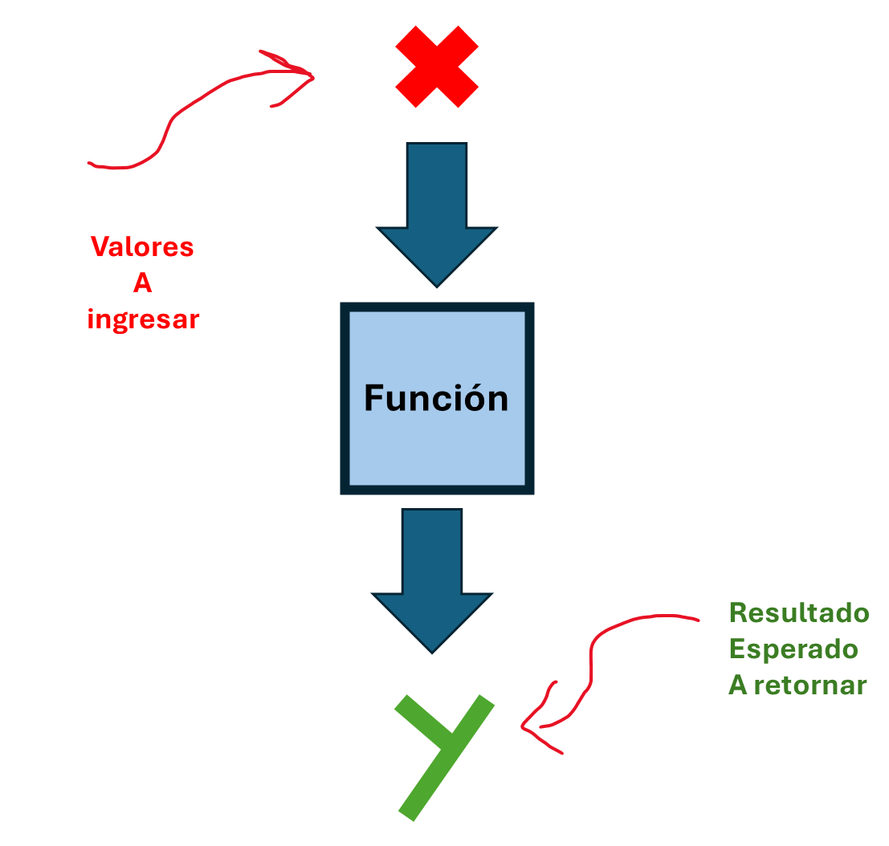
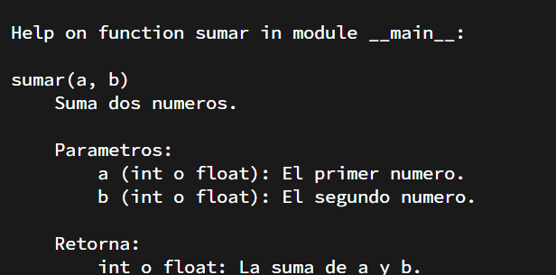
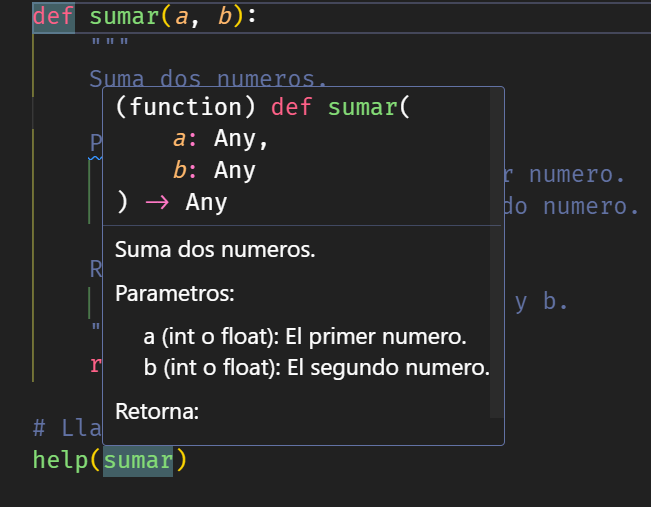
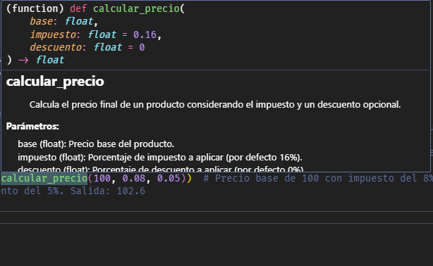

# Funciones


> *Repositorio*: [python_desde_cero_2024](https://github.com/Duz-Dev/python_desde_cero_2024) - fecha de edición: 25/12/2024

<!-- TODO: Añadir indice -->

## Introducción

Imagina que estás desarrollando un sistema para una tienda que calcula el precio total de una compra. Cada cliente tiene diferentes productos y cantidades. Podrías escribir el mismo cálculo una y otra vez, pero esto haría que el código fuera repetitivo, difícil de leer y propenso a errores. Aquí es donde las funciones se vuelven indispensables: nos permiten encapsular lógica reutilizable en una sola parte del programa.

Por ejemplo, queremos calcular el precio total de tres compras diferentes. Sin funciones, tendríamos que escribir esto de manera repetitiva:  

```python
precio1 = 10 * 2  # Producto 1
precio2 = 5 * 3   # Producto 2
precio3 = 20 * 1  # Producto 3
total = precio1 + precio2 + precio3
```

Ahora bien, con una función podemos resolver este problema de forma más clara y eficiente.

En su forma más básica, **una función es un bloque de código que realiza una tarea específica y se puede reutilizar tantas veces como necesites.** Python implementa las funciones de manera sencilla, utilizando la palabra clave `def` para definirías. Cuando llamas a una función, el programa ejecuta el código dentro de ella y te da un resultado (si la función lo tiene).  

**Sintaxis básica de una función:**

```python
def nombre_de_funcion(parametros_opcionales):
    # Código dentro de la función
    return resultado_opcional

nombre_de_funcion() #Llamada a la funcion
```

- `def`: es la palabra reservada para definir funciones.
- `nombre_de_funcion`: Aqui estamos dandole un nombre que haga referencia a la funcionalidad del codigo en cuestion. Se aconseja usar verbos para nombrar tus funciones (ejemplo `obtener_nombre()` ).
- ``Parametro``: Son variables especiales que trabajan solo dentro de la funcion misma. Estas con el objetivo de almacenar un valor externo cuando se llame la funcion. Estos pueden ser opcionales si no requieren.
- `return`: Palabra reservada que indica cual es el resultado final de dicha funcion o en su defecto lo que valdra la funcion cuando sea  'llamada'.
- **Llamada a la funcion**: Este es mas un termino. Se hace alución a el uso explicito de la funcion creda, porque las funciones inicialmente no son ejecutadas hasta ser mencionadas especificamente en el codigo, como una llamada.

Apartir de esto podemos hacer muchas cosas. Es importante mencionar que cada vez que usamos parentesis es porque se espera ingresar posiblemente un **argumento**. Los cuales son los valores que le indicamos dentro de los parentesis y que formaran como el valor asignar a los parametros indicados en la funcion. Veamos ejemplos mas claros a continuación.

**Ejemplo básico 1. Mensaje de bienvenida:**

```python
def saludo(nombre):
    mensaje = f"¡Hola, {nombre}! Bienvenido a nuestra tienda.")
    return mensaje

print(saludo("Juan"))  # Salida: ¡Hola, Juan! Bienvenido a nuestra tienda.
```

Cuando llamamos la función `saludo()` dentro de la función `print()`, lo primero que a realizar es añadir un argumento valido, en este caso se espera un nombre (un string) y posteriormente la función tomara dicho valor y se lo asignara al parametro `nombre`, por ende ahora `nombre = "juan"` y con ello creamos que la variable mensaje tome dicho mensaje personalizado. Por ultimo indicamos que el valor que retornara la función sera la variable mensaje por lo que al imprimir la funcion saludo, muestra el valor de mensaje.

Esto puede ser un poco conjunfuso al principio, asi que te brindo una analogia; imaginar que las funciones no son mas que maquinas. Estas maquinas tienen forma de caja y lo que hacemos con ellas es ingresar un dato, digamos una letra como la 'x' y lo que esperamos cuando ingresamos este dato a la maquina es otro valor, 'y'

```python
def Funcion(x):
    y = x
    return y

Funcion(1)
```



La interpretacion seria la siguiente:

Primeramente creamos una función con la palabra reservada `def` el cual crea nuestra maquina. Nuestra maquina tiene un nombre para identificarla, asi que enseguida ecribimos el nombre de nuestra maquina. Nuestra maquina necesita recibir la letra "x", para ello es que usamos los parentesis en las funciones, dentro de estos podemos añadir parámetros, que no son mas que valores que podemos utilizar solo y exclusivamente dentro de nuestra maquina. Estas tomaran el valor que le demos a "x", ya sea que les indiquemos unos por defecto u el programador le pase dichos valores cuando se mande a llamar a la maquina.

Con llamar a la maquina nos referimos a que en un inicio las funciones no se ejecutara, a no ser que el programador explícitamente escriba el nombre de dicha maquina, ya que esto la activara y la hechara andar.

Pero hay un detalle, hasta el momento aun no hemos definido que hace la maquina, solo que datos necesita. Para ello escribimos el codigo de sus instrucciones dentro de esta, en nuestro ejemplo no es mas que `x = y`. Y recuerda que al menos en nuestro ejemplo debemos de indicar que la maquina tiene el objetivo de generar un nuevo valor, en este caso "y", para ello le indicamos a la maquina que nos de el valor de "y" usando la palabra `return`.

Y listo, ahora solo basta con llamar a a nuestra maquina para encenderla y no olvidemos darle un argumento, en este caso solo le indico el valor de `1`.

Ya un poco mas explicito el proceso, veamos otro ejemplo.

**Ejemplo básico 2. Sumar dos números:**

```python
def sumar(a, b):
    return a + b

resultado = sumar(4, 5)
print("El resultado es:", resultado)  # Salida: El resultado es: 9
```

Ahora con esto, pasemos a ver con mayor detalle los siguientes temas.

## Parámetros y valores  

Los **parámetros** son variables que pasamos a una función para personalizar su comportamiento. Existen diferentes formas de utilizarlos en Python:

### Valores predeterminados  

Podemos asignar un valor por defecto a los parámetros, para que la función lo use si no proporcionamos uno al llamarla. Esto es muy util si es que esperamos que los parametros si o si tengan un valor por defecto y asi evitar posibles errores. Esto es muy util porque ten en cuenta que si añadimos un parametro a una funcion esta sera **obligatorio** añadir le los argumentos que la función necesite cuando se mande a 'llamar'. En cambio al darle un valor por default, estos argumentos se vuelven opcionales.

```python
def saludo(nombre="Cliente"):
    print(f"Hola, {nombre}")

saludo()  # Salida: Hola, Cliente
saludo("Ana")  # Salida: Hola, Ana

```

Si incluyes parámetros opcionales y sin definir un valor por predeterminado sera importante primero llamar aquellos que sean obligatorios y posteriormente los que seran opcionales.

```python
def saludo(cliente,mensaje="Hola"):
    print(f"{mensaje}, cliente")

saludo("Pablo") # Salida: Hola, Pablo
saludo("Ana","Adiós") # Salida: Adiós, Ana
```

También es posible especificar sin importar el orden los valores que queremos añadir a dicha función, escribiendo dentro de esta el nombre de los parámetros y asignándoles el valor que deseamos.

```python
saludo(mensaje="Buen dia", cliente="María") # Salida: Buen dia, María
```

### `*args` (argumentos variables) 

`*args` permite pasar un número indefinido de argumentos posicionales a una función. Util si no se tiene en mente, un numero finito de valores a utilizar.

```python
def sum(*args):
    value = 0
    for n in args:
        value += n
    return print(value)

sum()
sum(2, 3, 4)
sum(2, 3, 4, 6, 9, 21)

# Salida:
# 0
# 9
# 45
```

Pero también podemos invocar una función resultante  con un único parámetro de tipo iterable, como una tupla o una lista, del siguiente modo (*args):

```python
def resultado(x, y, op):
    if op == '+':
        return x + y
    elif op == '-':
        return x – y

a = (1, 2, '+')
resultado(*a)
# salida: 3

#O incluso así:

a = (2, '-')
resultado(3, *a)
# salida: 3

```

### `**kwargs` (argumentos nombrados variables)  

`**kwargs` permite pasar un número indefinido de argumentos con nombre (clave-valor) a una función. Similar al anterior, pero con mayor utilidad para diccionarios

```python
def mostrar_info(**datos):
    for clave, valor in datos.items():
        print(f"{clave}: {valor}")

mostrar_info(nombre="Ana", edad=25, ciudad="Monterrey")
# Salida:
# nombre: Ana
# edad: 25
# ciudad: Monterrey
```

Un ejemplo de cada uno de ellos es la función mas elemental que hemos utilizado desde el principio, la función [**print**](./01-1-funcion%20_print.md). *Visita dicho tema para mas referencia*

Ahora, antes de dar entrada a mas utilidades de las funciones, quiero hacer énfasis en dos temas, los docstrings y los type hints.

## Docstrings

Un *docstring* es una cadena de texto que se utiliza para documentar funciones, métodos, clases o módulos. Aparece inmediatamente después de la declaración de una función (o clase) y sirve para describir qué hace la función, los parámetros que recibe y qué devuelve.
Esta ya la llegamos a nombrar en su momento en el bloque 1 de esta recopilación de guia de python, [clic aqui](./01_introduccion.md/#8-docstrings).

### ¿Por qué son útiles?

1. **Claridad del propósito del código:** Facilita a otros (o a ti mismo) entender qué hace una función sin necesidad de analizar toda su implementación.

2. **Compatibilidad con herramientas:** Herramientas como `help()` o generadores de documentación pueden extraer y mostrar docstrings automáticamente.

3. **Estandarización:** Promueven la escritura de documentación consistente dentro de un equipo.

**Ejemplo 1. Docstring básico:**

```python
def sumar(a, b):
    """
    Suma dos números.

    Parámetros:
        a (int o float): El primer número.
        b (int o float): El segundo número.
    
    Retorna:
        int o float: La suma de a y b.
    """
    return a + b

# Llamada
help(sumar)
```

Precisamente, si ejecutamos esta ultima función seria vista como un mensaje en la terminal.



Como dato adicional, herramientas como visual studio code también hace uso de estos comentarios para que de manera mas cómoda puedas ver una previsualización de la funcionalidad de dichas funciones, e incluso respeta las normas de markdown, por lo que podrías añadir títulos y énfasis en palabras en negritas. Ejemplo, si pasamos el cursos por en sima de la función help(sumar), veremos algo tal asi:



**Ejemplo 2. Docstring en funciones más complejas:**

```python
def filtrar_pares(numeros):
    """
    Filtra los números pares de una lista.

    Parámetros:
        numeros (list[int]): Lista de números enteros.

    Retorna:
        list[int]: Una lista con los números pares.
    """
    return [n for n in numeros if n % 2 == 0]

# Llamada
help(filtrar_pares)
# Salida:
# Filtra los números pares de una lista.
#
# Parámetros:
#    numeros (list[int]): Lista de números enteros.
#
# Retorna:
#    list[int]: Una lista con los números pares.
```

Encontraras con el tiempo que muchas librerías para llevar una mejor compresión de su código usan estos constantemente, por lo que no dudes en utilizarlo tu también a partir de ahora.

## Type Hints

Los *type hints* (o anotaciones de tipo) son una característica introducida en Python 3.5 que permite especificar los tipos de datos de los parámetros y del valor de retorno en una función. Esto mejora la legibilidad del código y ayuda a herramientas como **linters** (e.g., MyPy) a detectar errores antes de ejecutar el código. En palabras simples, son comentarios mas cortos que los que ya vimos, que solo ayudan aportar contexto al programador. No esta incorporando una especie de tipado fuerte en python si lo que solamente ayuda a orientar en base que tipo de dato se intenta trabajar.

Debido a que python es un lenguaje de tipado dinámico, es util, al punto que lenguajes de la misma índole también adoptaron esto mismo.

### Utilidad

1. **Prevención de errores:** Ayudan a evitar errores de tipo al escribir o modificar el código.
2. **Documentación implícita:** Sirven como una forma de documentación para los desarrolladores, indicando qué tipo de datos esperan las funciones.
3. **Soporte avanzado con módulos:** La biblioteca estándar incluye el módulo `typing` para definir tipos avanzados como `Union`, `List`, `Optional`, etc.

Con esto mencionado, veamos como se emplean.

**Ejemplo 1. Type hints básicos:**

```python
def dividir(a: float, b: float):
    """
    Divide dos números.

    Retorna:
        float: Resultado de la división.
    """
    return a / b

# Llamada
print(dividir(10.0, 2.0))  # Salida: 5.0
```

Si analizamos, vemos que ahora los paramentos 'a' y 'b' no solo están asignados en la función `dividir()` si no que también tienen dos puntos adjuntos y seguido de esto la palabra float. Esto ultimo es la sintaxis para añadir las anotaciones de tipo. En este caso se coloco la palabra float, porque es el tipo de dato que se espera que sea a y b. Pero cabe aclarar que aunque se espera un dato flotante, aun asi puedes manipularlo como el dato que deses, no estas estrictamente obligado a usar flotantes.

Esto puede ser algo innecesario si lo ves asi en primer logar, pero en realidad es muy util ya que no solo te ayuda a limitar a el programador a entender que datos se deben ingresar y manipular, si no que para librerías mas avanzadas que inventan sus nuevos tipos de datos, mas allá de lo que python aporta, te ayuda a ver que funcionalidad u operaciones puedes realizar.
Esto igualmente le tomaras mas importancia y darás gracia de su utilidad cuando pasemos a librerís como el uso de Discord.py y Flask.

Ahora mira este ejemplo:

```python
def saludar(nombre: str) -> str:
    """
    Genera un saludo personalizado.

    Retorna:
        str: Mensaje de saludo.
    """
    return f"Hola, {nombre}!"

# Llamada
print(saludar("Pablo"))  # Salida: Hola, Pablo!
```

Aquí hay un pequeño añadido, y es que al colocar `(nombre: str)` este le adjuntamos una anotación `-> str`. Este ultimo indica que se espera que la función debe retornar un dato de tipo str, pero como ya aclare, este solo es un comentario, técnicamente si puedes devolver cualquier dato aunque no sea un str, solo que se espera que tu respetes dicho tipo.

**Ejemplo 2. Precio de un producto:**

Este es otro ejemplo de usando el type hints con todo lo que sabemos hasta el momento.

```python
def calcular_precio(base: float, impuesto: float = 0.16, descuento: float = 0.0) -> float:
    """
    ## calcular_precio
    > Calcula el precio final de un producto considerando el impuesto y un descuento opcional.

    **Parámetros:**
        base (float): Precio base del producto.
        impuesto (float): Porcentaje de impuesto a aplicar (por defecto 16%).
        descuento (float): Porcentaje de descuento a aplicar (por defecto 0%).

    **Retorna:**
        float: Precio final tras aplicar impuesto y descuento.
    """
    precio_con_impuesto = base + (base * impuesto)
    precio_final = precio_con_impuesto - (precio_con_impuesto * descuento)
    return precio_final

# Llamadas a la función
print(calcular_precio(100))  # Precio base de 100 con impuesto del 16%, sin descuento. Salida: 116.0
print(calcular_precio(100, descuento=0.10))  # Precio base de 100 con impuesto del 16% y descuento del 10%. Salida: 104.4
print(calcular_precio(100, 0.08, 0.05))  # Precio base de 100 con impuesto del 8% y descuento del 5%. Salida: 102.6

```

Como vemos, editores de código como visual studio code utiliza estas herramientas para dar contexto de las utilidades de nuestras funciones con mayor comodidad.



### Modulo Typing

Hasta el momento hemos utilizado un par de módulos para el manejo de números a una mayor precisión, pero los módulos no solo existen para ello, si no para demasiadas utilidades. Hay módulos que como este que vamos a ver, nos ayuda a extender las funcionalidades de el type hints.

El módulo `typing` en Python se introdujo en la versión 3.5 para proporcionar soporte avanzado a las *type hints*. Este módulo permite anotar los tipos de datos en funciones, clases y otros componentes del código, mejorando la claridad, la mantenibilidad y la capacidad de detectar errores antes de la ejecución (por ejemplo, usando herramientas como `mypy`).

**Características principales del módulo `typing`:**

1. **Compatibilidad con estructuras de datos complejas:**
   - Puedes especificar tipos para listas, diccionarios, tuplas, conjuntos, etc.
   - Ejemplo: `List[int]`, `Dict[str, float]`, `Tuple[int, str]`.

2. **Soporte para tipos opcionales y combinados:**
   - Permite manejar valores que pueden ser de múltiples tipos o incluso nulos.
   - Ejemplo: `Union[int, str]`, `Optional[str]`.

3. **Definición de funciones más precisas:**
   - Puedes usar tipos para funciones que retornan otras funciones, clases, o cualquier objeto.
   - Ejemplo: `Callable[[int, int], int]`.

4. **Documentación del código:**
   - Los *type hints* mejoran la comprensión del propósito de las funciones, parámetros y variables.

#### Conceptos clave

1. **Tipos genéricos básicos:**
   - `List`, `Dict`, `Tuple`, `Set` son genéricos para anotar colecciones.
   - Ejemplo:

     ```python
     from typing import List

     def sumar_valores(valores: List[int]) -> int:
         return sum(valores)
     ```

2. **`Union`:**
   - Permite especificar que un valor puede ser de más de un tipo.
   - Ejemplo:

     ```python
     from typing import Union

     def procesar_dato(dato: Union[int, str]) -> str:
         return str(dato)
     ```

3. **`Optional`:**
   - Es equivalente a `Union[T, None]`, indicando que un valor puede ser nulo.
   - Ejemplo:

     ```python
     from typing import Optional

     def obtener_nombre(id: int) -> Optional[str]:
         return "Nombre" if id == 1 else None
     ```

4. **`Callable`:**
   - Anota funciones como argumentos o valores retornados.
   - Ejemplo:

     ```python
     from typing import Callable

     def ejecutar(func: Callable[[int, int], int], a: int, b: int) -> int:
         return func(a, b)
     ```

5. **Alias de tipos personalizados:**
   - Permiten dar nombres a tipos complejos para simplificar el código.
   - Ejemplo:

     ```python
     from typing import List, Dict

     Registro = Dict[str, List[int]]

     def agregar_registro(registros: Registro, nombre: str, valores: List[int]) -> None:
         registros[nombre] = valores
     ```

Ahora que conocemos estos detalles del lenguaje python, continuemos con la explicación de las funciones.

## devoluciones múltiples

Imagina que estás desarrollando un programa para calcular información estadística básica de un conjunto de números. Necesitas una función que, al proporcionarle una lista, devuelva tres datos: el promedio, el número máximo y el número mínimo. En lugar de crear varias funciones para cada cálculo, puedes usar una sola función en Python que devuelva todos estos valores.

En Python, una función puede devolver múltiples valores empaquetándose en una tupla. Esto es muy útil cuando necesitas resultados relacionados entre sí. Los valores devueltos se pueden desempaquetar en variables individuales al momento de llamar la función. A continuación planteare 2 escenarios donde esto puede ser util.

### Ejemplo Practico 1. Calcular area y perímetro de un triangulo

Supongamos que queremos calcular el área y el perímetro de un rectángulo dadas su base y altura. Esto lo hacemos dentro de una función que devuelve ambos valores.

```python
def calcular_area_y_perimetro(base, altura):
    # Cálculos
    area = base * altura
    perimetro = 2 * (base + altura)
    # Aquí ocurre el empaquetamiento en una tupla
    return area, perimetro

# Llamada a la función
resultado = calcular_area_y_perimetro(5, 3)
print(resultado)  # Salida: (15, 16)

# Desempaquetando la tupla en variables individuales
area, perimetro = calcular_area_y_perimetro(5, 3)
print(f"Área: {area}")       # Salida: Área: 15
print(f"Perímetro: {perimetro}")  # Salida: Perímetro: 16
```

**Explicación:**

En la línea return area, perimetro, Python crea automáticamente una tupla con los valores area y perimetro. Esto ocurre sin necesidad de escribir explícitamente return (area, perimetro) porque el uso de la coma , ya indica el empaquetamiento.

Cuando llamamos a la función, podemos almacenar el resultado en una variable (en este caso, resultado), que será una tupla que contiene los valores devueltos.

Podemos extraer los valores individuales de la tupla usando el desempaquetamiento, como en la línea area, perimetro = calcular_area_y_perimetro(5, 3). Así asignamos cada valor de la tupla a una variable independiente.

### Ejemplo Practico 2. El anillo rojo de la muerte (Xbox 360)

El problema del "anillo rojo de la muerte" en las Xbox 360 fue causado por sobrecalentamiento y fallos en la placa base. Supongamos que tenemos una función que evalúa el estado de una consola basándose en su temperatura y el estado de su hardware, y devuelve si está en buen estado o no, junto con un mensaje de advertencia si es necesario.

```python
def diagnosticar_consola(temperatura, hardware_ok):
    if temperatura > 70:
        estado = "Defectuosa"
        mensaje = "Advertencia: Temperatura crítica. RIESGO DE FALLA."
    elif not hardware_ok:
        estado = "Defectuosa"
        mensaje = "Error: Problemas detectados en el hardware."
    else:
        estado = "Funcional"
        mensaje = "Todo está en orden."
    return estado, mensaje

# Llamada a la función
estado, mensaje = diagnosticar_consola(75, True)
print(estado)  # Salida: Defectuosa
print(mensaje) # Salida: Advertencia: Temperatura crítica. RIESGO DE FALLA.
```

### Ejemplo Practico 3. La era de los hackeos en PlayStation 2

Imagina que Sony está evaluando la vulnerabilidad de sus consolas frente a ataques de hackers. Crearemos una función que toma el número de intentos de hackeo y los sistemas afectados, y devuelve si la consola es vulnerable y un reporte con detalles.

```python
def evaluar_seguridad(intentos_hackeo, sistemas_afectados):
    if intentos_hackeo > 5 or len(sistemas_afectados) > 2:
        vulnerable = True
        reporte = f"Vulnerable: {intentos_hackeo} intentos detectados. Sistemas comprometidos: {', '.join(sistemas_afectados)}."
    else:
        vulnerable = False
        reporte = "Sistema seguro. No se detectaron vulnerabilidades críticas."
    return vulnerable, reporte

# Llamada a la función
vulnerable, reporte = evaluar_seguridad(6, ["Kernel", "Red"])
print(vulnerable)  # Salida: True
print(reporte)     # Salida: Vulnerable: 6 intentos detectados. Sistemas comprometidos: Kernel, Red.
```

## Funciones importantes

Como ya analizamos hasta este punto, las funciones son poderosas y pueden tener un conjunto de procesos que nos facilitan el proceso al momento de desarrollar alguno en nuestros programas. Python de forma nativa incluye un sin fin de funciones que desde el primer momento ya estamos utilizando, un ejemplo de estas seria la función `print()`.

A continuación te mostrare un par de funciones que python nos ofrece y que podemos sacarle un buen de partido:

Además de las funciones mencionadas anteriormente, hay muchas otras que son importantes para aprender en Python, dependiendo del tipo de problemas que deseas resolver. Aquí tienes un conjunto de funciones nativas y módulos relevantes que vale la pena explorar. Estas funciones son esenciales en el día a día del desarrollo y también para algoritmos más avanzados.

1. **`zip()`**
   - **Descripción:** Combina dos o más iterables (listas, tuplas, etc.) elemento por elemento, creando pares (o tuplas) de valores correspondientes.
   - **Utilidad:** Útil para iterar sobre varias colecciones al mismo tiempo, o para fusionar datos.
   - **Ejemplo:**

     ```python
     nombres = ["Ana", "Luis", "Pedro"]
     edades = [25, 30, 35]
     combinados = list(zip(nombres, edades))
     print(combinados)  # [('Ana', 25), ('Luis', 30), ('Pedro', 35)]
     ```

2. **`enumerate()`**
   - **Descripción:** Devuelve un objeto iterable que genera pares de índice y valor al recorrer una colección.
   - **Utilidad:** Muy útil cuando necesitas el índice de los elementos al iterar.
   - **Ejemplo:**

     ```python
     lista = ["manzana", "naranja", "pera"]
     for indice, fruta in enumerate(lista):
         print(f"{indice}: {fruta}")
     # Resultado:
     # 0: manzana
     # 1: naranja
     # 2: pera
     ```

3. **`filter()`**
   - **Descripción:** Aplica una función a un iterable y devuelve un nuevo iterable con los elementos que cumplan con una condición.
   - **Utilidad:** Para filtrar datos sin necesidad de bucles manuales.
   - **Ejemplo:**

     ```python
     numeros = [10, 15, 20, 25, 30]
     mayores_de_20 = list(filter(lambda x: x > 20, numeros))
     print(mayores_de_20)  # [25, 30]
     ```

4. **`map()`**
   - **Descripción:** Aplica una función a cada elemento de un iterable y devuelve un nuevo iterable con los resultados.
   - **Utilidad:** Útil para realizar transformaciones rápidas en colecciones.
   - **Ejemplo:**

     ```python
     numeros = [1, 2, 3, 4]
     cuadrados = list(map(lambda x: x**2, numeros))
     print(cuadrados)  # [1, 4, 9, 16]
     ```

5. **`all()` y `any()`**
   - **`all()`**: Retorna `True` si todos los elementos de un iterable son verdaderos (o si el iterable está vacío).
   - **`any()`**: Retorna `True` si al menos un elemento del iterable es verdadero.
   - **Ejemplo:**

     ```python
     condiciones = [True, True, False]
     print(all(condiciones))  # False
     print(any(condiciones))  # True
     ```

6. **`reversed()`**
   - **Invierte el orden de cualquier secuencia.**
   - Ejemplo:

     ```python
     lista = [1, 2, 3]
     print(list(reversed(lista)))  # [3, 2, 1]
     ```

7. **`sorted()`**
   - **Ordena un iterable.**
   - Ejemplo:

     ```python
     numeros = [3, 1, 4, 2]
     print(sorted(numeros))  # [1, 2, 3, 4]
     ```

8. **`eval()`**
   - **Evalúa una expresión de Python dada como cadena.**
   - Ejemplo:

     ```python
     expresion = "2 + 3 * 4"
     print(eval(expresion))  # 14
     ```

Aparte de todos los mostrados, python nos brinda muchas herramientas que solo seran posible acceder a estas si importamos modulos.

## Alcance de las variables

Imagina que estás desarrollando un programa que calcula el precio total de un producto después de aplicarle un descuento. Decides implementar esta funcionalidad con funciones, pero algo extraño ocurre: al ejecutar el código, el resultado final no parece calcularse correctamente.  

```python
def aplicar_descuento():
    precio = precio - descuento  # Error aquí
    return precio

precio = 100
descuento = 20
print(aplicar_descuento())
```

En este ejemplo, el programa arroja un error: **`UnboundLocalError: local variable 'precio' referenced before assignment`**. ¿Qué está sucediendo? Aquí entra el tema del alcance de las variables.  

### Definición

En Python, el alcance se refiere a la región del código donde una variable es accesible. Existen tres palabras clave relevantes que afectan el alcance: `global`, `nonlocal`, y el uso por defecto sin ellas. Existen dos tipos principales de alcance:  

1. **Alcance global**:  
   - Una variable declarada fuera de cualquier función o bloque.  
   - Puede ser accedida desde cualquier parte del programa.  
   - Pero dentro de una función, no puede ser modificada directamente a menos que uses la palabra clave `global`.

2. **Alcance local**:  
   - Una variable declarada dentro de una función o bloque.  
   - Sólo puede ser accedida dentro de ese contexto.  
   - No afecta a las variables globales, incluso si tienen el mismo nombre.  

### Reglas LEGB en Python

Python sigue el principio **LEGB** para buscar variables:  

1. **Local**: Primero busca en el ámbito local (dentro de la función actual).  
2. **Enclosing**: Luego busca en funciones anidadas (si las hay).  
3. **Global**: Si no encuentra nada, busca en el ámbito global.  
4. **Built-in**: Por último, busca entre los nombres predefinidos de Python (como `len`, `print`, etc.).  

En el ejemplo anterior, Python intenta encontrar la variable `precio` dentro de la función (ámbito local), pero no está definida allí.

### Uso de `nonlocal` en funciones anidadas

La palabra clave `nonlocal` sirve para trabajar con variables **del alcance externo inmediato**, es decir, las declaradas en una función envolvente. Esto es útil cuando tienes una función dentro de otra y deseas modificar una variable de la función externa sin tocar variables globales.

**Ejemplo básico**.

```python
def funcion_externa():
    mensaje = "Hola"

    def funcion_interna():
        nonlocal mensaje  # Modifica la variable de la función externa
        mensaje = "Adiós"

    funcion_interna()
    print(mensaje)

funcion_externa()  # Salida: Adiós
```

En este caso:

- La variable `mensaje` está en el alcance de la función externa (`funcion_externa`).
- Al usar `nonlocal`, permitimos que `funcion_interna` modifique esa variable.
- Sin `nonlocal`, cualquier asignación dentro de `funcion_interna` crearía una nueva variable local llamada `mensaje`, sin afectar la original.

**Ejemplo avanzado: Contador con funciones anidadas**.

```python
def crear_contador():
    contador = 0  # Variable del alcance externo

    def incrementar():
        nonlocal contador  # Modificamos la variable de la función externa
        contador += 1
        return contador

    return incrementar

contador = crear_contador()
print(contador())  # Salida: 1
print(contador())  # Salida: 2
```

En este ejemplo:

- `crear_contador` genera una función `incrementar` que conserva el valor de `contador`.
- Usar `nonlocal` asegura que la variable `contador` no se cree como local en `incrementar`.

#### Puntos importantes al usar `nonlocal`

1. **Solo afecta variables en el alcance inmediatamente superior**:  
   - No se puede usar `nonlocal` para acceder o modificar variables globales. Si necesitas trabajar con variables globales, usa `global`.

2. **Evita confusiones con `global`**:  
   - `nonlocal` se utiliza exclusivamente para modificar variables **en funciones anidadas**, mientras que `global` actúa a nivel de todo el módulo.

3. **Facilita encapsulación y modularidad**:  
   - Usar `nonlocal` es preferible a usar `global`, ya que limita el alcance de las modificaciones y evita efectos colaterales en otras partes del programa.

4. **Úsalo con precaución**:  
   - Modificar variables del alcance externo puede hacer que el código sea más difícil de leer y depurar si no está bien documentado.

### `global` vs `nonlocal`

```python
x = 10  # Variable global

def externa():
    x = 20  # Variable de la función externa

    def interna():
        global x  # Modifica la variable global
        x = 30

    interna()
    print("Valor en externa:", x)  # Sigue siendo 20, ya que `x` global fue modificada

externa()
print("Valor global:", x)  # Salida: 30
```

Ahora usando `nonlocal`:

```python
def externa():
    x = 20  # Variable de la función externa

    def interna():
        nonlocal x  # Modifica la variable de la función externa
        x = 30

    interna()
    print("Valor en externa:", x)  # Salida: 30

externa()
```

### Elementos mutables y el alcance

En Python, los elementos mutables como listas o diccionarios tienen un comportamiento diferente al de las variables que almacenan datos inmutables (números, cadenas, tuplas). Esto se debe a que las variables mutables permiten modificar su contenido sin necesidad de redefinirlas, lo que puede generar confusión en ciertos casos.

**Caso de variables globales con elementos mutables:**

```python
mi_lista = [1, 2, 3]  # Variable global (mutable)

def agregar_elemento():
    mi_lista.append(4)  # Modifica el contenido de la lista global
    print("Dentro de la función:", mi_lista)

agregar_elemento()
print("Fuera de la función:", mi_lista)  # Salida: [1, 2, 3, 4]
```

En este ejemplo:

- Aunque no usamos `global`, el contenido de la lista global es modificado directamente porque estamos trabajando con el mismo objeto.
- No estamos reasignando la variable `mi_lista`; simplemente modificamos su contenido.

**Puntos importantes sobre elementos mutables:**

1. **Modificación directa**:  
   - No necesitas usar `global` ni `nonlocal` para modificar el contenido de un elemento mutable (como añadir a una lista o actualizar un diccionario).
   - Esto aplica siempre que no estés intentando reasignar la variable a un nuevo objeto.

2. **Reasignación vs modificación**:  
   - Si intentas reasignar una variable mutable dentro de una función, necesitarás `global` o `nonlocal`:

     ```python
     mi_lista = [1, 2, 3]

     def reasignar_lista():
         global mi_lista
         mi_lista = [4, 5, 6]  # Reasigna la lista global

     reasignar_lista()
     print(mi_lista)  # Salida: [4, 5, 6]
     ```

3. **Encapsulación y claridad**:  
   - Usa `nonlocal` o argumentos y retornos en funciones anidadas para evitar modificar elementos globales, mejorando la modularidad del código.

4. **Evita efectos secundarios**:  
   - Documenta bien las modificaciones en elementos mutables para que los cambios no generen comportamientos inesperados.
  
Aqui aportare un pequeño parentesis a una utilidad que tenemos en python el cual es el Ellipsis.

## Ellipsis en Python

En Python, `...` (tres puntos consecutivos), conocido formalmente como **Ellipsis**, es un objeto especial que tiene diversos usos, aunque es poco común en comparación con otras características del lenguaje. Su representación literal es `Ellipsis` y es un singleton, es decir, una única instancia que se comparte en todo el programa.

### Definición

El objeto `Ellipsis` se encuentra integrado en Python y puede representarse tanto por `Ellipsis` como por `...`. Es útil en diversos contextos, especialmente en programación avanzada, aunque no tiene un uso obligatorio en la mayoría de los casos.

**Sintaxis:**

```python
...
# o
Ellipsis
```

Ambas notaciones son equivalentes.

### Principales Aplicaciones

1. **Marcador de posición (Placeholder)**
   `Ellipsis` se utiliza para indicar que algo está incompleto o pendiente de implementación en el código. Es comúnmente usado en métodos o funciones que aún no se han definido completamente.

   ```python
   def funcion_pendiente():
       ...
   ```

   Este uso es similar a `pass`, pero más explícito para señalar que el cuerpo de la función no se ha implementado.

   - **Ventaja:** Hace el código más legible al indicar claramente que falta lógica.

2. **Acceso avanzado a estructuras de datos**
   En el contexto de **arrays multidimensionales** (por ejemplo, al trabajar con bibliotecas como NumPy), `Ellipsis` se utiliza para simplificar el acceso a dimensiones específicas, especialmente cuando no es práctico especificar todas las dimensiones.

   ```python
   import numpy as np

   array = np.random.rand(3, 4, 5, 6)
   sub_array = array[..., 2]  # Equivale a array[:, :, :, 2]
   ```

   - **Función:** `...` permite reemplazar múltiples `:` en índices de arrays, haciéndolo más compacto y manejable.

3. **Tipado en Python (Type Annotations)**
   En proyectos que utilizan **type hints** con herramientas como `mypy`, `Ellipsis` puede ser usado para definir funciones o clases genéricas donde el tipo aún no está especificado.

   ```python
   from typing import Callable

   FuncType = Callable[..., int]  # Función con cualquier número de argumentos que retorna un int.
   ```

   - **Aplicación:** Indicar que la función puede aceptar cualquier cantidad y tipo de argumentos.

## Recursividad

## Decoradores

## Funcion lambda

## Funciones asincronas
