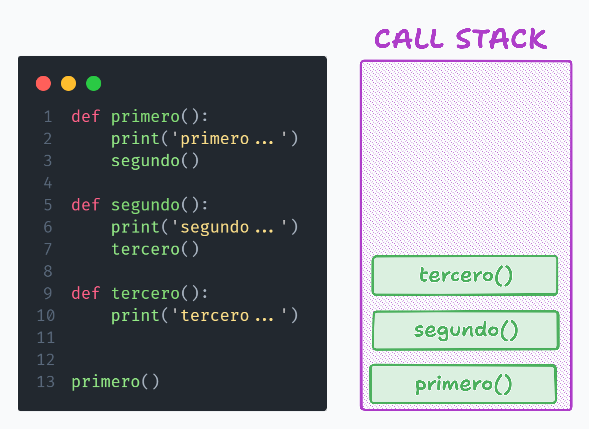

# Funciones


> *Repositorio*: [python_desde_cero_2024](https://github.com/Duz-Dev/python_desde_cero_2024) - fecha de edición: 25/12/2024

<!-- TOC -->

- [Funciones](#funciones)
  - [Introducción](#introducción)
  - [Parámetros y valores](#parámetros-y-valores)
    - [Valores predeterminados](#valores-predeterminados)
    - [`*args` (argumentos variables)](#args-argumentos-variables)
    - [`**kwargs` (argumentos nombrados variables)](#kwargs-argumentos-nombrados-variables)
  - [Docstring](#docstring)
    - [¿Por qué son útiles?](#por-qué-son-útiles)
  - [Type Hints](#type-hints)
    - [Utilidad](#utilidad)
    - [Modulo Typing](#modulo-typing)
      - [Conceptos clave](#conceptos-clave)
  - [devoluciones múltiples](#devoluciones-múltiples)
    - [Ejemplo Practico 1. Calcular area y perímetro de un triangulo](#ejemplo-practico-1-calcular-area-y-perímetro-de-un-triangulo)
    - [Ejemplo Practico 2. El anillo rojo de la muerte (Xbox 360)](#ejemplo-practico-2-el-anillo-rojo-de-la-muerte-xbox-360)
    - [Ejemplo Practico 3. La era de los hackeos en PlayStation 2](#ejemplo-practico-3-la-era-de-los-hackeos-en-playstation-2)
  - [Funciones importantes](#funciones-importantes)
  - [Alcance de las variables](#alcance-de-las-variables)
    - [Definición](#definición)
    - [Reglas LEGB en Python](#reglas-legb-en-python)
    - [Uso de `nonlocal` en funciones anidadas](#uso-de-nonlocal-en-funciones-anidadas)
      - [Puntos importantes al usar `nonlocal`](#puntos-importantes-al-usar-nonlocal)
    - [`global` vs `nonlocal`](#global-vs-nonlocal)
    - [Elementos mutables y el alcance](#elementos-mutables-y-el-alcance)
  - [Ellipsis en Python](#ellipsis-en-python)
    - [Definición](#definición-1)
    - [Principales Aplicaciones](#principales-aplicaciones)
  - [Funciones anidadas](#funciones-anidadas)
    - [Introducción](#introducción-1)
    - [Definición](#definición-2)
    - [Sintaxis](#sintaxis)
    - [Ejemplos](#ejemplos)
    - [Ámbito y alcance](#ámbito-y-alcance)
  - [Clausulas](#clausulas)
    - [Introducción](#introducción-2)
    - [Definición](#definición-3)
    - [scope chaining (encadenamiento de ámbitos)](#scope-chaining-encadenamiento-de-ámbitos)
  - [Pila de llamadas (the call stack)](#pila-de-llamadas-the-call-stack)
  - [Recursividad](#recursividad)
    - [Definición](#definición-4)
    - [Sintaxis](#sintaxis-1)
    - [Ejemplos](#ejemplos-1)
    - [Recursos](#recursos)
  - [Decoradores](#decoradores)
    - [Definición](#definición-5)
    - [Sintaxis](#sintaxis-2)
    - [Ejemplos](#ejemplos-2)
  - [Funciones lambda](#funciones-lambda)
    - [Definición](#definición-6)
  - [Funciones de orden superior](#funciones-de-orden-superior)
    - [Definición](#definición-7)
    - [Casos de uso](#casos-de-uso)
    - [Funciones integradas de orden superior](#funciones-integradas-de-orden-superior)
    - [Ejemplo](#ejemplo)
  - [Proximos pasos](#proximos-pasos)

<!-- /TOC -->

---

## Introducción

Imagina que estás desarrollando un sistema para una tienda que calcula el precio total de una compra. Cada cliente tiene diferentes productos y cantidades. Podrías escribir el mismo cálculo una y otra vez, pero esto haría que el código fuera repetitivo, difícil de leer y propenso a errores. Aquí es donde las funciones se vuelven indispensables: nos permiten encapsular lógica reutilizable en una sola parte del programa.

Por ejemplo, queremos calcular el precio total de tres compras diferentes. Sin funciones, tendríamos que escribir esto de manera repetitiva:  

```python
precio1 = 10 * 2  # Producto 1
precio2 = 5 * 3   # Producto 2
precio3 = 20 * 1  # Producto 3
total = precio1 + precio2 + precio3
```

Ahora bien, con una función podemos resolver este problema de forma más clara y eficiente.

En su forma más básica, **una función es un bloque de código que realiza una tarea específica y se puede reutilizar tantas veces como necesites.** Python implementa las funciones de manera sencilla, utilizando la palabra clave `def` para definirías. Cuando llamas a una función, el programa ejecuta el código dentro de ella y te da un resultado (si la función lo tiene).  

**Sintaxis básica de una función:**

```python
def nombre_de_funcion(parametros_opcionales):
    # Código dentro de la función
    return resultado_opcional

nombre_de_funcion() #Llamada a la funcion
```

- `def`: es la palabra reservada para definir funciones.
- `nombre_de_funcion`: Aquí estamos dándole un nombre que haga referencia a la funcionalidad del código en cuestión. Se aconseja usar verbos para nombrar tus funciones (ejemplo `obtener_nombre()` ).
- ``Parámetro``: Son variables especiales que trabajan solo dentro de la función misma. Estas con el objetivo de almacenar un valor externo cuando se llame la función. Estos pueden ser opcionales si no requieren.
- `return`: Palabra reservada que indica cual es el resultado final de dicha función o en su defecto lo que valdrá la función cuando sea  'llamada'. En caso de no especificar cual sera dicho valor, por defecto sera asignado el valor de `None`.
- **Llamada a la función**: Se hace alusión a el uso explicito de la función creada. Las funciones inicialmente no son ejecutadas hasta ser mencionadas específicamente en el código, como una llamada.

A partir de esto podemos hacer muchas cosas. Es importante mencionar que cada vez que usamos paréntesis es porque se espera ingresar posiblemente un **argumento**. Los cuales son los valores que le indicamos dentro de los paréntesis y que formaran como el valor asignar a los parámetros indicados en la función. Veamos ejemplos mas claros a continuación.

**Ejemplo básico 1. Mensaje de bienvenida:**

```python
def saludo(nombre):
    mensaje = f"¡Hola, {nombre}! Bienvenido a nuestra tienda.")
    return mensaje

print(saludo("Juan"))  # Salida: ¡Hola, Juan! Bienvenido a nuestra tienda.
```

Cuando llamamos la función `saludo()` dentro de la función `print()`, lo primero que a realizar es añadir un argumento valido, en este caso se espera un nombre (un string) y posteriormente la función tomara dicho valor y se lo asignara al parámetro `nombre`, por ende ahora `nombre = "juan"` y con ello creamos que la variable mensaje tome dicho mensaje personalizado. Por ultimo indicamos que el valor que retornara la función sera la variable mensaje por lo que al imprimir la función saludo, muestra el valor de mensaje.

**Observación:** No esta permitido llamar una función si antes no la has creado crearla. Esto pareciera obvio pero existen lenguajes que si permiten dicho comportamiento.

```python
# - X - Esto no esta permitido.
mensaje()

def mensaje():
    print("Hola mundo")
```

Esto puede ser un poco confuso al principio, asi que te brindo una analogía; imaginar que las funciones no son mas que maquinas. Estas maquinas tienen forma de caja y lo que hacemos con ellas es ingresar un dato, digamos una letra como la 'x' y lo que esperamos cuando ingresamos este dato a la maquina es otro valor, 'y'

```python
def Funcion(x):
    y = x
    return y

Funcion(1)
```


La interpretación seria la siguiente:

Primeramente creamos una función con la palabra reservada `def` el cual crea nuestra maquina. Nuestra maquina tiene un nombre para identificarla, asi que enseguida escribiremos el nombre de nuestra maquina. Nuestra maquina necesita recibir la letra "x", para ello es que usamos los paréntesis en las funciones, dentro de estos podemos añadir parámetros, que no son mas que valores que podemos utilizar solo y exclusivamente dentro de nuestra maquina. Estas tomaran el valor que le demos a "x", ya sea que les indiquemos unos por defecto u el programador le pase dichos valores cuando se mande a llamar a la maquina.

Con llamar a la maquina nos referimos a que en un inicio las funciones no se ejecutara, a no ser que el programador explícitamente escriba el nombre de dicha maquina, ya que esto la activara y la echara andar.

Pero hay un detalle, hasta el momento aun no hemos definido que hace la maquina, solo que datos necesita. Para ello escribimos el código de sus instrucciones dentro de esta, en nuestro ejemplo no es mas que `x = y`. Y recuerda que al menos en nuestro ejemplo debemos de indicar que la maquina tiene el objetivo de generar un nuevo valor, en este caso "y", para ello le indicamos a la maquina que nos de el valor de "y" usando la palabra `return`.

Y listo, ahora solo basta con llamar a a nuestra maquina para encenderla y no olvidemos darle un argumento, en este caso solo le indico el valor de `1`.

Ya un poco mas explicito el proceso, veamos otro ejemplo.

**Ejemplo básico 2. Sumar dos números:**

```python
def sumar(a, b):
    return a + b

resultado = sumar(4, 5)
print("El resultado es:", resultado)  # Salida: El resultado es: 9
```

Ahora con esto, pasemos a ver con mayor detalle los siguientes temas.

## Parámetros y valores  

Los **parámetros** son variables que pasamos a una función para personalizar su comportamiento. Existen diferentes formas de utilizarlos en Python:

### Valores predeterminados  

Podemos asignar un valor por defecto a los parámetros, para que la función lo use si no proporcionamos uno al llamarla. Esto es muy util si es que esperamos que los parámetros si o si tengan un valor por defecto y asi evitar posibles errores. Esto es muy util porque ten en cuenta que si añadimos un parámetro a una función esta sera **obligatorio** añadir le los argumentos que la función necesite cuando se mande a 'llamar'. En cambio al darle un valor por default, estos argumentos se vuelven opcionales.

```python
def saludo(nombre="Cliente"):
    print(f"Hola, {nombre}")

saludo()  # Salida: Hola, Cliente
saludo("Ana")  # Salida: Hola, Ana

```

Si incluyes parámetros opcionales y sin definir un valor por predeterminado sera importante primero llamar aquellos que sean obligatorios y posteriormente los que serán opcionales.

```python
def saludo(cliente,mensaje="Hola"):
    print(f"{mensaje}, cliente")

saludo("Pablo") # Salida: Hola, Pablo
saludo("Ana","Adiós") # Salida: Adiós, Ana
```

También es posible especificar sin importar el orden los valores que queremos añadir a dicha función, escribiendo dentro de esta el nombre de los parámetros y asignándoles el valor que deseamos.

```python
saludo(mensaje="Buen dia", cliente="María") # Salida: Buen dia, María
```

### `*args` (argumentos variables)

`*args` permite pasar un número indefinido de argumentos posicionales a una función. Util si no se tiene en mente, un numero finito de valores a utilizar.

```python
def sum(*args):
    value = 0
    for n in args:
        value += n
    return print(value)

sum()
sum(2, 3, 4)
sum(2, 3, 4, 6, 9, 21)

# Salida:
# 0
# 9
# 45
```

Pero también podemos invocar una función resultante con un único parámetro de tipo iterable, como una tupla o una lista, del siguiente modo (*args):

```python
def resultado(x, y, op):
    if op == '+':
        return x + y
    elif op == '-':
        return x – y

a = (1, 2, '+')
resultado(*a)
# salida: 3

#O incluso así:

a = (2, '-')
resultado(3, *a)
# salida: 3

```

### `**kwargs` (argumentos nombrados variables)  

`**kwargs` permite pasar un número indefinido de argumentos con nombre (clave-valor) a una función. Similar al anterior, pero con mayor utilidad para diccionarios

```python
def mostrar_info(**datos):
    for clave, valor in datos.items():
        print(f"{clave}: {valor}")

mostrar_info(nombre="Ana", edad=25, ciudad="Monterrey")
# Salida:
# nombre: Ana
# edad: 25
# ciudad: Monterrey
```

Un ejemplo de cada uno de ellos es la función mas elemental que hemos utilizado desde el principio, la función [**print**](./01-1-funcion%20_print.md). *Visita dicho tema para mas referencia*

Ahora, antes de dar entrada a mas utilidades de las funciones, quiero hacer énfasis en dos temas, los docstrings y los type hints.

## Docstring

Un *docstring* es una cadena de texto que se utiliza para documentar funciones, métodos, clases o módulos. Aparece inmediatamente después de la declaración de una función (o clase) y sirve para describir qué hace la función, los parámetros que recibe y qué devuelve.
Esta ya la llegamos a nombrar en su momento en el bloque 1 de esta recopilación de guía de python, [clic aquí](./01_introduccion.md/#8-docstrings).

### ¿Por qué son útiles?

1. **Claridad del propósito del código:** Facilita a otros (o a ti mismo) entender qué hace una función sin necesidad de analizar toda su implementación.

2. **Compatibilidad con herramientas:** Herramientas como `help()` o generadores de documentación pueden extraer y mostrar el docstring automáticamente.

3. **Estandarización:** Promueven la escritura de documentación consistente dentro de un equipo.

**Ejemplo 1. Docstring básico:**

```python
def sumar(a, b):
    """
    Suma dos números.

    Parámetros:
        a (int o float): El primer número.
        b (int o float): El segundo número.
    
    Retorna:
        int o float: La suma de a y b.
    """
    return a + b

# Llamada
help(sumar)
```

Precisamente, si ejecutamos esta ultima función seria vista como un mensaje en la terminal.


Como dato adicional, herramientas como visual studio code también hace uso de estos comentarios para que de manera mas cómoda puedas ver una previsualización de la funcionalidad de dichas funciones, e incluso respeta las normas de markdown, por lo que podrías añadir títulos y énfasis en palabras en negritas. Ejemplo, si pasamos el cursos por en sima de la función help(sumar), veremos algo tal asi:


**Ejemplo 2. Docstring en funciones más complejas:**

```python
def filtrar_pares(numeros):
    """
    Filtra los números pares de una lista.

    Parámetros:
        numeros (list[int]): Lista de números enteros.

    Retorna:
        list[int]: Una lista con los números pares.
    """
    return [n for n in numeros if n % 2 == 0]

# Llamada
help(filtrar_pares)
# Salida:
# Filtra los números pares de una lista.
#
# Parámetros:
#    numeros (list[int]): Lista de números enteros.
#
# Retorna:
#    list[int]: Una lista con los números pares.
```

Encontraras con el tiempo que muchas librerías para llevar una mejor compresión de su código usan estos constantemente, por lo que no dudes en utilizarlo tu también a partir de ahora.

## Type Hints

Los *type hints* (o anotaciones de tipo) son una característica introducida en Python 3.5 que permite especificar los tipos de datos de los parámetros y del valor de retorno en una función. Esto mejora la legibilidad del código y ayuda a herramientas como **linters** (e.g., MyPy) a detectar errores antes de ejecutar el código. En palabras simples, son comentarios mas cortos que los que ya vimos, que solo ayudan aportar contexto al programador. No esta incorporando una especie de tipado fuerte en python si lo que solamente ayuda a orientar en base que tipo de dato se intenta trabajar.

Debido a que python es un lenguaje de tipado dinámico, es util, al punto que lenguajes de la misma índole también adoptaron esto mismo.

### Utilidad

1. **Prevención de errores:** Ayudan a evitar errores de tipo al escribir o modificar el código.
2. **Documentación implícita:** Sirven como una forma de documentación para los desarrolladores, indicando qué tipo de datos esperan las funciones.
3. **Soporte avanzado con módulos:** La biblioteca estándar incluye el módulo `typing` para definir tipos avanzados como `Union`, `List`, `Optional`, etc.

Con esto mencionado, veamos como se emplean.

**Ejemplo 1. Type hints básicos:**

```python
def dividir(a: float, b: float):
    """
    Divide dos números.

    Retorna:
        float: Resultado de la división.
    """
    return a / b

# Llamada
print(dividir(10.0, 2.0))  # Salida: 5.0
```

Si analizamos, vemos que ahora los paramentos 'a' y 'b' no solo están asignados en la función `dividir()` si no que también tienen dos puntos adjuntos y seguido de esto la palabra float. Esto ultimo es la sintaxis para añadir las anotaciones de tipo. En este caso se coloco la palabra float, porque es el tipo de dato que se espera que sea a y b. Pero cabe aclarar que aunque se espera un dato flotante, aun asi puedes manipularlo como el dato que deses, no estas estrictamente obligado a usar flotantes.

Esto puede ser algo innecesario si lo ves asi en primer logar, pero en realidad es muy util ya que no solo te ayuda a limitar a el programador a entender que datos se deben ingresar y manipular, si no que para librerías mas avanzadas que inventan sus nuevos tipos de datos, mas allá de lo que python aporta, te ayuda a ver que funcionalidad u operaciones puedes realizar.
Esto igualmente le tomaras mas importancia y darás gracia de su utilidad cuando pasemos a librerías como el uso de Discord.py y Flask.

Ahora mira este ejemplo:

```python
def saludar(nombre: str) -> str:
    """
    Genera un saludo personalizado.

    Retorna:
        str: Mensaje de saludo.
    """
    return f"Hola, {nombre}!"

# Llamada
print(saludar("Pablo"))  # Salida: Hola, Pablo!
```

Aquí hay un pequeño añadido, y es que al colocar `(nombre: str)` este le adjuntamos una anotación `-> str`. Este ultimo indica que se espera que la función debe retornar un dato de tipo str, pero como ya aclare, este solo es un comentario, técnicamente si puedes devolver cualquier dato aunque no sea un str, solo que se espera que tu respetes dicho tipo.

**Ejemplo 2. Precio de un producto:**

Este es otro ejemplo de usando el type hints con todo lo que sabemos hasta el momento.

```python
def calcular_precio(base: float, impuesto: float = 0.16, descuento: float = 0.0) -> float:
    """
    ## calcular_precio
    > Calcula el precio final de un producto considerando el impuesto y un descuento opcional.

    **Parámetros:**
        base (float): Precio base del producto.
        impuesto (float): Porcentaje de impuesto a aplicar (por defecto 16%).
        descuento (float): Porcentaje de descuento a aplicar (por defecto 0%).

    **Retorna:**
        float: Precio final tras aplicar impuesto y descuento.
    """
    precio_con_impuesto = base + (base * impuesto)
    precio_final = precio_con_impuesto - (precio_con_impuesto * descuento)
    return precio_final

# Llamadas a la función
print(calcular_precio(100))  # Precio base de 100 con impuesto del 16%, sin descuento. Salida: 116.0
print(calcular_precio(100, descuento=0.10))  # Precio base de 100 con impuesto del 16% y descuento del 10%. Salida: 104.4
print(calcular_precio(100, 0.08, 0.05))  # Precio base de 100 con impuesto del 8% y descuento del 5%. Salida: 102.6

```

Como vemos, editores de código como visual studio code utiliza estas herramientas para dar contexto de las utilidades de nuestras funciones con mayor comodidad.


### Modulo Typing

Hasta el momento hemos utilizado un par de módulos para el manejo de números a una mayor precisión, pero los módulos no solo existen para ello, si no para demasiadas utilidades. Hay módulos que como este que vamos a ver, nos ayuda a extender las funcionalidades de el type hints.

El módulo `typing` en Python se introdujo en la versión 3.5 para proporcionar soporte avanzado a las *type hints*. Este módulo permite anotar los tipos de datos en funciones, clases y otros componentes del código, mejorando la claridad, la mantenibilidad y la capacidad de detectar errores antes de la ejecución (por ejemplo, usando herramientas como `mypy`).

**Características principales del módulo `typing`:**

1. **Compatibilidad con estructuras de datos complejas:**
   - Puedes especificar tipos para listas, diccionarios, tuplas, conjuntos, etc.
   - Ejemplo: `List[int]`, `Dict[str, float]`, `Tuple[int, str]`.

2. **Soporte para tipos opcionales y combinados:**
   - Permite manejar valores que pueden ser de múltiples tipos o incluso nulos.
   - Ejemplo: `Union[int, str]`, `Optional[str]`.

3. **Definición de funciones más precisas:**
   - Puedes usar tipos para funciones que retornan otras funciones, clases, o cualquier objeto.
   - Ejemplo: `Callable[[int, int], int]`.

4. **Documentación del código:**
   - Los *type hints* mejoran la comprensión del propósito de las funciones, parámetros y variables.

#### Conceptos clave

1. **Tipos genéricos básicos:**
   - `List`, `Dict`, `Tuple`, `Set` son genéricos para anotar colecciones.
   - Ejemplo:

     ```python
     from typing import List

     def sumar_valores(valores: List[int]) -> int:
         return sum(valores)
     ```

2. **`Union`:**
   - Permite especificar que un valor puede ser de más de un tipo.
   - Ejemplo:

     ```python
     from typing import Union

     def procesar_dato(dato: Union[int, str]) -> str:
         return str(dato)
     ```

3. **`Optional`:**
   - Es equivalente a `Union[T, None]`, indicando que un valor puede ser nulo.
   - Ejemplo:

     ```python
     from typing import Optional

     def obtener_nombre(id: int) -> Optional[str]:
         return "Nombre" if id == 1 else None
     ```

4. **`Callable`:**
   - Anota funciones como argumentos o valores retornados.
   - Ejemplo:

     ```python
     from typing import Callable

     def ejecutar(func: Callable[[int, int], int], a: int, b: int) -> int:
         return func(a, b)
     ```

5. **Alias de tipos personalizados:**
   - Permiten dar nombres a tipos complejos para simplificar el código.
   - Ejemplo:

     ```python
     from typing import List, Dict

     Registro = Dict[str, List[int]]

     def agregar_registro(registros: Registro, nombre: str, valores: List[int]) -> None:
         registros[nombre] = valores
     ```

Ahora que conocemos estos detalles del lenguaje python, continuemos con la explicación de las funciones.

## devoluciones múltiples

Imagina que estás desarrollando un programa para calcular información estadística básica de un conjunto de números. Necesitas una función que, al proporcionarle una lista, devuelva tres datos: el promedio, el número máximo y el número mínimo. En lugar de crear varias funciones para cada cálculo, puedes usar una sola función en Python que devuelva todos estos valores.

En Python, una función puede devolver múltiples valores empaquetándose en una tupla. Esto es muy útil cuando necesitas resultados relacionados entre sí. Los valores devueltos se pueden desempaquetar en variables individuales al momento de llamar la función. A continuación planteare 2 escenarios donde esto puede ser util.

### Ejemplo Practico 1. Calcular area y perímetro de un triangulo

Supongamos que queremos calcular el área y el perímetro de un rectángulo dadas su base y altura. Esto lo hacemos dentro de una función que devuelve ambos valores.

```python
def calcular_area_y_perimetro(base, altura):
    # Cálculos
    area = base * altura
    perimetro = 2 * (base + altura)
    # Aquí ocurre el empaquetamiento en una tupla
    return area, perimetro

# Llamada a la función
resultado = calcular_area_y_perimetro(5, 3)
print(resultado)  # Salida: (15, 16)

# Desempaquetando la tupla en variables individuales
area, perimetro = calcular_area_y_perimetro(5, 3)
print(f"Área: {area}")       # Salida: Área: 15
print(f"Perímetro: {perimetro}")  # Salida: Perímetro: 16
```

**Explicación:**

En la línea return area, perímetro, Python crea automáticamente una tupla con los valores area y perímetro. Esto ocurre sin necesidad de escribir explícitamente return (area, perímetro) porque el uso de la coma , ya indica el empaquetamiento.

Cuando llamamos a la función, podemos almacenar el resultado en una variable (en este caso, resultado), que será una tupla que contiene los valores devueltos.

Podemos extraer los valores individuales de la tupla usando el desempaquetamiento, como en la línea area, perímetro = calcular_area_y_perimetro(5, 3). Así asignamos cada valor de la tupla a una variable independiente.

### Ejemplo Practico 2. El anillo rojo de la muerte (Xbox 360)

El problema del "anillo rojo de la muerte" en las Xbox 360 fue causado por sobrecalentamiento y fallos en la placa base. Supongamos que tenemos una función que evalúa el estado de una consola basándose en su temperatura y el estado de su hardware, y devuelve si está en buen estado o no, junto con un mensaje de advertencia si es necesario.

```python
def diagnosticar_consola(temperatura, hardware_ok):
    if temperatura > 70:
        estado = "Defectuosa"
        mensaje = "Advertencia: Temperatura crítica. RIESGO DE FALLA."
    elif not hardware_ok:
        estado = "Defectuosa"
        mensaje = "Error: Problemas detectados en el hardware."
    else:
        estado = "Funcional"
        mensaje = "Todo está en orden."
    return estado, mensaje

# Llamada a la función
estado, mensaje = diagnosticar_consola(75, True)
print(estado)  # Salida: Defectuosa
print(mensaje) # Salida: Advertencia: Temperatura crítica. RIESGO DE FALLA.
```

### Ejemplo Practico 3. La era de los hackeos en PlayStation 2

Imagina que Sony está evaluando la vulnerabilidad de sus consolas frente a ataques de hackers. Crearemos una función que toma el número de intentos de hackeo y los sistemas afectados, y devuelve si la consola es vulnerable y un reporte con detalles.

```python
def evaluar_seguridad(intentos_hackeo, sistemas_afectados):
    if intentos_hackeo > 5 or len(sistemas_afectados) > 2:
        vulnerable = True
        reporte = f"Vulnerable: {intentos_hackeo} intentos detectados. Sistemas comprometidos: {', '.join(sistemas_afectados)}."
    else:
        vulnerable = False
        reporte = "Sistema seguro. No se detectaron vulnerabilidades críticas."
    return vulnerable, reporte

# Llamada a la función
vulnerable, reporte = evaluar_seguridad(6, ["Kernel", "Red"])
print(vulnerable)  # Salida: True
print(reporte)     # Salida: Vulnerable: 6 intentos detectados. Sistemas comprometidos: Kernel, Red.
```

## Funciones importantes

Como ya analizamos hasta este punto, las funciones son poderosas y pueden tener un conjunto de procesos que nos facilitan el proceso al momento de desarrollar alguno en nuestros programas. Python de forma nativa incluye un sin fin de funciones que desde el primer momento ya estamos utilizando, un ejemplo de estas seria la función `print()`.

A continuación te mostrare un par de funciones que python nos ofrece y que podemos sacarle un buen de partido:

Además de las funciones mencionadas anteriormente, hay muchas otras que son importantes para aprender en Python, dependiendo del tipo de problemas que deseas resolver. Aquí tienes un conjunto de funciones nativas y módulos relevantes que vale la pena explorar. Estas funciones son esenciales en el día a día del desarrollo y también para algoritmos más avanzados.

1. **`zip()`**
   - **Descripción:** Combina dos o más iterables (listas, tuplas, etc.) elemento por elemento, creando pares (o tuplas) de valores correspondientes.
   - **Utilidad:** Útil para iterar sobre varias colecciones al mismo tiempo, o para fusionar datos.
   - **Ejemplo:**

     ```python
     nombres = ["Ana", "Luis", "Pedro"]
     edades = [25, 30, 35]
     combinados = list(zip(nombres, edades))
     print(combinados)  # [('Ana', 25), ('Luis', 30), ('Pedro', 35)]
     ```

2. **`enumerate()`**
   - **Descripción:** Devuelve un objeto iterable que genera pares de índice y valor al recorrer una colección.
   - **Utilidad:** Muy útil cuando necesitas el índice de los elementos al iterar.
   - **Ejemplo:**

     ```python
     lista = ["manzana", "naranja", "pera"]
     for indice, fruta in enumerate(lista):
         print(f"{indice}: {fruta}")
     # Resultado:
     # 0: manzana
     # 1: naranja
     # 2: pera
     ```

3. **`filter()`**
   - **Descripción:** Aplica una función a un iterable y devuelve un nuevo iterable con los elementos que cumplan con una condición.
   - **Utilidad:** Para filtrar datos sin necesidad de bucles manuales.
   - **Ejemplo:**

     ```python
     numeros = [10, 15, 20, 25, 30]
     mayores_de_20 = list(filter(lambda x: x > 20, numeros))
     print(mayores_de_20)  # [25, 30]
     ```

4. **`map()`**
   - **Descripción:** Aplica una función a cada elemento de un iterable y devuelve un nuevo iterable con los resultados.
   - **Utilidad:** Útil para realizar transformaciones rápidas en colecciones.
   - **Ejemplo:**

     ```python
     numeros = [1, 2, 3, 4]
     cuadrados = list(map(lambda x: x**2, numeros))
     print(cuadrados)  # [1, 4, 9, 16]
     ```

5. **`all()` y `any()`**
   - **`all()`**: Retorna `True` si todos los elementos de un iterable son verdaderos (o si el iterable está vacío).
   - **`any()`**: Retorna `True` si al menos un elemento del iterable es verdadero.
   - **Ejemplo:**

     ```python
     condiciones = [True, True, False]
     print(all(condiciones))  # False
     print(any(condiciones))  # True
     ```

6. **`reversed()`**
   - **Invierte el orden de cualquier secuencia.**
   - Ejemplo:

     ```python
     lista = [1, 2, 3]
     print(list(reversed(lista)))  # [3, 2, 1]
     ```

7. **`sorted()`**
   - **Ordena un iterable.**
   - Ejemplo:

     ```python
     numeros = [3, 1, 4, 2]
     print(sorted(numeros))  # [1, 2, 3, 4]
     ```

8. **`eval()`**
   - **Evalúa una expresión de Python dada como cadena.**
   - Ejemplo:

     ```python
     expresion = "2 + 3 * 4"
     print(eval(expresion))  # 14
     ```

Aparte de todos los mostrados, python nos brinda muchas herramientas que solo serán posible acceder a estas si importamos módulos.

## Alcance de las variables

Imagina que estás desarrollando un programa que calcula el precio total de un producto después de aplicarle un descuento. Decides implementar esta funcionalidad con funciones, pero algo extraño ocurre: al ejecutar el código, el resultado final no parece calcularse correctamente.  

```python
def aplicar_descuento():
    precio = precio - descuento  # Error aquí
    return precio

precio = 100
descuento = 20
print(aplicar_descuento())
```

En este ejemplo, el programa arroja un error: **`UnboundLocalError: local variable 'precio' referenced before assignment`**. ¿Qué está sucediendo? Aquí entra el tema del alcance de las variables.  

### Definición

En Python, el alcance se refiere a la región del código donde una variable es accesible. Existen tres palabras clave relevantes que afectan el alcance: `global`, `nonlocal`, y el uso por defecto sin ellas. Existen dos tipos principales de alcance:  

1. **Alcance global**:  
   - Una variable declarada fuera de cualquier función o bloque.  
   - Puede ser accedida desde cualquier parte del programa.  
   - Pero dentro de una función, no puede ser modificada directamente a menos que uses la palabra clave `global`.

2. **Alcance local**:  
   - Una variable declarada dentro de una función o bloque.  
   - Sólo puede ser accedida dentro de ese contexto.  
   - No afecta a las variables globales, incluso si tienen el mismo nombre.  

### Reglas LEGB en Python

Python sigue el principio **LEGB** para buscar variables:  

1. **Local**: Primero busca en el ámbito local (dentro de la función actual).  
2. **Enclosing**: Luego busca en funciones anidadas (si las hay).  
3. **Global**: Si no encuentra nada, busca en el ámbito global.  
4. **Built-in**: Por último, busca entre los nombres predefinidos de Python (como `len`, `print`, etc.).  

En el ejemplo anterior, Python intenta encontrar la variable `precio` dentro de la función (ámbito local), pero no está definida allí; de allí el error. Existe entonces diferentes maneras de poder arraglar esto, como lo veremos con las palabras reservadas `nonlocal` y `global`.

> Nota. Existe un proceso que se puede explorar mas afondo acerca del concepto que esta pasado aqui, pero no lo mencionare aun. Puedes verlo en la parte de [funcion anidada](#funciones-anidadas) y [Clausulas](#clausulas)

### Uso de `nonlocal` en funciones anidadas

La palabra clave `nonlocal` sirve para trabajar con variables **del alcance externo inmediato**, es decir, las declaradas en una función envolvente. Esto es útil cuando tienes una función dentro de otra y deseas modificar una variable de la función externa sin tocar variables globales.

**Ejemplo básico**.

```python
def funcion_externa():
    mensaje = "Hola"

    def funcion_interna():
        nonlocal mensaje  # Modifica la variable de la función externa
        mensaje = "Adiós"

    funcion_interna()
    print(mensaje)

funcion_externa()  # Salida: Adiós
```

En este caso:

- La variable `mensaje` está en el alcance de la función externa (`funcion_externa`).
- Al usar `nonlocal`, permitimos que `funcion_interna` modifique esa variable.
- Sin `nonlocal`, cualquier asignación dentro de `funcion_interna` crearía una nueva variable local llamada `mensaje`, sin afectar la original.

**Ejemplo avanzado: Contador con funciones anidadas**.

```python
def crear_contador():
    contador = 0  # Variable del alcance externo

    def incrementar():
        nonlocal contador  # Modificamos la variable de la función externa
        contador += 1
        return contador

    return incrementar

contador = crear_contador()
print(contador())  # Salida: 1
print(contador())  # Salida: 2
```

En este ejemplo:

- `crear_contador` genera una función `incrementar` que conserva el valor de `contador`.
- Usar `nonlocal` asegura que la variable `contador` no se cree como local en `incrementar`.

#### Puntos importantes al usar `nonlocal`

1. **Solo afecta variables en el alcance inmediatamente superior**:  
   - No se puede usar `nonlocal` para acceder o modificar variables globales. Si necesitas trabajar con variables globales, usa `global`.

2. **Evita confusiones con `global`**:  
   - `nonlocal` se utiliza exclusivamente para modificar variables **en funciones anidadas**, mientras que `global` actúa a nivel de todo el módulo.

3. **Facilita encapsulación y modularidad**:  
   - Usar `nonlocal` es preferible a usar `global`, ya que limita el alcance de las modificaciones y evita efectos colaterales en otras partes del programa.

4. **Úsalo con precaución**:  
   - Modificar variables del alcance externo puede hacer que el código sea más difícil de leer y depurar si no está bien documentado.

### `global` vs `nonlocal`

```python
x = 10  # Variable global

def externa():
    x = 20  # Variable de la función externa

    def interna():
        global x  # Modifica la variable global
        x = 30

    interna()
    print("Valor en externa:", x)  # Sigue siendo 20, ya que `x` global fue modificada

externa()
print("Valor global:", x)  # Salida: 30
```

Ahora usando `nonlocal`:

```python
def externa():
    x = 20  # Variable de la función externa

    def interna():
        nonlocal x  # Modifica la variable de la función externa
        x = 30

    interna()
    print("Valor en externa:", x)  # Salida: 30

externa()
```

### Elementos mutables y el alcance

En Python, los elementos mutables como listas o diccionarios tienen un comportamiento diferente al de las variables que almacenan datos inmutables (números, cadenas, tuplas). Esto se debe a que las variables mutables permiten modificar su contenido sin necesidad de redefinirlas, lo que puede generar confusión en ciertos casos.

**Caso de variables globales con elementos mutables:**

```python
mi_lista = [1, 2, 3]  # Variable global (mutable)

def agregar_elemento():
    mi_lista.append(4)  # Modifica el contenido de la lista global
    print("Dentro de la función:", mi_lista)

agregar_elemento()
print("Fuera de la función:", mi_lista)  # Salida: [1, 2, 3, 4]
```

En este ejemplo:

- Aunque no usamos `global`, el contenido de la lista global es modificado directamente porque estamos trabajando con el mismo objeto.
- No estamos reasignando la variable `mi_lista`; simplemente modificamos su contenido.

**Puntos importantes sobre elementos mutables:**

1. **Modificación directa**:  
   - No necesitas usar `global` ni `nonlocal` para modificar el contenido de un elemento mutable (como añadir a una lista o actualizar un diccionario).
   - Esto aplica siempre que no estés intentando reasignar la variable a un nuevo objeto.

2. **Reasignación vs modificación**:  
   - Si intentas reasignar una variable mutable dentro de una función, necesitarás `global` o `nonlocal`:

     ```python
     mi_lista = [1, 2, 3]

     def reasignar_lista():
         global mi_lista
         mi_lista = [4, 5, 6]  # Reasigna la lista global

     reasignar_lista()
     print(mi_lista)  # Salida: [4, 5, 6]
     ```

3. **Encapsulación y claridad**:  
   - Usa `nonlocal` o argumentos y retornos en funciones anidadas para evitar modificar elementos globales, mejorando la modularidad del código.

4. **Evita efectos secundarios**:  
   - Documenta bien las modificaciones en elementos mutables para que los cambios no generen comportamientos inesperados.
  
Aqui aportare un pequeño parentesis a una utilidad que tenemos en python el cual es el Ellipsis.

## Ellipsis en Python

En Python, `...` (tres puntos consecutivos), conocido formalmente como **Ellipsis**, es un objeto especial que tiene diversos usos, aunque es poco común en comparación con otras características del lenguaje. Su representación literal es `Ellipsis` y es un singleton, es decir, una única instancia que se comparte en todo el programa.

### Definición

El objeto `Ellipsis` se encuentra integrado en Python y puede representarse tanto por `Ellipsis` como por `...`. Es útil en diversos contextos, especialmente en programación avanzada, aunque no tiene un uso obligatorio en la mayoría de los casos.

**Sintaxis:**

```python
...
# o
Ellipsis
```

Ambas notaciones son equivalentes.

### Principales Aplicaciones

1. **Marcador de posición (Placeholder)**
   `Ellipsis` se utiliza para indicar que algo está incompleto o pendiente de implementación en el código. Es comúnmente usado en métodos o funciones que aún no se han definido completamente.

   ```python
   def funcion_pendiente():
       ...
   ```

   Este uso es similar a `pass`, pero más explícito para señalar que el cuerpo de la función no se ha implementado.

   - **Ventaja:** Hace el código más legible al indicar claramente que falta lógica.

2. **Acceso avanzado a estructuras de datos**
   En el contexto de **arrays multidimensionales** (por ejemplo, al trabajar con bibliotecas como NumPy), `Ellipsis` se utiliza para simplificar el acceso a dimensiones específicas, especialmente cuando no es práctico especificar todas las dimensiones.

   ```python
   import numpy as np

   array = np.random.rand(3, 4, 5, 6)
   sub_array = array[..., 2]  # Equivale a array[:, :, :, 2]
   ```

   - **Función:** `...` permite reemplazar múltiples `:` en índices de arrays, haciéndolo más compacto y manejable.

3. **Tipado en Python (Type Annotations)**
   En proyectos que utilizan **type hints** con herramientas como `mypy`, `Ellipsis` puede ser usado para definir funciones o clases genéricas donde el tipo aún no está especificado.

   ```python
   from typing import Callable

   FuncType = Callable[..., int]  # Función con cualquier número de argumentos que retorna un int.
   ```

   - **Aplicación:** Indicar que la función puede aceptar cualquier cantidad y tipo de argumentos.

## Funciones anidadas

A partir de este tema, entraremos en lo que seria un terreno mas complejo sobre las funciones, esto sera de gran utilidad ya que nos abrirán paso para comprender la lógica detrás de las funciones y sobre todo a poder trabajar dentro de poco ya con librerías y frameworks de python sin restricciones.

### Introducción

En Python, puedes definir funciones dentro de otras funciones, esto ya nos a quedado claro con los diversos ejemplos que hemos visto hasta el momento. A este proceso se le conoce como funciones anidadas o *nested functions*. Son útiles para **encapsular** la lógica que solo es relevante dentro de una función específica, mejorando la organización y legibilidad del código.

Con encapsular  me refiero a aislar una parte del código dentro de una función, de manera que esa lógica quede protegida y no interfiera con otras partes del programa.

En el caso de las funciones anidadas, el encapsulamiento permite que la función interna solo sea accesible y ejecutada dentro del contexto de la función externa. Esto no solo mejora la claridad del código, sino que también ayuda a evitar posibles errores o conflictos de nombres al mantener las variables y funciones locales al ámbito en el que son necesarias.

**Ejemplo:**

```python
def saludar(nombre):
    def mensaje():
        return f"Hola, {nombre}!"
    return mensaje()

print(saludar("Pablo")) # Salida:  "Hola Pablo"

#print(mensaje()) | No se puede acceder a la función mensaje(). Error
```

En este fragmento sucede lo siguiente:

- Función Externa (saludar): Recibe un parámetro nombre.
- Función Interna (mensaje): Es anidada y solo puede ser utilizada dentro de saludar. Su única tarea es construir un mensaje con el nombre recibido.

La función interna accede a la variable nombre, que pertenece al ámbito de la función externa, y devuelve el saludo. Básicamente, ten cuenta por los temas que ya vimos del [alcance de las variables](#alcance-de-las-variables) porque es posible esto.

### Definición

Una **función anidada** es una función definida dentro del cuerpo de otra función. Esto significa que la función anidada solo puede ser accedida y utilizada dentro del alcance de la función externa que la contiene.  

Algunos beneficios de las funciones anidadas:

- **Encapsulación**: La función anidada no es accesible fuera de la función principal, lo que reduce la posibilidad de errores.  
- **Reutilización local**: Si una lógica específica se necesita varias veces dentro de una función, puedes definirla como función anidada para evitar duplicación de código.  

### Sintaxis  

La sintaxis básica de las funciones anidadas es la siguiente:

```python
def funcion_externa(parametros_externos):
    def funcion_anidada(parametros_internos):
        # Lógica de la función anidada
        return resultado_interno
    # Llamar a la función anidada dentro de la externa
    resultado_externo = funcion_anidada(argumentos_internos)
    return resultado_externo
```

### Ejemplos

**Ejemplo: Calculadora de descuentos**  

Imagina que Ana tiene una tienda y necesita calcular descuentos personalizados para sus clientes. Decide usar funciones anidadas para encapsular las operaciones.

```python
def calcular_precio_total(precio, descuento):
    def aplicar_descuento():
        return precio * (1 - descuento / 100)
    
    total = aplicar_descuento()
    return f"El precio final con descuento es: ${total:.2f}"

# Ejemplo de uso
precio = 100
descuento = 15
print(calcular_precio_total(precio, descuento))
```

En este caso:  

1. `aplicar_descuento` es una función anidada que encapsula la lógica de calcular el precio con descuento.  
2. Es privada y no puede ser llamada directamente desde fuera de `calcular_precio_total`.  

**Ejemplo: Validación de Usuario.**

Supongamos que tienes un sistema en el que necesitas validar el nombre y la contraseña de un usuario. Las funciones anidadas ayudan a dividir las validaciones en pasos más claros:

```python
def validar_usuario(usuario, contraseña):
    def validar_nombre():
        return usuario == "admin"

    def validar_contraseña():
        return contraseña == "1234"

    if validar_nombre() and validar_contraseña():
        return "Acceso concedido"
    else:
        return "Acceso denegado"

print(validar_usuario("admin", "1234"))
# Salida: Acceso concedido
```

**Ejemplo: Clasificación de Estudiantes.**

Un maestro desea clasificar a sus estudiantes como "Aprobados" o "Reprobados" dependiendo de su calificación. Las funciones anidadas ayudan a dividir el proceso de evaluación:

```python
def clasificar_estudiante(nombre, calificacion):
    def es_aprobado():
        return calificacion >= 70

    def mensaje():
        if es_aprobado():
            return f"{nombre} ha aprobado con {calificacion}."
        else:
            return f"{nombre} ha reprobado con {calificacion}."

    return mensaje()

print(clasificar_estudiante("Juan", 85))
print(clasificar_estudiante("Laura", 65))
```

### Ámbito y alcance

Las funciones anidadas tienen acceso a las variables definidas en la función externa gracias al principio del [*closure*.](#clausulas) Sin embargo, no pueden modificar variables de la función externa a menos que utilices la palabra clave `nonlocal`.

Ejemplo del uso de `nonlocal`:

```python
def contador():
    total = 0
    def incrementar():
        nonlocal total
        total += 1
        return total
    return incrementar

contador_func = contador()
print(contador_func())  # 1
print(contador_func())  # 2
print(contador_func())  # 3
```

**Ventajas**:  

- Mejora la organización del código.  
- Encapsula la lógica específica.  
- Facilita el uso de *closures*.  

**Limitaciones**:  

- Puede dificultar la depuración si no se usa con cuidado.  
- No es recomendable si la función anidada debe usarse en varios contextos (mejor definirla como función independiente).

## Clausulas

### Introducción

Una *closula* (closure en ingles), en ocurre cuando una función anidada "recuerda" las variables de su función contenedora, incluso después de que esta última haya terminado de ejecutarse. Es decir, las funciones internas pueden capturar y retener referencias a variables del ámbito externo donde fueron definidas, permitiendo que sigan disponibles y útiles más adelante.

### Definición

Formalmente, un *closure* es una técnica de programación en la que una función anidada retiene el entorno léxico que existía cuando fue creada. Este entorno incluye las variables locales de la función contenedora que son utilizadas por la función interna. Los *closures* son posibles gracias al principio de [*scope chaining*](#scope-chaining-encadenamiento-de-ámbitos), que permite que una función interna acceda a variables de su función externa.

**Características principales de un closure:**

1. Debe haber una función anidada.
2. La función interna debe acceder a una variable de la función externa.
3. La función externa debe devolver la función interna.

Un ejemplo básico de un closure es el siguiente:

```python
def multiplicador(factor):
    def multiplicar(numero):
        return numero * factor
    return multiplicar

doble = multiplicador(2)
print(doble(5))  # Resultado: 10
```

**¿Qué está pasando aquí?**  

1. **`multiplicador`** es la función externa que recibe un parámetro `factor`.
2. Dentro de ella, **`multiplicar`** es una función anidada que utiliza `factor` en su operación.
3. La función `multiplicador` retorna la función `multiplicar`, pero esta "recuerda" el valor de `factor` (en este caso, `2`) incluso después de que `multiplicador` haya terminado de ejecutarse.

Esto hace que `doble` sea un closure que siempre multiplica un número por `2`.

Veamos otro ejemplo:

**Escenario: Generar saludos personalizados.**

Imagina que necesitas una función para generar saludos personalizados dependiendo del idioma que prefieras. Esto se puede lograr con un closure:

```python
def generador_saludo(idioma):
    def saludo(nombre):
        if idioma == "es":
            return f"Hola, {nombre}!"
        elif idioma == "en":
            return f"Hello, {nombre}!"
        elif idioma == "fr":
            return f"Bonjour, {nombre}!"
        else:
            return f"Hi, {nombre}!"
    return saludo

saludo_es = generador_saludo("es")
saludo_en = generador_saludo("en")

print(saludo_es("Ana"))  # Resultado: Hola, Ana!
print(saludo_en("Ana"))  # Resultado: Hello, Ana!
```

**Explicación:**  

1. La función `generador_saludo` recibe un idioma y devuelve una función anidada llamada `saludo`.
2. La función `saludo` utiliza la variable `idioma` definida en `generador_saludo`, lo que convierte a esta última en un closure.
3. Cada saludo generado "recuerda" el idioma con el que fue configurado inicialmente.

### scope chaining (encadenamiento de ámbitos)

En Python, el *encadenamiento de ámbitos* es un mecanismo que define cómo se resuelven los nombres (variables, funciones, etc.) en el programa. Es el proceso que sigue Python para buscar una variable o función cuando se hace referencia a ella, explorando una jerarquía de ámbitos en un orden predefinido. Este orden se conoce como [**LEGB**](#reglas-legb-en-python).  

Para entender cómo funciona el *scope chaining*, observemos un ejemplo:

```python
x = "global"

def funcion_externa():
    x = "enclosing"
    
    def funcion_interna():
        x = "local"
        print(x)
    
    funcion_interna()

funcion_externa() # Salida: local
```

**Explicación:**  

1. **Local (L):** En `funcion_interna`, `x` está definido como `"local"`. Este es el ámbito más cercano, por lo que Python usa esta definición.
2. **Enclosing (E):** Si no se encuentra `x` en el ámbito local, Python buscaría en el ámbito de `funcion_externa`, donde `x` está definido como `"enclosing"`.
3. **Global (G):** Si `x` no estuviera definido en los ámbitos anteriores, Python buscaría en el ámbito global, donde `x` es `"global"`.
4. **Built-in (B):** Si Python no encuentra la variable en los tres ámbitos anteriores, buscaría en el ámbito predefinido (por ejemplo, funciones como `print`).

Podemos manipular este flujo si lo deseamos para que python le de mas peso a una variable o utilizar el valor de cualquiera de estos niveles como ya exploramos en el tema [alcance de las variables](#alcance-de-las-variables).

## Pila de llamadas (the call stack)

Cuando ejecutamos un programa en Python, el intérprete necesita llevar un registro de qué función está en ejecución y en qué punto debe continuar una vez que termine. Para manejar esto, se utiliza una estructura de datos llamada call stack o pila de llamadas. Comprender cómo funciona esta pila es esencial, especialmente al trabajar con funciones recursivas.

la pila de llamadas es una estructura de datos que almacena información sobre las funciones que se están ejecutando. Cada vez que llamamos una función en nuestro programa, se crea un marco de pila (stack frame), que es un objeto en memoria que almacena:

- **Argumentos de la función**
- **Variables locales**: todas las definidas dentro de la función.
- **Valor de retorno pendiente**: el lugar donde debe continuar la ejecución tras el retorno.
- **El contexto de ejecución**: como las referencias necesarias al alcance     global o externo.

Este marco se coloca en la parte superior de la pila, y se van eliminando en orden de último en entrar, primero en salir (LIFO; Last In, First Out).

Si aun no te a quedado claro, la pila no es mas que una torre de bloques, y dichos bloques son los marcos que tienen información de cada llamada a la funciones de nuestro programa. Esta torre no es infinita, por ello es posible desbordarlo, causar un [*Stack Overflow*](https://stackoverflow.com/):D

**Ejemplo:**

<center></center>

Asi que recapitulando. Los marcos contienen un estado de cada función y se van añadiendo a dicha pila formada, no solo esto, si no que si sabemos jugar bien con este sistema, podríamos dejar 'pendiente' alguna ejecución para llamar a otra función para posteriormente continuar con nuestra primera función. Esto trae consigo ventajas y desventajas, ya que eso significa que bajo este sistema la primera función en ser llamada no terminara de ejecutarse hasta que sea el marco que esta mas arriba en la pila.

Veamos otro ejemplo:

```python
def saludar(nombre):
    return f"Hola, {nombre}"

def main():
    mensaje = saludar("Pablo")  # Se llama a `saludar` aquí.
    print(mensaje)             # Continúa después de que `saludar` retorna.

main()
```

1. El programa inicia en `main()`.  
   - Se crea un marco de pila para `main`.  
2. Dentro de `main`, se llama a `saludar("Pablo")`.  
   - Se crea un marco de pila para `saludar`, que contiene:
     - El argumento `nombre="Pablo"`.
   - El intérprete ejecuta el código de `saludar`, calcula el resultado y lo retorna.  
3. El marco de `saludar` es eliminado.  
   - El valor `"Hola, Pablo"` se pasa al marco de `main` como resultado.  
4. La ejecución de `main` continúa, usando el valor retornado para imprimir el mensaje.  
5. Finalmente, el marco de `main` se elimina al terminar el programa.

**Nota:** Debo recalcar que una vez tu función termine de ejecutarse, el marco del cual pertenece, antes de desaparecer almacena temporalmente el valor retornado, de esta forma dicho valor ahora formara parte del marco del cual origino.
El marco retornara el valor directamente al lugar donde la función fue invocada. Una vez hecho esto, el marco actual se elimina de la pila, ya que ya no es necesario.

**Observación**: Ya mencione esto antes pero te lo recuerdo. La pila donde se almacenan los marcos, no es infinita, un ejemplo claro es crear un bucle de llamada entre dos funciones que se hagan referencia de forma indirecta un de la otra.

```python
def huevo():
    return gallina()
    
def gallina():
    return huevo()

print(gallina() + "LLego primero")

# Salida : RecursionError: maximum recursion depth exceeded
```

## Recursividad

<center></center>

La recursividad es como mirarte en un espejo frente a otro: el mismo patrón se repite una y otra vez, pero cada vez más pequeño. En programación, es una técnica donde una función se llama a sí misma para resolver problemas más grandes descomponiéndose en sub-problemas más pequeños. Aunque puede parecer complejo al principio, es una herramienta poderosa cuando se usa correctamente.

### Definición

La recursividad en Python se refiere a una función que se llama a sí misma directa o indirectamente. Para que una función recursiva no entre en un ciclo infinito, debe tener al menos un caso base que detenga la recursion. Este caso base es una condición que permite que la función deje de llamarse a sí misma y devuelva un resultado.

Características clave de la recursividad:  

- **Caso base**: La condición que detiene la recursion.  
- **Caso recursivo**: La parte de la función que se llama a sí misma con una versión más pequeña del problema.  

### Sintaxis

La estructura básica de una función recursiva en Python es:

```python
def funcion_recursiva(argumentos):
    if caso_base:  # Condición para detener la recursión
        return resultado
    else:
        # Llamada recursiva con una versión reducida del problema
        return funcion_recursiva(argumentos_modificados)
```

### Ejemplos

**práctico: Factorial de un número**.

Juan está preparando una presentación para su clase de matemáticas y necesita calcular el factorial de varios números. En lugar de hacerlo manualmente, decide escribir un programa en Python usando recursividad.

Recuerda que el factorial de un número `n` (representado como `n!`) se define como:  

- `n! = n × (n-1) × (n-2) × ... × 1`  
Debido a que no existe factoriales menores a 0, el caso base sera:
- `0! = 1`

```python
def factorial(n):
    if n == 0:  # Caso base
        return 1
    else:  # Caso recursivo
        return n * factorial(n - 1)

# Ejemplo de uso
numero = 5
print(f"El factorial de {numero} es: {factorial(numero)}")
```

En este ejemplo:  

1. Si `n` es 0, la función devuelve 1 y detiene la recursion.  
2. En cualquier otro caso, la función se llama a sí misma con `n-1` hasta llegar al caso base.

Si llamamos a `factorial(3)`, el flujo de la *call stack* es el siguiente:  

1. Llamada inicial: `factorial(3)` → Se apila.  
2. Dentro de `factorial(3)`, se llama a `factorial(2)` → Se apila.  
3. Dentro de `factorial(2)`, se llama a `factorial(1)` → Se apila.  
4. Dentro de `factorial(1)`, se llama a `factorial(0)` → Se apila.  
5. `factorial(0)` devuelve 1 y se desapila.  
6. `factorial(1)` usa el resultado de `factorial(0)` y devuelve 1 × 1 → Se desapila.  
7. `factorial(2)` usa el resultado de `factorial(1)` y devuelve 2 × 1 → Se desapila.  
8. `factorial(3)` usa el resultado de `factorial(2)` y devuelve 3 × 2 → Se desapila.

Ilustración:

<center></center>

Recuerda que en algún punto este proceso debe terminar para evitar desborra la pila, de allí el uso de un caso base. Dicho caso base provocara que dicho bucle retroceda pero teniendo como valores a retornar. Esto ultimo sucede porque las funciones como ya mencione, para terminar su ciclo de vida, deben de retornar su valor en el lugar donde fueron invocadas, y por conveniencia estas fueron invocadas un marco anterior a estas (de el efecto ode regresar en la pila)

**ejemplo práctico: Serie de Fibonacci**  

La serie de Fibonacci es una sucesión numérica donde cada número es la suma de los dos anteriores:  

- `F(0) = 0, F(1) = 1`  
- Para `n ≥ 2`, `F(n) = F(n-1) + F(n-2)`

Supongamos que Ana está estudiando esta serie para un proyecto. Decide implementar la solución recursiva en Python.

```python
def fibonacci(n):
    if n == 0:  # Caso base 1
        return 0
    elif n == 1:  # Caso base 2
        return 1
    else:  # Caso recursivo
        return fibonacci(n - 1) + fibonacci(n - 2)

# Ejemplo de uso
numero = 7
print(f"El término {numero} de la serie de Fibonacci es: {fibonacci(numero)}")
```

### Recursos

Puede que hasta este momento aun no te haya quedado tan claro el proceso de la recursividad, y esto es normal ya que este proceso necesita un pensamiento lógico mas abstracto, parecido al que desarrollan los matemáticos (de allí que los ejemplos mas usados son con sucesiones matemáticas).

- Video paso a paso **Factorial de 3**. [Enlace Aqui](.img/Presentación1.mp4)
- Presentación editable del video anterior: [Enlace Aqui](./img/RECURSIVDAD.pptx)
- Recursividad | FÁCIL de entender y visualizar | Chio Code | Youtube. [Enlace Aquí](https://www.youtube.com/watch?v=YwRjEOFxvO0). Te recomiendo encarecidamente este video, ya que pone en practica con mas ejemplos pythonicos el proceso de la recursividad.

## Decoradores

En programación, a menudo necesitamos añadir funcionalidades a funciones o métodos existentes sin alterar su código. Los **decoradores** son una herramienta fundamental en Python que nos permite realizar esto de forma clara y concisa. Aprender a usarlos te ayudará a escribir código más modular, reutilizable y elegante.

### Definición

Un **decorador** es una función en Python que recibe como entrada otra función (o método), le añade funcionalidades adicionales y devuelve una nueva función. Esto se logra sin modificar el código original de la función que se está decorando. Los decoradores son un ejemplo de programación funcional y hacen que el código sea más limpio y mantenible.

En Python, se aplican utilizando el símbolo `@` antes del nombre de la función que queremos decorar.

### Sintaxis

La estructura básica de un decorador es la siguiente:

```python
def mi_decorador(funcion):
    def envoltura(*args, **kwargs):
        # Código antes de la ejecución de la función original
        print("Ejecutando código antes de la función...")
        
        resultado = funcion(*args, **kwargs)
        
        # Código después de la ejecución de la función original
        print("Ejecutando código después de la función...")
        return resultado
    return envoltura
```

Para usarlo, simplemente añadimos el decorador con `@` antes de la función:

```python
@mi_decorador
def saludar(nombre):
    print(f"Hola, {nombre}!")

saludar("Pablo")
```

Esto es equivalente a:

```python
def saludar(nombre):
    print(f"Hola, {nombre}!")

saludar = mi_decorador(saludar)
saludar("Pablo")
```

Salida:

```text
#Salida en la terminal:

Ejecutando código antes de la función...
Hola, Pablo!
Ejecutando código después de la función...
```

Los decoradores son demaciados utiles, tanto para:

- **Logging**: Registrar cada vez que una función es llamada.  
- **Autenticación y autorización**: Verificar permisos de usuario.  
- **Manejo de errores**: Envolver funciones para capturar y manejar excepciones.  
- **Memorización**: Guardar en caché resultados de funciones costosas.

> Nota. Se tiene como buena practica incluir en la función interna del decorador indicarle los parametros especiales *args y **kwargs ya que de esta forma hacemos que nuestros decoradores sean flexibles y admitan sin restricción cualquier funcion.

### Ejemplos

**Ejemplo: Reutilizacion de funciones.**

Existiran ocaciones en donde nos plantiemos cuanto tiempo tarda en ejecutarse alguna funcion o parte de nuestro codigo. Usemos como ejemplo el siguiente fragmento:

```python
def contar(num:int) -> None:
    for i in range(num):
        print(i)

contar(1000)
```

Para saber cuanto tarda el ciclo for en terminal podemos hacer uso del modulo Time.

```python
import time
def contar(num:int)->None:
    inicio = time.time()

    for i in range(num):
        print(i)

    fin = time.time()
    print(f"tiempo transcurrido: {fin - inicio} seguidos")

contar(1000) # Salida: ... tiempo transcurrido: 0.09618234634399414 segundos
```

Ahora imagina que deseamos reutilizar esta funcionalidad añadia, ¿Como lo podriamos implementar?. Para ello se utilizan los decoradores. Veamos la solución:

```python
def temporizador(funcion)-> None:
    def covertura(num):
        import time
        inicio = time.time()

        funcion(num)
        
        fin = time.time()
        print(f"tiempo transcurrido: {fin - inicio} segundos")
    return covertura
```

Explicación:

1. **Definición del decorador:** `temporizador` recibe una función y devuelve una nueva función (envoltura).
2. **Función interna (`covertura`):** Calcula el tiempo de ejecución de la función decorada.
3. **Mide el tiempo:**
   - Usa `time.time()` para registrar el tiempo antes y después de ejecutar la función.
   - Calcula la diferencia para obtener el tiempo transcurrido.
4. **Impresión:** Muestra en consola el tiempo de ejecución.
5. **Retorno:** Devuelve la función `covertura`, que envuelve y mide cualquier función decorada.
Así, cualquier función decorada con `@temporizador` reporta cuánto tiempo tarda en ejecutarse.

Los decoradores son muy potentes, como vez parecen una forma de tener una especie de plantilla para funciones.

**Ejemplo: Decorador para autenticar permisos.**
Imagina que eres un administrador de sistemas responsable de gestionar el acceso a una base de datos en un servidor PostgreSQL. Solo los usuarios con permisos de administrador (`admin`) deben poder consultar información confidencial. Este programa utiliza un decorador para verificar los permisos antes de ejecutar una función que muestra datos sensibles, asegurando que solo usuarios autorizados accedan a ellos. Una posible solución seria esta:

```python
def verificar_permisos(funcion):
    def envoltura(usuario, *args, **kwargs):
        if usuario == "admin":
            print("Permiso concedido.")
            return funcion(*args, **kwargs)
        else:
            print("Permiso denegado.")
    return envoltura

@verificar_permisos
def mostrar_datos():
    print("Datos confidenciales.")

# Uso
mostrar_datos("admin")  # Salida: "Permiso concedido. Datos confidenciales."
mostrar_datos("invitado")  # Salida: "Permiso denegado."
```

**Ejemplo: Contar llamadas a una función.**

```python
def contador_llamadas(funcion):
    contador = 0

    def envoltura(*args, **kwargs):
        nonlocal contador
        contador += 1
        print(f"Llamada #{contador}")
        return funcion(*args, **kwargs)

    return envoltura

@contador_llamadas
def saludar(nombre):
    print(f"¡Hola, {nombre}!")

# Uso
saludar("Juan")  # Salida: "Llamada #1" y "¡Hola, Juan!"
saludar("Ana")   # Salida: "Llamada #2" y "¡Hola, Ana!"
```

Explicación:

- La función ``contador_llamadas`` se ejecuta y retorna la función interna ``envoltura``, junto con el contexto que contiene la variable contador.
- Cada vez que llamas a la función decorada (por ejemplo, saludar), en realidad estás llamando a ``envoltura``.
-Como contador es parte del contexto del closure, su valor se conserva y se actualiza entre llamadas.

Normalmente, las variables locales se eliminan de la memoria una vez que una función termina su ejecución porque el contexto en la pila de llamadas desaparece. Sin embargo, en un closure, las variables capturadas permanecen vivas porque están asociadas al objeto función retornado (en este caso, envoltura). Mientras ese objeto función exista, su contexto también lo hará. Gracias a dicha naturaleza, podemos aprovechar esto para asi tener información extra y que la 'recuerde' el decorador, en este caso lo implementa el ejercicio con la variable `contador`.

**Observación:** Las clausulas son muy utilizadas en frameworks y librerias, asi que aprende su proceso para que no te esperes resultados inesperados. Solo quiero recalcar que si te parece algo verboso el hecho de crear una funcion dentro de otra funcion para el final llamar otra funcion, la implementacion de los decoradores tambien es posible crearlo con clases. Esta segunda forma ya la tocare en el tema de clases.

## Funciones lambda

Las funciones lambda, también conocidas como **funciones anónimas**, son una herramienta esencial en Python para escribir funciones pequeñas y rápidas de forma concisa. Su principal objetivo es simplificar el código cuando solo se necesita una función temporal, especialmente dentro de **Funciones de orden superior** como `map`, `filter` o `sorted`.

### Definición

Una función lambda es una función de una sola línea que no requiere un nombre explícito (de ahí el término "anónima"). Estas funciones pueden tomar cualquier cantidad de argumentos, pero deben contener **solo una expresión**, cuyo resultado se devuelve automáticamente.

**Sintaxis**:

```python
# Definición de una función lambda:
lambda parámetros: expresión

# Ejemplo:
lambda x, y: x + y
```

**Equivalente a una función normal:**

```python
# Función tradicional
def sumar(a, b):
    return a + b

# Función lambda
lambda a, b: a + b
```

Un ejemplo de uso prodria ser el siguiente:

```python
saludar = lambda name : f"Hola, {name}"

saludo1 = saludar("pablo")

print(saludo1) # Salida: Hola, pablo
print(saludar("Jose")) #Salida: Hola Jose
```

**Observación**: No es posible añadir mas de una expresion en las funciones lambda, ni añadir type Hints, ya que su propósito es mantener la simplificidad ante todo. En caso de querer utilizar una logica mas avanzada, es mejor que utilices una función tradicional.

En caso de que te lo preguntes, tambien es posible indicar argumentos opcionales:

```python
saludar = lambda name = "Mundo" : f"Hola, {name}"

print(saludar()) # Salida: Hola Mundo
```

## Funciones de orden superior

Las **funciones de orden superior** (Higher-Order Functions, HOFs) son fundamentales en la programación funcional y permiten llevar el manejo de funciones a un nivel más avanzado. Estas funciones son capaces de recibir otras funciones como argumentos, devolver funciones como resultado, o incluso ambas cosas. Python, con su flexibilidad y enfoque en la productividad, soporta de forma nativa este concepto.

### Definición

Una función de orden superior es cualquier función que cumple con al menos una de las siguientes características:

1. Recibe una o más funciones como argumentos.
2. Devuelve otra función como resultado.

Esto permite crear patrones reutilizables y trabajar con abstracciones más limpias y expresivas.

**Ejemplo básico:**

```python
def aplicar_funcion(funcion, valor):
    return funcion(valor)

doble = lambda x: x * 2
print(aplicar_funcion(doble, 5))  # Salida: 10
```

### Casos de uso

1. **Recibir funciones como argumentos:**
   Puedes pasar cualquier función a otra como argumento, incluyendo funciones lambda, funciones normales o métodos.

   **Ejemplo:**

   ```python
   def operar(funcion, a, b):
       return funcion(a, b)

   sumar = lambda x, y: x + y
   print(operar(sumar, 3, 5))  # Salida: 8
   ```

2. **Devolver funciones:**
   Las funciones también pueden regresar otras funciones. Esto es común en patrones como [**factories**](https://medium.com/@amirm.lavasani/design-patterns-in-python-factory-method-1882d9a06cb4) o funciones personalizadas.

   **Ejemplo:**

   ```python
   def crear_multiplicador(n):
       return lambda x: x * n

   duplicar = crear_multiplicador(2)
   print(duplicar(5))  # Salida: 10
   ```

### Funciones integradas de orden superior

1. **`map(función, iterable)`**  
   Transforma cada elemento de un iterable aplicando una función.

   ```python
   numeros = [1, 2, 3, 4]
   cuadrados = list(map(lambda x: x**2, numeros))
   print(cuadrados)  # Salida: [1, 4, 9, 16]
   ```

2. **`filter(función, iterable)`**  
   Filtra los elementos que cumplen una condición.

   ```python
   numeros = [10, 15, 20, 25]
   pares = list(filter(lambda x: x % 2 == 0, numeros))
   print(pares)  # Salida: [10, 20]
   ```

3. **`reduce(función, iterable)`** (de `functools`)  
   Acumula los elementos de un iterable en un único valor.

   ```python
   from functools import reduce

   numeros = [1, 2, 3, 4]
   producto = reduce(lambda x, y: x * y, numeros)
   print(producto)  # Salida: 24
   ```

4. **`sorted(iterable, key=función)`**  
   Ordena los elementos de un iterable según una función clave.

   ```python
   nombres = ["Ana", "Luis", "Sofía"]
   ordenados = sorted(nombres, key=lambda x: len(x))
   print(ordenados)  # Salida: ['Ana', 'Luis', 'Sofía']
   ```

### Ejemplo

**Ejemplo práctico: Organización de tareas**  

Sofía tiene una lista de tareas pendientes, algunas de las cuales ya están completadas. Quiere:

1. Filtrar solo las tareas incompletas.
2. Ordenar las tareas por su prioridad.
3. Generar un informe donde cada tarea aparezca en mayúsculas.

Solución:

```python
tareas = [
    {"nombre": "Lavar platos", "completada": False, "prioridad": 2},
    {"nombre": "Comprar comida", "completada": True, "prioridad": 1},
    {"nombre": "Hacer ejercicio", "completada": False, "prioridad": 3}
]

# 1. Filtrar tareas incompletas
incompletas = filter(lambda tarea: not tarea["completada"], tareas)

# 2. Ordenar por prioridad
ordenadas = sorted(incompletas, key=lambda tarea: tarea["prioridad"])

# 3. Generar informe en mayúsculas
informe = map(lambda tarea: tarea["nombre"].upper(), ordenadas)

print(list(informe))
```

**Salida esperada:**

```python
['LAVAR PLATOS', 'HACER EJERCICIO']
```

## Proximos pasos

He intentado condensar lo mas relevante y que funje como base del uso de las funciones y como se comoportan dentro de python. Hasta el momento deberias poder utilizarlas y crear sistemas mas complejos con los conceptos ya adquiridos en este aprendizaje.

Aun falta mocho por aprender, y como python es usado para el uso de gestión de grandes bases de datos, backend para web, e IA, existen muchas cosas mas que deberias aprender dependiendo del area en donde quieras especializarte.

Temas como Generadores, Programación funcional, Memoization, Asincronismo; solo son algunos cuantos temas que te serian de utilidad repasar y reforzar por tu cuenta para crecer como desarrolloador. posteriormente ire añadiendo posiblemente en temas posteriormente el uso y aplicacion de cada una de estas, pero ya con el panorama completo de utilidades que python nos perimite utilizar, asi que por el momento sigue practicando y estudia mucho.
