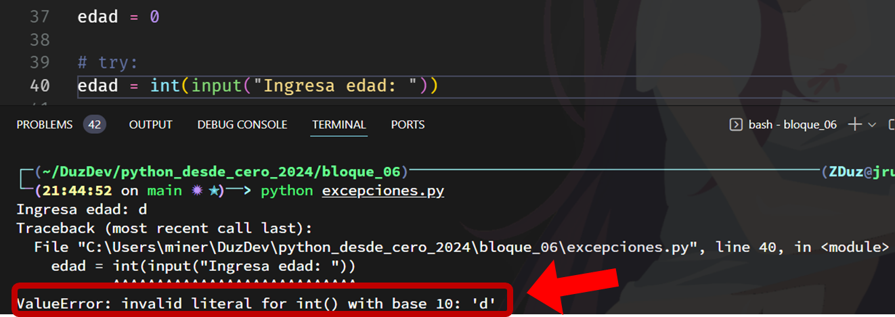
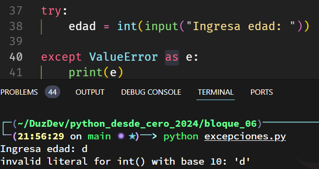

# Excepciones


> *Repositorio*: [python_desde_cero_2024](https://github.com/Duz-Dev/python_desde_cero_2024) - fecha de edición: 14/11/2024
---
<!-- TOC -->

- [Excepciones](#excepciones)
  - [Introducción](#introducción)
  - [Estructura de try-except](#estructura-de-try-except)
  - [Ejemplos](#ejemplos)
  - [Mensajes de error](#mensajes-de-error)
  - [Comando 'as' en try-except](#comando-as-en-try-except)
  - [Comando Raise](#comando-raise)
  - [Excepciones personalizadas](#excepciones-personalizadas)
  - [Múltiples excepciones](#múltiples-excepciones)
    - [Ejemplos](#ejemplos-1)

<!-- /TOC -->

---

## Introducción

Imagina que desarrollas una aplicación para un sistema bancario. Uno de tus módulos se encarga de calcular el saldo final de los clientes tras una serie de transacciones. Al probarlo, todo parece funcionar hasta que alguien introduce un valor inesperado: en lugar de un número, intenta procesar una transacción con una letra. De repente, el sistema se detiene por completo. No muestra ningún mensaje de error claro ni permite a nadie hacer más cálculos hasta que se resuelva el problema. Aquí es donde surge la pregunta: ¿cómo puedes evitar que el programa se caiga por errores inesperados y, al mismo tiempo, mostrar mensajes que indiquen qué salió mal?

Aquí entra en juego el manejo de excepciones en Python, y en particular, el bloque try-except, una herramienta fundamental para identificar, gestionar y responder a errores en tiempo de ejecución. Vamos a desglosar su funcionamiento paso a paso.

## Estructura de try-except

try-except es una estructura que permite "intentar" ejecutar un código que puede fallar. Si ocurre un error, el except toma el control, permitiéndonos definir qué hacer cuando algo sale mal. Esto es útil para evitar que el programa se cierre por completo y para personalizar el mensaje de error. Por ejemplo:

```python
try:
    numero = int(input("Introduce un número: "))
    print("El número es:", numero)
except ValueError:
    print("¡Ocurrió un error! Por favor introduce un número válido.")
```

En este caso, si el usuario introduce algo que no es un número, el programa muestra un mensaje de error personalizado sin cerrarse.

- **try:** En este bloque colocamos el código que deseamos ejecutar y que podría generar un error.
- **except:** Aquí definimos cómo manejar la excepción si ocurre. Podemos especificar el tipo de error (por ejemplo, `ValueError`, `TypeError`) o usar un `except` general para capturar cualquier tipo de excepción.
- **else (opcional):** Si no se produce ninguna excepción en el bloque `try`, el código en `else` se ejecutará.
- **finally (opcional):** Este bloque se ejecuta siempre, ocurra o no una excepción, y es útil para limpiar recursos.

A diferencia de la sentencia `try` y `finally`, las demas pueden repetirse en la misma estructura.

## Ejemplos

1. **Division entre cero**. Este ejemplo captura un ZeroDivisionError, que ocurre cuando intentas dividir un número entre cero. Con try-except, podemos dar un mensaje amigable en lugar de permitir que el programa se detenga con un error.

    ```python
    try:
        numerador = 10
        denominador = int(input("Introduce un denominador: "))
        resultado = numerador / denominador
        print("El resultado es:", resultado)
    except ZeroDivisionError:
        print("Error: No se puede dividir entre cero.")
    ```

2. **Manejo de FileNotFoundError al intentar abrir un archivo**. En este caso, intentamos abrir un archivo que quizás no exista. Si el archivo no se encuentra, se genera un FileNotFoundError, y el bloque except maneja el error, indicando que el archivo no se pudo localizar.

    ```python
    try:
        archivo = open("archivo_inexistente.txt", "r")
        contenido = archivo.read()
        print(contenido)
        archivo.close()
    except FileNotFoundError:
        print("Error: El archivo no existe o no se pudo encontrar.")

    ```

## Mensajes de error

Hasta el momento conocimos tres mensajes de excepciones que python incorpora, pero existe una amplia variedad de excepciones predefinidas, que pueden manejarse mediante `try-except`. Estos son algunos de los errores más utilizados:

1. **Exception**: Clase base de la mayoría de excepciones en Python.
2. **AttributeError**: Se produce cuando un objeto no tiene el atributo solicitado.
3. **EOFError**: Sucede cuando la función `input()` alcanza el final de un archivo inesperadamente.
4. **FloatingPointError**: Error relacionado con operaciones de coma flotante (poco frecuente).
5. **GeneratorExit**: Se genera cuando un generador se cierra.
6. **ImportError**: Ocurre cuando una importación falla.
7. **ModuleNotFoundError**: Tipo específico de `ImportError` que indica que el módulo no fue encontrado.
8. **IndexError**: Sucede cuando intentas acceder a un índice que no existe en una lista o tupla.
9. **KeyError**: Se produce al intentar acceder a una clave inexistente en un diccionario.
10. **KeyboardInterrupt**: Se activa cuando el usuario interrumpe la ejecución (ej., con Ctrl+C).
11. **MemoryError**: Indica que no hay suficiente memoria disponible para continuar la ejecución.
12. **NameError**: Ocurre cuando una variable o nombre no está definido en el ámbito actual.
13. **NotImplementedError**: Señala que una funcionalidad no ha sido implementada.
14. **OSError**: Error relacionado con el sistema operativo (ej., acceso a archivos).
15. **OverflowError**: Se produce cuando un cálculo excede el límite permitido para un tipo de datos numérico.
16. **RecursionError**: Sucede cuando se excede el límite de recursión.
17. **ReferenceError**: Ocurre cuando una referencia débil intenta acceder a un objeto ya eliminado.
18. **RuntimeError**: Clase general para errores que ocurren en tiempo de ejecución.
19. **StopIteration**: Levantada para indicar el final de una iteración en un iterador.
20. **SyntaxError**: Error en la sintaxis del código.
21. **IndentationError**: Error específico de `SyntaxError` por problemas de indentación.
22. **TabError**: Error específico de `IndentationError` cuando se mezclan tabulaciones y espacios.
23. **SystemError**: Indica un error interno en el intérprete de Python.
24. **SystemExit**: Usada para indicar que el intérprete va a cerrarse.
25. **TypeError**: Error de tipo de dato inapropiado para una operación.
26. **UnboundLocalError**: Especificación de `NameError` para variables locales que no han sido asignadas.
27. **ValueError**: Error de valor inapropiado, aún si el tipo es correcto.
28. **ZeroDivisionError**: Error cuando se intenta dividir entre cero.

Con todas estas como vimos en los ejemplos podemos contemplar diversos errores en nuestro programas. Cabe aclarar que cada una de estas son clases que heredan la clase `Exception` cosa que veremos mas adelante.

## Comando 'as' en try-except

Cuando no hacemos uso de estos mensajes, el try-except solo ejecutara lo que venga dentro del except si ocurre cualquier error de ejecución. Por lo que es mejor para depurar y dar mejor manejo de errores contemplar las excepciones que python ya nos brinda.

Cada una de estas tiene un mensaje por defecto que no lo vemos a simple vista que arrojaría el contexto del error ocurrido, una forma de verlo es propiciando estos errores. Ejemplo:



Este nos indico que justamente el error fue del tipo "ValueError" y el contexto fue que es invalido el caracter "d" para la funcion int().

Si usamos la siguiente anotación, podremos adjuntar a nuestro script el error que internamente arrojaría de la siguiente manera:

```python
try:
    edad = int(input("Ingresa edad: "))

except ValueError as e:
    print(e)
```

El comando `as` permite capturar la excepción esperada de la izquierda, en este caso el ValueError, y asignarla a una variable para acceder a más detalles sobre el error. Normalmente esta variable se acostumbra llamarla "e", pero puede ser cualquiera.
Esta mostraría en la ejecución exactamente el mismo mensaje que vimos anteriormente pero de forma mas limpia y resumida. Ejemplo:



## Comando Raise

Contemplando los diferentes tipos de excepciones que hay, podemos personalizar un poco mas estas, en concreto el mensaje que nos devuelve y hasta el contexto en el cual queremos que arroje una excepción, y para esto existe el siguiente comando. El comando `raise` nos permite generar nuestras propias excepciones si necesitamos forzar un error en ciertas situaciones específicas. Esto se usa, por ejemplo, en validaciones de datos. Podemos utilizar como base cualquiera de las excepciones ya vistas, y modificar su mensaje esperando un error.

Si planteamos un problema en donde esperamos no solo verificar que la entrada de un dato sea un numero y a su vez que dicho numero sea positivo, podemos manejar esto de la siguiente manera:

```python
try:
    edad = int(input("Introduce tu edad: "))
    if edad < 0:
        raise ValueError("La edad no puede ser negativa.")
except ValueError as e:
    print("¡Error!", e)
```

Aquí raise fuerza un ValueError si se introduce una edad negativa, proporcionando un mensaje personalizado.
De este modo, al escribir `èxcept ValueError as e`, la variable e, podría contener el mensaje del error original de ValueError (que ya vimos anteriormente) o si en dado caso este no suceda, pero si el dato es negativo, se ejecutara el `raise` y mostrara el mensaje de este mismo que indicamos.

Se puede usar no solo el ValueError, si no cualquiera de los ya existentes en python.

## Excepciones personalizadas

Este posiblemente que este sea un subtema mas complejo si no conoces aun nada del tema de clases, por lo que no es necesario que profundices. Vuelve cuando hayas aprendido el tema y practica tus habilidades :)

La forma más básica de crear una excepción personalizada en Python es definir una nueva clase que herede directamente de la clase base Exception. Esto permite que tu excepción personalizada se comporte como cualquier otra excepción en Python, sin necesidad de agregar funcionalidades extra si no se requieren.

El modelo base es el siguiente:

```python
class MiExcepcionPersonalizada(Exception):
    pass
```

El nombre de nuestra nueva excepción es "MiExcepcionPersonalizada" y de momento no realiza nada interesante, pero con esto seria suficiente para tener una Excepción nueva fuera de las ya existentes.

Debido a que aun no hemos añadido un mensaje sobre cual fue la excepción ocurrida, por defecto no tendrá un mensaje de error a mostrar.

Ejemplo, si ejecutamos el siguiente código, teniendo el fragmento de la excepción previamente creada:

```python
try:
    raise MiExcepcionPersonalizada()
except MiExcepcionPersonalizada as e:
    print("Capturada una excepción personalizada:", e)
```

Esto solo imprimirá la leyenda "Capturada una excepción personalizada:", pero como la excepción no tiene ningún mensaje a mostrar, a la variable 'e' no tendrá nada que imprimir.

Como esta forma de implementar excepciones tenemos la disponibilidad de añadir mas caracteristicas a nuestras excepciones nuevas.

Lo mas elemental seria utilizar la siguiente sintaxis:

```python
class NumerosNegativos(Exception):
    def __init__(self, mensaje="los datos ingresados fueron negativos. Se espera otro valor."):
        super().__init__(mensaje)
```

Al usar `super().__init__(mensaje)`, estamos inicializando la excepción personalizada de manera similar a las excepciones internas de Python, haciendo que el mensaje de error esté disponible en el mismo atributo (args) que cualquier otra excepción. En otras palabras, este se comportara en funcionalidad al mostrar el mensaje de excepción de la misma forma que cualquier otro tipo de excepción dentro de python.

Por lo que al usar nuestra excepcion nuevamente, ahora si mostara un mensaje, este sera el que indicamos previamente. Aclaro, este se vera sustituido por raise si lo utilizamos. Ejemplo:

```python
raise NumerosNegativos("Error: número negativo detectado")
```

Si ocurre un error con esta excepción, devolverá el mensaje que indica raise, en lugar del indicado dentro de la clase 'NumerosNegativos'.

Ahora que hemos desarrollado la base de nuestra excepción personalizada, podemos ver mas cosas que podrían hacernos útiles. Aquí algunos de los más importantes:

1. **`args`**: Este es un atributo de `Exception` que almacena los argumentos pasados al constructor, en forma de tupla. Es útil para acceder al mensaje directamente o para manejar varios argumentos si decides extender la excepción personalizada.

    ```python
    class NumerosNegativos(Exception):
        def __init__(self, valor, mensaje="Número negativo detectado"):
            self.valor = valor
            super().__init__(mensaje)
    
    try:
        raise NumerosNegativos(-5)
    except NumerosNegativos as e:
        print(e.args)   # Muestra el mensaje de error
        print(e.valor)  # Muestra el valor (-5) que causó la excepción
    ```

2. **Métodos de personalización**: Puedes redefinir métodos especiales para controlar cómo se muestra la excepción. Por ejemplo, el método `__str__()` controla cómo se convierte la excepción en una cadena cuando se imprime.

    ```python
    class NumerosNegativos(Exception):
        def __init__(self, valor, mensaje="Número negativo detectado"):
            self.valor = valor
            super().__init__(mensaje)
        
        def __str__(self):
            return f"{self.args[0]} - Valor inválido: {self.valor}"
    
    try:
        raise NumerosNegativos(-10)
    except NumerosNegativos as e:
        print(e)  # Resultado: Número negativo detectado - Valor inválido: -10
    ```

3. **Compatibilidad con múltiples mensajes**: Puedes expandir la excepción para que acepte múltiples argumentos si necesitas un mensaje más complejo, y acceder a ellos desde `self.args` en el objeto de excepción.

    ```python
    class NumerosNegativos(Exception):
        def __init__(self, valor, mensaje="Número negativo detectado", codigo=100):
            self.valor = valor
            self.codigo = codigo
            super().__init__(mensaje, codigo)  # Pasamos ambos al constructor de Exception

    try:
        raise NumerosNegativos(-20, "Error de entrada", 404)
    except NumerosNegativos as e:
        print(e.args)  # ('Error de entrada', 404)
        print(e.valor, e.codigo)  # -20, 404
    ```

## Múltiples excepciones

Ahora que sabemos como utilizar las excepciones, es importante saber que no estamos limitados a usar solo una vez estas excepciones. A continuación mostrare un par de ejemplos mas completos.

### Ejemplos

1- Crea un programa que le pida al usuario ingresar un índice para acceder a un elemento de una lista. La lista contiene 5 elementos de tipo string. Si el usuario ingresa un índice fuera de rango o algo no numérico, el programa debe manejar estos errores con el bloque try-except y mostrar un mensaje adecuado.
Lista de ejemplo: ["Manzana", "Banana", "Cereza", "Durazno", "Uva"].

```python
lista = [1,2,3,"a",4,"b"]
suma = 0
for i in lista:
    try:
    
        if isinstance(i,(int,float)):
            suma+=i
        else:
            raise TypeError(f"[Alerta]: El dato '{i}' no es un numero. Se omitira la suma a el resultado final.")
    except TypeError as e:
       print(e)
       continue

print(f"\n\tsuma final: {suma}")
```

En este algoritmo, lo que conseguimos es mostrar un mensaje de alerta cada vez que nos topemos con un valor que no sea un numero y mostrar dicho mensaje. En dado caso de que no sea por este motivo, la excepción se desencadenaría por error al intentar sumar datos que no son compatibles.

Ten en cuenta que las excepciones por si mismas detienen la ejecución de nuestros script una vez la excepción suceda, por lo que en este caso se hizo fue meter dicha excepción en un bucle y que cuando ocurra en lugar de detener la ejecución, simplemente continue.

2- Escribe un programa que calcule el área de un triángulo. Pide al usuario ingresar la base y la altura. Si el usuario ingresa un valor no numérico o negativo, el programa debe capturar la excepción y mostrar un mensaje que indique que solo se aceptan números positivos. La fórmula del área del triángulo es: Área = (base * altura) / 2.

```python
import time

base, altura = 0,0

try:
    print("ingresa las dimensiones de un triangulo")
    base = float(input("Base: "))
    altura = float(input("altura: "))

    if base <= 0 or altura <= 0:
        raise TypeError("Los valores deben ser positivos")

    resultado = base * altura / 2
    print("resultado: ",resultado)
    
except ValueError:
    print("[ERROR]: Los datos ingresados no son numeros")
    exit()
except TypeError as e:
    print("[ERROR]:",e)
    exit()
```

Aquí desglosamos dos posibles excepciones de diferente tipo, en el primer caso tenemos una en donde el error sucede por convertir un dato str a float sin que sea compatible, y el segundo con typeError filtramos dos errores de una. Un mensaje en dado caso de que se intente operar con datos negativos u en su defecto que el valueError falle, typeError indicaría que se intento operar con datos incompatibles.
