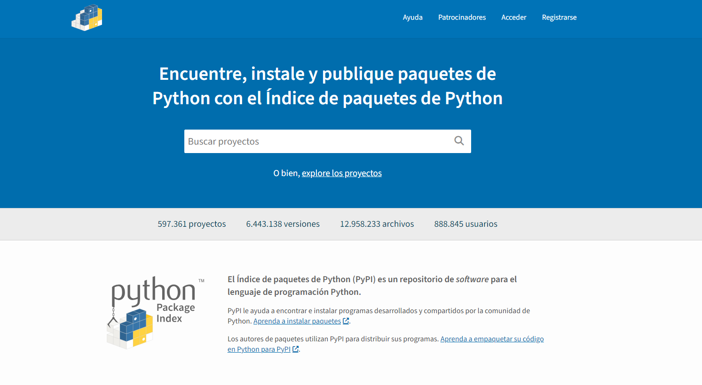
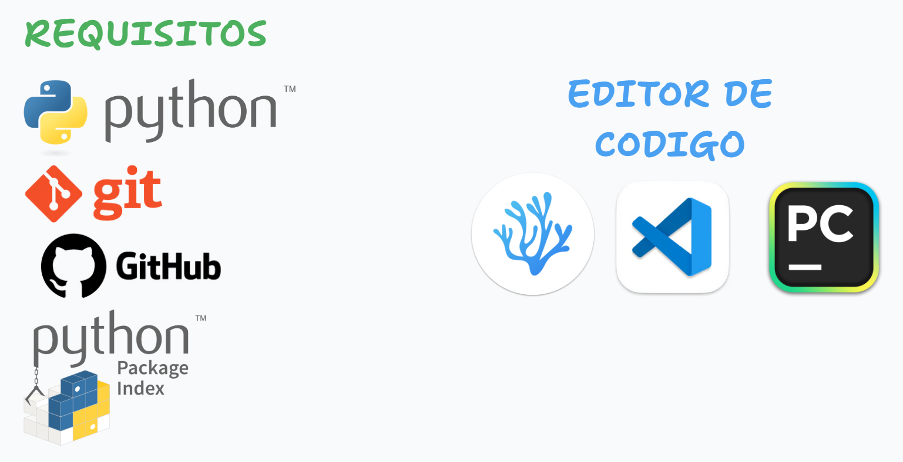
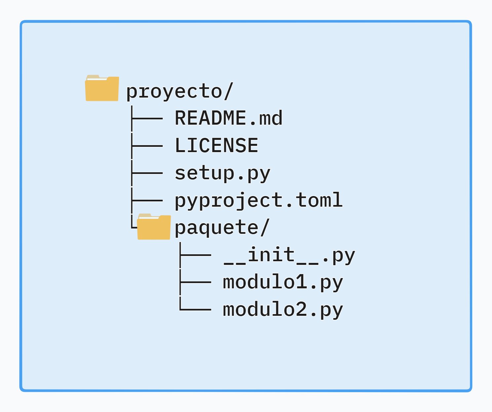
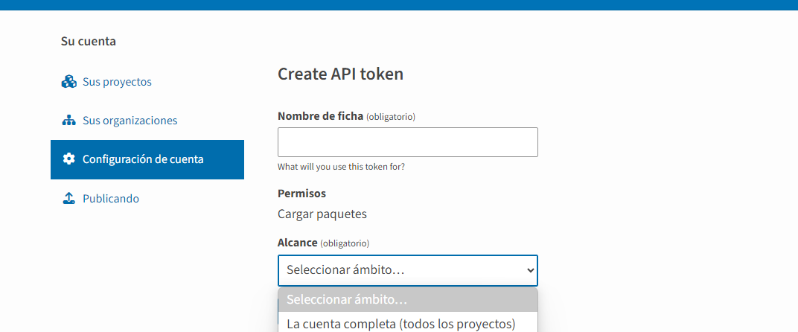

# Módulos en Python


> *Repositorio*: [python_desde_cero_2024](https://github.com/Duz-Dev/python_desde_cero_2024) - fecha de edición: 02/01/2025
---

<!-- TOC -->

- [Módulos en Python](#módulos-en-python)
  - [Introducción](#introducción)
  - [Definición](#definición)
  - [Importando módulos](#importando-módulos)
  - [Palabra clave: 'as'](#palabra-clave-as)
  - [Palabra clave: 'from-import'](#palabra-clave-from-import)
  - [Módulos locales](#módulos-locales)
    - [Gestión de exportaciones](#gestión-de-exportaciones)
  - [Paquetes](#paquetes)
    - [archivo \_\_init\_\_](#archivo-__init__)
  - [Programa principal](#programa-principal)
  - [Ruta de búsqueda de Módulos](#ruta-de-búsqueda-de-módulos)
  - [PyPi](#pypi)
  - [Creación de un paquete publico](#creación-de-un-paquete-publico)
    - [Pasos previos](#pasos-previos)
    - [Estructura](#estructura)
    - [Contenido](#contenido)
    - [Crear y subir repositorio a la nube (git/github)](#crear-y-subir-repositorio-a-la-nube-gitgithub)
    - [Build y Subir a PyPi](#build-y-subir-a-pypi)

<!-- /TOC -->

---

## Introducción

Imagina que estás desarrollando una aplicación para manejar fechas en un sistema. Si tu aplicación necesita realizar operaciones como calcular la diferencia entre dos fechas, convertir fechas entre diferentes formatos o validar si una fecha es válida, ¿deberías escribir todo el código desde cero cada vez que necesites hacer esto? Aquí es donde los módulos en Python juegan un papel crucial. Los módulos te permiten organizar el código en bloques reusables y dividir la lógica de manera eficiente, evitando la repetición.

En Python, un módulo es simplemente un archivo que contiene código Python, ya sea funciones, clases o variables, y lo puedes importar en otros programas para aprovechar su funcionalidad sin tener que reescribir nada.

## Definición

Un módulo en Python es un archivo con extensión `.py` que contiene definiciones y declaraciones, como funciones, clases y variables. Los módulos pueden ser importados en otros programas de Python para reutilizar código, lo que facilita la modelización y organización del código. Esto te permite dividir tu programa en diferentes partes, lo que mejora la legibilidad y mantenimiento del código.

Los módulos en Python pueden estar integrados en el lenguaje (Built-in o modulo estándar), ser creados por el usuario o descargar algún modulo externo.

Ejemplo, El archivo `math.py`, es un módulo estándar que contiene funciones matemáticas útiles, como `sqrt()` o `pow()`. Este lo usaremos de ejemplo de aquí en adelante.

## Importando módulos

Para empezar a utilizar un módulo en tu código, debes importarlo. La forma más sencilla de hacerlo es mediante la declaración
`import`:

```python
import <nombre-modulo> #sintaxis básica

#ejemplo
import math
```

Esto importa el módulo completo `math`, lo que te permite usar sus __funciones, variables, todo lo que esté definido explícitamente en el módulo y sea accesible según su nivel de visibilidad__, como `math.sqrt()` para calcular raíces cuadradas. Para empezar a utilizar las herramientas que nos puede proporcionar dicho modulo de matemáticas es escribiendo el nombre de este mismo seguido de la funcionalidad a la que queremos hacer referencia. Ejemplo:

```python
import math

print(math.sqrt(16))  # Imprime: 4.0
```

Este código utiliza la función `sqrt()` del módulo `math` para calcular la raíz cuadrada de 16.

Cuanto mas empieces a utilizar un modulo veras que aveces es algo ineficiente o incomodo escribir el nombre del modulo por completo o directamente quisiéramos omitirlo. Pues esto es posible y veremos mas adelante de que manera llevarlo acabo.

## Palabra clave: 'as'

Si el nombre del módulo es largo, puedes usar un alias para abreviarlo mediante la palabra clave `as`:

```python
import math as m

print(m.sqrt(25))  # Imprime: 5.0
```

Esto hace que el módulo `math` se pueda referenciar con el alias `m`, ahorrando tiempo y espacio al escribir código.

## Palabra clave: 'from-import'

Otra forma de importar módulos es utilizando `from ... import ...`, que te permite importar directamente una función, clase o variable específica de un módulo:

```python
from math import sqrt

print(sqrt(36))  # Imprime: 6.0
```

La forma en que se lee en español es *"Desde `Match` importa `sqrt`"*.
Esto importa directamente la función `sqrt` del módulo `math`, y puedes usarla sin tener que escribir `math.sqrt()`.

Como dato adicional también es posible importar elementos en una sola linea:

```python
from math import ceil, floor

def redondear_numero(numero):
    redondeo_arriba = ceil(numero)
    redondeo_abajo = floor(numero)
    redondeo_cercano = round(numero)  # Alternativa nativa
    return {
        "redondeo_arriba": redondeo_arriba,
        "redondeo_abajo": redondeo_abajo,
        "redondeo_cercano": redondeo_cercano
    }
```

Ahora observemos otro ejemplo pero usando un comando nuevo:

__Ejercicio: Calcular el área de un círculo__.

Planteamiento:
Escribe una función que reciba el radio de un círculo y calcule su área. Recuerda que la fórmula para el área de un círculo es: Area = π⋅r²

```python
import math

def area_circulo(radio):
    if radio < 0:
        return "El radio no puede ser negativo."
    return math.pi * math.pow(radio, 2)

# Ejemplo de uso
print(area_circulo(5))   # 78.53981633974483
print(area_circulo(10))  # 314.1592653589793
print(area_circulo(-3))  # El radio no puede ser negativo.
```

- Podríamos hacer uso de comando `*` como de la siguiente forma para evitar usar `math.pi` y `math.pow` directamente:

```python
from math import *

def area_circulo(radio):
    if radio < 0:
        return "El radio no puede ser negativo."
    return pi * pow(radio, 2)

# Ejemplo de uso
print(area_circulo(5))   # 78.53981633974483
print(area_circulo(10))  # 314.1592653589793
print(area_circulo(-3))  # El radio no puede ser negativo.
```

El uso de `*` establece que en lugar de importar un elemento del modulo (en este caso math), se importa todos los elementos disponibles. Esto se considera una __Mala practica__, por lo que es mejor evitar su uso excesivo, solo importa aquellos elementos que sean necesarios en tu proyecto. Los principales motivos es porque dificulta el rastrear de donde vienen los elementos, mala legibilidad, importa incluso elementos 'ocultos' del modulo (elementos que empiezan con '_' al principio de su nombre).

## Módulos locales

Puedes crear tus propios módulos para organizar mejor tu código. Simplemente crea un archivo con extensión `.py` y coloca en él las funciones, clases o variables que quieras reutilizar.

Para esto tenemos el siguiente caso en donde dicho modulo esta en la misma raíz de tu archivo principal, digamos que se llama `main.py`. Primero crear un nuevo script el cual tenga el nombre que deses, en este ejemplo le llamare `mi_modulo.py`. Gráficamente nuestra organización seria la siguiente:

```text
mi_proyecto/ -> Nombre de la carpeta que contiene nuestro scripts
├── main.py -> Archivo principal de nuestro ejemplo
├── mi_modulo.py -> Archivo con funciones creada para importarlo en main.py

```

Ahora en `mi_modulo.py` añade un script como el siguiente:

```python
# mi_modulo.py
def saludo(nombre):
    return f"Hola, {nombre}!"
```

Ahora, en otro archivo Python, en este caso en `main.py`, puedes importar y usar este módulo de la siguiente manera:

```python
import mi_modulo

print(mi_modulo.saludo("Juan"))
```

Esto seria la implementación mas básica para crear un modulo. Esto nos ayudara a organizar mejor nuestro código y tener un mejor orden de nuestras funcionalidades y lógica implementada.

### Gestión de exportaciones

Existen formas de definir qué elementos de un módulo o paquete pueden ser __accesibles desde fuera__ (exportados) y cómo __proteger aquellos que no deberían ser accedidos libremente__. Esto se hace mediante varias técnicas y convenciones, aunque es importante notar que Python no tiene un verdadero control de acceso como en lenguajes como Java o C++. En su lugar, utiliza convenciones y herramientas específicas. Veamos que Alternativas entonces nos ofrece python:

__1. Definir qué exportar con `__all__`__

El atributo especial `__all__` es una lista de nombres que define explícitamente __qué elementos se exportan__ cuando alguien usa `from modulo import *`.

__Ejemplo__:

Archivo `modulo.py`:

```python
__all__ = ['funcion_publica', 'ClasePublica']

def funcion_publica():
    return "Soy accesible desde fuera"

def _funcion_privada():
    return "No deberías acceder a esto"

class ClasePublica:
    pass

class _ClasePrivada:
    pass
```

Uso:

```python
from modulo import *
print(funcion_publica())  # Funciona
print(ClasePublica)       # Funciona

# Estos no se exportan por `__all__`
# print(_funcion_privada())  # Error
# print(_ClasePrivada)       # Error
```

__Nota__: Si no defines `__all__`, __todos los elementos públicos serán accesibles__ al usar `from modulo import *`.

> Observación. Por la naturaleza de python, no existe una forma de colocar de manera privada los elementos dentro de nuestros módulos. Por lo que al usar `__all__` simplemente es una formalidad y practica para evitar llamar a todos los elementos cuando se utilice el comando `*`

__2. Nombres privados (convención con guiones bajos)__.

Python usa una __convención de prefijos con guiones bajos__ para indicar que un elemento es privado, esto es muy utilizado a menudo en el uso de clases, pero esto se puede extender a todo el lenguaje. Veamos unos ejemplos:

- `_nombre`: Sugiere que el elemento es "privado" y no debería ser usado fuera del módulo.
- `__nombre`: Activa __name mangling__ para evitar conflictos de nombres en clases.

__Ejemplo:__

```python
def _funcion_privada():
    return "Soy privado"

def funcion_publica():
    return "Soy público"

class _ClasePrivada:
    pass

class ClasePublica:
    pass
```

- `_funcion_privada` y `_ClasePrivada` son técnicamente accesibles, pero por convención no deberían ser usadas fuera del módulo.

```python
from modulo import *
# Esto funcionará, pero no debería hacerse según las buenas prácticas:
print(_funcion_privada())  # Es accesible, pero no recomendado.

```

Es por ello que se recomienda solo llamar solo a el modulo en si o en casos específicos a los elementos que que vayamos a utilizar en especifico.

Existen varias implementaciones mas que nos ayudarían a mantener nuestros elementos mejor protegidos o determinar que cosa puede ser sensible con mayor control, pero esto ya toca el tema de clases y el uso del archivo `__init__.py`. De este ultimo comentare mas adelante.

## Paquetes

En Python, los paquetes son una forma de organizar módulos. Este no es mas que una colección de módulos organizados en una estructura de carpetas. Los paquetes permiten manejar proyectos complejos dividiendo el código en partes más pequeñas y lógicas.

Un paquete en Python es esencialmente una carpeta que contiene un archivo __init__.py (aunque este archivo ya no es obligatorio en versiones modernas de Python). Asi que de forma conceptual se puede ver a los módulos como libros y a los paquetes como librerías (de allí que se le asocia dicho termino).

Supongamos que tenemos la siguiente estructura de carpetas:

```text
mi_proyecto/
├── main.py
├── paquete/
    ├── modulo1.py
    ├── modulo2.py

```

Para poder acceder a nuestro módulos que están en paquete existe dos métodos. Desde `main.py` podemos importarlo de la siguiente forma:

Primer método:

```python
import paquete.modulo1 
import paquete.modulo2 
```

```python
from paquete.modulo1 import mod1 #!Ejemplo 
```

Segundo metodo:

```python
from paquete import modulo1, modulo2
```

En realidad cada uno tiene su contexto de empleo, el primer método nos ayudaría para indicar que elementos explícitamente queremos importar de dichos módulos, y el segundo seria mas como indicar que queremos importar el modulo tal cual.

### archivo \__init\_\_

Este archivo esta ligado a el uso de paquetes ya que es es un archivo especial que, cuando está presente en un directorio, convierte ese directorio en un paquete Python. Esto significa que el directorio puede ser tratado como un módulo desde el que se pueden importar otros sub-módulos o sub-paquetes.

Antes de Python 3.3, su presencia era obligatoria para que Python reconociera un directorio como un paquete. A partir de Python 3.3, ya no es obligatorio, pero sigue siendo útil para realizar tareas específicas.

Aun asi es implementado ya que se ve como buena practica que este en los paquetes para indicar que es un paquete de python.

Dentro de dicho archivo podemos ejecutar diversas cosas de utilidad, asi que enlistare un par de ellas:

1. __Controlar lo que se importa__:  
   Puedes usar el archivo `__init__.py` para definir explícitamente qué módulos o atributos estarán disponibles al importar el paquete principal mediante el uso de `__all__`.

   __Ejemplo:__

   ```python
   # Estructura del paquete:
   # mi_paquete/
   # ├── __init__.py
   # ├── modulo1.py
   # ├── modulo2.py

   # __init__.py
   __all__ = ['modulo1']  # Solo se exportará modulo1

   # modulo1.py
   def funcion_modulo1():
       return "Función del módulo 1"

   # modulo2.py
   def funcion_modulo2():
       return "Función del módulo 2"
   ```

   __Uso:__

   Digamos que creamos un archivo adicional el cual se llame main.py. Para importar nuestro módulos debemos escribir lo siguiente:

   ```python
   from mi_paquete import *  # Solo importará `modulo1`
   ```

   En este ejemplo solo importara lo que es el modulo1 por el uso de _*all* en `__init__.py`

2. __Inicialización del paquete__:  
   Puedes incluir código en `__init__.py` que se ejecute automáticamente al importar el paquete. Esto es útil para inicializar configuraciones, cargar datos o establecer dependencias.

   __Ejemplo:__

   ```python
   # __init__.py
   print("El paquete ha sido importado")
   ```

   Uso:

   ```python
   import mi_paquete
   # Salida: "El paquete ha sido importado"
   ```

3. __Re-exportar módulos o elementos__:  
   Puedes usar el archivo `__init__.py` para __re-exportar__ funciones, clases o variables específicas de los sub-módulos, haciendo que se comporten como parte del paquete principal.

   __Ejemplo:__

   ```python
   # __init__.py
    from .modulo1 import *
   ```

   Uso:

   ```python
   from mi_paquete import funcion_modulo1
   print(funcion_modulo1())
   ```

   De esta forma evitamos la sintaxis como la que vimos empleada en el tema de [paquetes](#paquetes).

4. __Modularidad y organización del código__:  
   Al incluir `__init__.py`, puedes dividir el código en múltiples sub-módulos organizados dentro de un paquete sin perder cohesión. Esto mejora la mantenibilidad de proyectos grandes.

5. __Implementar patrones avanzados__:  
   En proyectos complejos, `__init__.py` puede usarse para:
   - Definir configuraciones globales.
   - Registrar módulos automáticamente.
   - Implementar dinámicamente el comportamiento del paquete.
  
Ten en cuenta que existen muchas cosas de utilidad que ya escala en cuanto implementación en tus proyectos modularizados. Podrías especificar variables de entorno o variables que podrían acceder todos los paquetes o implementar alguna lógica que ejecute cierto modulo dependiendo del sistema operativo.

## Programa principal

Cuando decidimos desarrollar una pieza de software en Python, normalmente usamos distintos ficheros para ello. Algunos de esos ficheros se convertirán en módulos, otros se englobarán en paquetes y existirá uno en concreto que será nuestro punto de entrada, también llamado programa principal.

Se tiene como conversion (y buena practica) llamar a tal archivo `main.py`.

El código que gestionaría este seria algo como esto:

```python
# imports de la librería estándar
# imports de librerías de terceros
# imports de módulos propios

# CÓDIGO PROPIO
# ...
# CÓDIGO PROPIO

if __name__ == '__main__':
    # punto de entrada real
```

Aquí lo mas importante es el ultimo fragmento que planteo `if __name__ == '__main__'`, veamos esto a paso:

__\_\_name\_\___

Las palabras que empiezan y terminan con dobles guiones bajos, en Python se conocen como __atributos especiales__. Estas son características que Python utiliza internamente para manejar la operación del lenguaje de manera automática, pero también pueden ser utilizadas directamente por los desarrolladores. En el caso en concreto de `__name__` bajo este contexto indica que obtendrá el nombre del el nombre del módulo que se está ejecutando. Si el módulo se está ejecutando directamente como un programa principal, ``__name__`` tendrá el valor '``__main__``'.
Si el módulo es importado desde otro archivo, ``__name__`` contendrá el nombre del módulo, es decir, el nombre del archivo sin la extensión .py.

__if __name__ == '__main__'__

Este bloque evalúa si el script actual está siendo ejecutado directamente o si está siendo importado como un módulo. Dependiendo del resultado, se ejecuta o no el código dentro del bloque.

es un patrón estándar en Python para distinguir entre ejecución directa e importación de un módulo. Esto fomenta la Modularidad, el orden y la reutilización del código, permitiendo que los desarrolladores creen scripts más robustos y escalables.

## Ruta de búsqueda de Módulos

Cuando importamos un módulo en Python, el intérprete trata de encontrarlo (por orden) en las rutas definidas en la variable sys.path. Veamos su contenido (para mi caso concreto):

```python
from sys import path

for i in path:
    print(i)
# Salida:
""" 
C:\Users\miner\DuzDev\python_desde_cero_2024\bloque_07
C:\Users\miner\AppData\Local\Programs\Python\Python312\python312.zip
C:\Users\miner\AppData\Local\Programs\Python\Python312\DLLs
C:\Users\miner\AppData\Local\Programs\Python\Python312\Lib
C:\Users\miner\AppData\Local\Programs\Python\Python312
C:\Users\miner\AppData\Roaming\Python\Python312\site-packages
C:\Users\miner\AppData\Roaming\Python\Python312\site-packages\win32
C:\Users\miner\AppData\Roaming\Python\Python312\site-packages\win32\lib
C:\Users\miner\AppData\Roaming\Python\Python312\site-packages\Pythonwin
C:\Users\miner\AppData\Local\Programs\Python\Python312\Lib\site-packages
"""
```

Cada vez que usamos algún modulo ya sea nuestro, interno o de terceros, python busca en estos directorios. Podemos modificar esto o añadir algún path adicional.
Si queremos modificar la ruta de búsqueda, existen dos opciones:

- Modificando directamente la variable PYTHONPATH

Para ello exportamos el directorio en donde deseamos que python tenga en cuenta para el tema de los paquetes externos. Escribe el siguiente comando en tu terminal:

```bash
export PYTHONPATH=/tmp
```

> Esto ultimo añadirá dicho path de manera 'temporal' ya que al cerrar la terminal se eliminara la ruta creada.

Y comprobamos que te haya añadido:

```text
C:\Users\miner\DuzDev\python_desde_cero_2024\bloque_07
C:\Users\miner\AppData\Local\Temp  <---------[aquí esta]
C:\Users\miner\AppData\Local\Programs\Python\Python312\python312.zip
C:\Users\miner\AppData\Local\Programs\Python\Python312\DLLs
C:\Users\miner\AppData\Local\Programs\Python\Python312\Lib
C:\Users\miner\AppData\Local\Programs\Python\Python312
C:\Users\miner\AppData\Roaming\Python\Python312\site-packages
C:\Users\miner\AppData\Roaming\Python\Python312\site-packages\win32
C:\Users\miner\AppData\Roaming\Python\Python312\site-packages\win32\lib
C:\Users\miner\AppData\Roaming\Python\Python312\site-packages\Pythonwin
C:\Users\miner\AppData\Local\Programs\Python\Python312\Lib\site-packages
```

- Modificando directamente la lista sys.path

Para ello accedemos a lista que está en el módulo sys de la librería estándar:

```python
import sys
sys.path.append('/tmp')  # añadimos al final
```

o podemos usar:

```python
ys.path.insert(0, '/tmp')  # insertamos por el principio
```

El hecho de poner nuestra ruta al principio o al final de sys.path influye en la búsqueda, ya que si existen dos (o más módulos) que se llaman igual en nuestra ruta de búsqueda, Python usará el primero que encuentre.
Esto puede ser util para sobreEscribir un modulo o añadir algún path de manera temporal.

Ahora que sabemos manipular y trabajar módulos para crear de una forma mas robusta librerías para organizarnos y extender las funcionalidades de nuestro código, te enseñare por ultimo como podríamos publicar nuestro modulo para que otros desarrolladores lo puedan utilizar.

## PyPi

[PyPI](https://pypi.org/) (Python Package Index) es el repositorio (alojamiento) oficial para distribuir y compartir paquetes de Python. Es una plataforma donde los desarrolladores publican sus bibliotecas o herramientas para que otros puedan instalarlas usando el comando ``pip`` (el cual exploraremos en otro momento). Piensa en PyPI como un "marketplace" para paquetes de Python. Gracias a este, desarrolladores de todo el planeta pueden ayudarse mutuamente para crear los softwares complejos de hoy en dia.

Aquí te recalco que solo están los proyectos de paquetes externos a python (paquetes de terceros), y se necesitan instalar de forma explicita en tu ordenador, ya que estos no vienen con python inicialmente.

<center></center>

> Observación. Ten en cuenta que este proceso puede ser algo avanzado y no es necesario que aprendas el proceso de este ultimo tema, pero te sera de utilidad como base si piensas crear proyectos o librerías que otras personas que usan python pueda utilizar.

## Creación de un paquete publico

> Nota: La documentación es demasiado amplía y solo abarcare lo que veo conveniente y de utilidad para entrar de manera básica a la publicación de un paquete.

Para este apartado necesitas cumplir con unos requisitos previos para llevar acabo la publicación de tu paquete.

### Pasos previos

Actualmente existe muchísimas opciones de personalización y que se necesitarían para un proyecto complejo en python, pero a modo de ejemplo solo montare un proyecto corto y simple, por lo que en caso de querer profundizar mas, consulta la [documentación oficial](https://packaging.python.org/en/latest/) de PyPi.

<center></center>

__Requisitos__:

- __Python >= 3.03__. Doy por hecho que tienes python 3.10 en adelante ya que se utilizan en este repositorio elementos de las versiones mas actuales de python pero igual remarco que debes tener una version superior a la marcada.
- __Editor de código__. Este al igual que el punto anterior lo doy por hecho, pero sera importante que lo tengas en cuenta.
- __Git__. Este es un software especializado en el control de versiones de proyectos personales o a gran escala. Diseñado inicialmente para trabajar desde la terminal del sistema operativo.
- __Github__. Tener una cuenta previamente creada para subir nuestro repositorio local creado en git a la nube.
- __PyPI__. Tener una cuenta previamente en PyPi para adquirir un __token__ y postreramente publicar nuestro paquete.

### Estructura

<center></center>

1. __`README.md`__  
   - __Utilidad__: Sirve como una descripción general de tu proyecto. Explica qué hace tu paquete, cómo instalarlo y cómo usarlo. Es lo primero que los usuarios ven en tu repositorio o en PyPI.  
   - __Importancia__: Ayuda a que otros entiendan tu proyecto rápidamente.
    En caso de no incluir la licencia, los derechos le pertenecen al creador del software, pero es mejor para temas de compromiso con la comunidad y legalidad incorporar que tipo de licencia deseas para tu proyecto. Existen muchas licencias ya formadas para la utilización en software.
      - MIT: Una de las más simples y populares.
      - Apache 2.0: Similar a MIT, pero con protección adicional para patentes.
      - BSD: También muy permisiva.
      - GPL (General Public License): Obliga a que los proyectos derivados mantengan la misma licencia.

2. __`LICENSE`__  
   - __Utilidad__: Define los términos bajo los cuales otros pueden usar, modificar o redistribuir tu código.  
   - __Importancia__: Es crucial para aclarar la parte legal del uso de tu paquete.

3. __`setup.py`__  
   - __Utilidad__: Es el archivo tradicional para la configuración de tu paquete. Contiene la información necesaria para que `pip` pueda instalar tu proyecto (como el nombre del paquete, la versión, las dependencias, etc.).  
   - __Importancia__: Aunque ahora se usa más `pyproject.toml`, sigue siendo compatible y útil para muchos proyectos.

4. __`pyproject.toml`__  
   - __Utilidad__: Es el archivo moderno para la configuración de paquetes en Python. Define metadatos del proyecto, configuraciones de construcción y dependencias.  
   - __Importancia__: Es un estándar más reciente que facilita la interoperabilidad entre herramientas y simplifica la gestión de paquetes.

5. __`__init__.py`__  
   - __Utilidad__: Indica que `paquete/` es un paquete en Python. También se usa para inicializar el paquete, como definir qué módulos se importan automáticamente al usar `from paquete import *`.  
   - __Importancia__: Es esencial para estructurar tu proyecto como un paquete.

6. __`modulo1.py y modulo2.py`__  
   - __Utilidad__: Contiene parte del código funcional de tu paquete, como clases, funciones o constantes que implementan una funcionalidad específica. Estos módulos solo son una representación a modo de ejemplo de los elementos que incorporarían nuestro proyecto.
   - __Importancia__: Es uno de los componentes principales de tu proyecto.

En proyectos reciente se hace mas uso de el archivo `pyproject.toml` a comparación de `setup.py` ya que son homólogo uno del otro, incluso pueden utilizarse en el mismo proyecto con fines diferentes.
En este ejemplo solo utilizare el `pyproject.toml` pero mostrare el equivalente en código en `setup`.

Una vez crees en una carpeta todos esos elementos, construye tu proyecto de python dentro de esta.

### Contenido

Este paso es mas a modo de ejemplo del contenido que puede contener nuestro proyecto.

Ya creados los archivos como el paso anterior añadiré lo siguiente respectivamente en cada archivo:

- licencia. La que utilizare sera la licencia 'MIT'. Recuerda que en este caso esta con el nombre de mi perfil de GitHub (DuzZeus), seria caso de que cambies dicho dato.

```LICENSE
MIT License

Copyright (c) 2025 DuzZeus

Permission is hereby granted, free of charge, to any person obtaining a copy
of this software and associated documentation files (the "Software"), to deal
in the Software without restriction, including without limitation the rights
to use, copy, modify, merge, publish, distribute, sublicense, and/or sell
copies of the Software, and to permit persons to whom the Software is
furnished to do so, subject to the following conditions:

The above copyright notice and this permission notice shall be included in all
copies or substantial portions of the Software.

THE SOFTWARE IS PROVIDED "AS IS", WITHOUT WARRANTY OF ANY KIND, EXPRESS OR
IMPLIED, INCLUDING BUT NOT LIMITED TO THE WARRANTIES OF MERCHANTABILITY,
FITNESS FOR A PARTICULAR PURPOSE AND NONINFRINGEMENT. IN NO EVENT SHALL THE
AUTHORS OR COPYRIGHT HOLDERS BE LIABLE FOR ANY CLAIM, DAMAGES OR OTHER
LIABILITY, WHETHER IN AN ACTION OF CONTRACT, TORT OR OTHERWISE, ARISING FROM,
OUT OF OR IN CONNECTION WITH THE SOFTWARE OR THE USE OR OTHER DEALINGS IN THE
SOFTWARE.
```

- Módulos.

```python
#modulo1.py

def saludar(name: str) -> str:
    return f" Saludos, {name}. Espero que logres publicar tu paquete :D"
```

```python
#modulo2.py
import modulo_pablo 

def despedir(name: str):
    return modulo_pablo.despedir(name)

```

>Nota: En el caso de `modulo2.py` hice uso de un modulo creado para fines educativos previamente por mi persona, y esta en PyPI. Para poder utilizarlo tendrás que escribir en la terminal `pip install modulo-pablo`

En modulo2 use un modulo de terceros a posta para representar que sucedería si usamos módulos ajenos a los nuestros.

- archivo init

```python
from .modulo1 import saludar
```

- pyproject.toml

En este debemos añadir todos los metadatos que serán requeridos para las herramientas que utiliza PyPi para indexar los paquetes en su pagina.

```toml
[build-system]
requires = ["setuptools>=70"]
build-backend = "setuptools.build_meta"

[project]
name = "modulo_juan"
version = "0.1.0"
description = "Paquete creado con fines educativos. Mas informacion: github.com/Duz-Dev"
readme = "README.md"
authors = [
    { name = "Ruben Chavez", email = "pablo.dev.academy@gmail.com" }
]
license = { file  = "LICENSE" }
keywords = ["testing", "logging", "example"]
classifiers = [
    "Programming Language :: Python :: 3",
    "License :: OSI Approved :: MIT License",
    "Operating System :: OS Independent"
]

dependencies = [
    "modulo_pablo==0.1.4"
]

[project.urls]
Homepage = "https://github.com/Duz-Dev/modulo-juan"
Download = "https://github.com/Duz-Dev/modulo-juan/tarball/0.1.0"
```

Cada elemento es importante aclarar y existen mas elementos que podemos modificar o alterar de forma diamica en la documentación oficial, pero de momento te enlistee que función fonje cada elemento:

Aquí tienes el desglose de los elementos en tu archivo `pyproject.toml`:

__[build-system]__

1. __`requires`__  
   - __Qué hace__: Especifica las dependencias necesarias para construir tu paquete. En este caso, estás usando `setuptools` versión 70 o superior.  
   - __Importancia__: Asegura que el sistema tenga las herramientas correctas para crear el paquete.

2. __`build-backend`__  
   - __Qué hace__: Define qué herramienta se usa para construir tu paquete. En este caso, `setuptools.build_meta`.  
   - __Importancia__: Especifica el backend que PyPI o `pip` usarán para compilar e instalar tu paquete.

 __[project]__

1. __`name`__  
   - __Qué hace__: Define el nombre del paquete que aparecerá en PyPI. En este caso, `modulo_juan`.  
   - __Importancia__: Es cómo los usuarios buscarán e instalarán tu paquete (`pip install modulo_juan`).
   - __Observación__: Para el nombre debes especificar uno que no exista previamente en PyPi y __NO escribas un nombre con espacios, ni guiones medios__; esto rompería con la compatibilidad al intentar importar la dependencia con tu proyecto.

2. __`version`__  
   - __Qué hace__: Indica la versión del paquete, en este caso, `0.1.0`.  
   - __Importancia__: Permite llevar un control de cambios y actualizaciones del paquete.
   - __Observación__: La version generalmente va de la mano con la version que se indica en tu proyecto en github. Existe implementaciones para cambiar este dato de manera dinámica en la documentación oficial.

3. __`description`__  
   - __Qué hace__: Proporciona una breve descripción del paquete.  
   - __Importancia__: Ayuda a los usuarios a entender de qué trata tu paquete cuando lo ven en PyPI.

4. __`readme`__  
   - __Qué hace__: Especifica el archivo de documentación principal (`README.md`). Este archivo se mostrará como la descripción del paquete en PyPI. Este mismo archivo es usado por GitHub con los mismos fines.
   - __Importancia__: Mejora la presentación de tu paquete.

5. __`authors`__  
   - __Qué hace__: Lista los autores del paquete junto con sus correos electrónicos.  
   - __Importancia__: Proporciona créditos y un contacto para los usuarios.

6. __`license`__  
   - __Qué hace__: Indica qué archivo contiene la licencia del proyecto. En este caso, `LICENSE`.  
   - __Importancia__: Es crucial para definir cómo otros pueden usar tu paquete.
   - __Observación__: Esto puede llegar a no ser necesario añadir a los metadatos si es que especificaste en *classifiers* la licencia de tu proyecto.
7. __`keywords`__  
   - __Qué hace__: Lista palabras clave relacionadas con tu paquete.  
   - __Importancia__: Facilita la búsqueda de tu paquete en PyPI.

8. __`classifiers`__  
   - __Qué hace__: Define metadatos predefinidos sobre tu paquete.  
   - __Ejemplos__:
     - `"Programming Language :: Python :: 3"`: Indica que tu paquete es compatible con Python 3.  
     - `"License :: OSI Approved :: MIT License"`: Declara que usas la licencia MIT.  
     - `"Operating System :: OS Independent"`: Indica que es multiplataforma.
   - __Importancia__: Ayuda a categorizar tu paquete y mejorar su visibilidad.

9. __`dependencies`__  
   - __Qué hace__: Lista las dependencias que tu paquete necesita para funcionar. En este caso, `modulo_pablo==0.1.4`.  
   - __Importancia__: Asegura que se instalen automáticamente las librerías necesarias.
   - __Observación__: Es importante que especifiques esto en caso de usar módulos de terceros, como en este ejemplo. Es buena practica igualmente indicar que versiones son compatibles con tu proyecto para evitar problemas de compatibilidad.

 __[project.urls]__

1. __`Homepage`__  
   - __Qué hace__: Enlace a la página principal del proyecto, como el repositorio de GitHub.  
   - __Importancia__: Facilita que los usuarios encuentren más información sobre el paquete.

2. __`Download`__  
   - __Qué hace__: Proporciona un enlace directo para descargar una versión específica del paquete.  
   - __Importancia__: Permite a los usuarios acceder directamente al código fuente.
   - __Observación__: Actualiza la información de este apartado de ser necesario. En este ejemplo esta bajo mis enlaces de descarga y home, tu coloca las de tu github.

Ya con los elementos listos para nuestro proyecto ya creados, debemos crear un repositorio y subirlo a github.

__setup.py__.

Aunque este ejemplo de creación de proyecto no lo necesita, te mostrare que Contenido tendira que llevar setup.py a modo de ejemplo.

```python
#Fragmento rescatado de modulo-pablo v0.1.3
from setuptools import setup

long_description = open("README.md", "r", encoding="utf-8")

setup(
    name='modulo_pablo', #Nombre del paquete
    packages=['modulo_pablo'],  # nombre de la carpeta que aloja los módulos
    version='0.1.3',
    description='Paquete creado con fines educativos. Mas informacion: github.com/Duz-Dev',
    long_description=long_description,
    long_description_content_type='text/markdown',
    author='Ruben Chavez',
    author_email='pablo.dev.academy@gmail.com',
    # use the URL to the github repo
    url='https://github.com/Duz-Dev/modulo-pablo',
    download_url='https://github.com/Duz-Dev/modulo-pablo/tarball/0.1.3',
    keywords=['testing', 'logging', 'example'],
    classifiers=[
        "Programming Language :: Python :: 3",
        "License :: OSI Approved :: MIT License",
        "Operating System :: OS Independent",
    ],
    license='MIT',
    install_requires=[
        "pillow",
        "requests", 
    ],
    include_package_data=True
)
```

### Crear y subir repositorio a la nube (git/github)

previamente con git instalado, usaremos los siguientes comandos en nuestra terminal. En caso de windows es recomendable usar git bash para evitar problemas.

Estando dentro de la carpeta del proyecto ejecutamos los siguientes comandos:

1. Inicializamos el repositorio de nuestro proyecto.

    ```bash
    git init
    ```

2. Mandamos todos los elementos al stage area.

    ```bash
    git add .
    ```

3. Creamos nuestro primer commit.

    ```bash
    git commit -m "Inicializando repositorio"
    ```

Ahora vamos a [GitHub](https://github.com/Duz-Dev) e iniciamos sesión. En este creamos un repositorio. El nombre es de dicho repositorio recomiendo que sea el mismo que el de tu paquete o la carpeta que contiene el paquete. En mi caso sera "modulo-juan" y posteriormente nos dará la opción de enlazar dicho repositorio de diferentes formas, la que te recomiendo es la de copiar y pegar los comandos siguientes:

```bash
git remote add origin https://github.com/Duz-Dev/<nombre de tu repositorio>.git
git branch -M main
git push -u origin main
```

Claramente solo cambia el nombre de tu proyecto en la url anterior y listo.
Ahora nuestro proyecto esta en GitHub y cualquiera puede acceder a el.

Ahora añadiremos una etiqueta a nuestro repositorio el cual indicara la version actual del proyecto:

```bash
git tag <version> "pequeña descripción de la version"
```

en version deberas colocar la version que especificaste en tu archivo `pyproject.toml`, en mi caso es __0.1.0__

```bash
git tag 0.1.0 "tag description"
```

Ejecutando esto, debemos ahora mandar dicho cambio a github. Para ello escribe:

```bash
git push --tag
```

### Build y Subir a PyPi

__Primera etapa__.

Debes instalar de antemano las siguientes dependencias, ejecuta esto en tu terminal:

```bash
pip install build twine
```

En el anterior fragmento lo que procederá es a instalar build y twine. El primero es el que se encargara de generar el paquete especial para subir a PiPy y twine el encargado de gestionar bajo que usuario se debe subir dicho paquete.

Empaqueta el proyecto con el comando siguiente:

```bash
python -m build
```

__Segunda etapa__.

Si no hubo problemas, procede ahora a conseguir el token que necesitaras para subir el proyecto, este se genera desde [https://pypi.org/manage/account/token/](https://pypi.org/manage/account/token/) (dando por hecho que tienes una cuenta creada previamente).

<center></center>

En nombre puedes añadir el que deses, y en el alcance como sera tu primer paquete solo podrías seleccionar 'la cuenta completa'. Te arrojara una advertencia sobre que dicho token puede manipular todos los paquetes que subas asi que ten cuidado, no proporciones dicho token a cualquiera. Este sera la llave de aquí en adelante para poder subir nuestro paquetes. Copialo y no lo pierdas.

Ahora ejecuta en tu terminal el siguiente comando:

```bash
twine upload dist/*
```

Este tomara el archivo generado por `build` y lo subirá a PiPy, pero sin antes pedirte el token, es aquí cuando lo pegaras en la terminal (dicho texto no se muestra en la terminal por seguridad, tenlo en cuenta).

Si todo marcho sin problemas, ya puedes ver tu modulo en PiPy, solo escribe el nombre de tu modulo en las búsquedas o da click en el enlace generado al final por twine y podrás verlo.

__Nota__.

Existen técnicas para guardar de forma segura o crear una autenticación automática de dicho token (evitar copiar y pegarlo siempre). Ejemplo creando el archivo `.pypirc` en la raíz de tu usuario en windows o en $HOME en linux/mac

dicho archivo tendría algo como esto:

```text
[distutils]
index-servers =
    pypi

[pypi]
repository = https://upload.pypi.org/legacy/
username = __token__
password = <tu-token>
```

Aun asi esto es inseguro ya que es un archivo de texto plano que cualquiera puede acceder, te recomiendo consultar la dependencia [keyring](https://pypi.org/project/keyring/) para mejor implementación y gestión de tu key.
